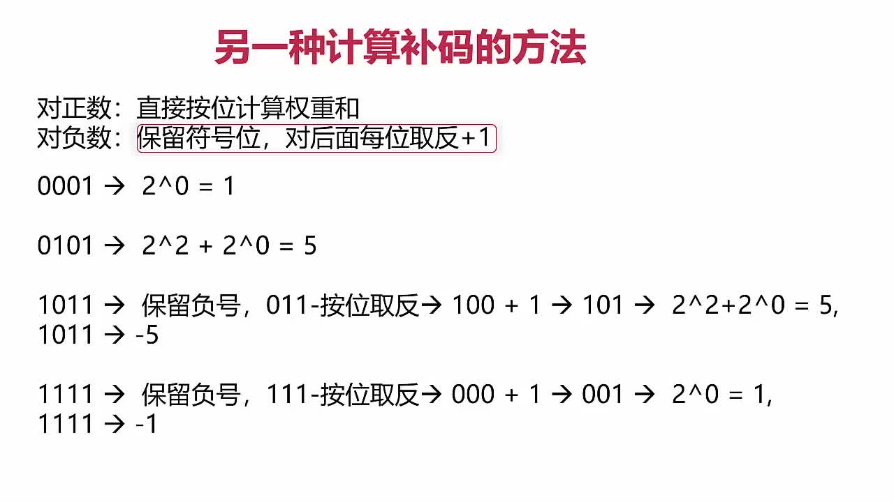
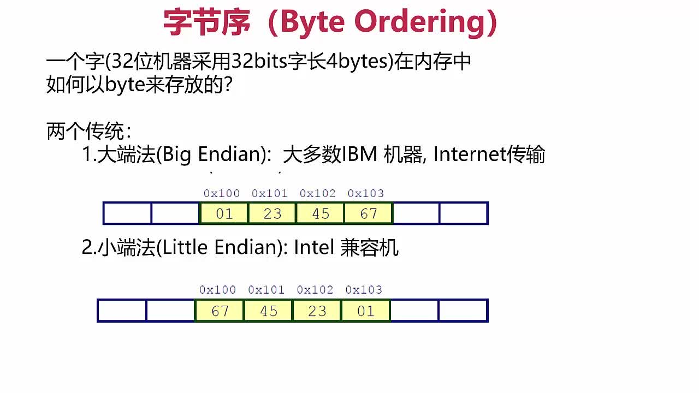

# 第03章 运算符与表达式

## 3-6 常见的位运算

## 3-7 杂项运算法

### 运算符优先级的记忆规则
+ 一般来说，一元运算符的优先级高于对应的二元运算符
+ 弄不清优先级就加括号

## 3-10 补码计算
+ 对正数：直接按位计算权重和
  > `0101: 2^2+2^0 = 5`
+ 对负数：保留符号位(0为正1为负)，对后面每位取反加1
  > `1011: -(~011)  = -(100) = -5`

## 3-11 补码2

### 补码数值范围

### 字节序

### 有符号数尽量不要用移位运算
