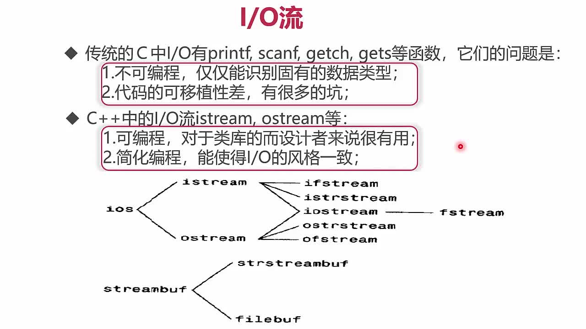
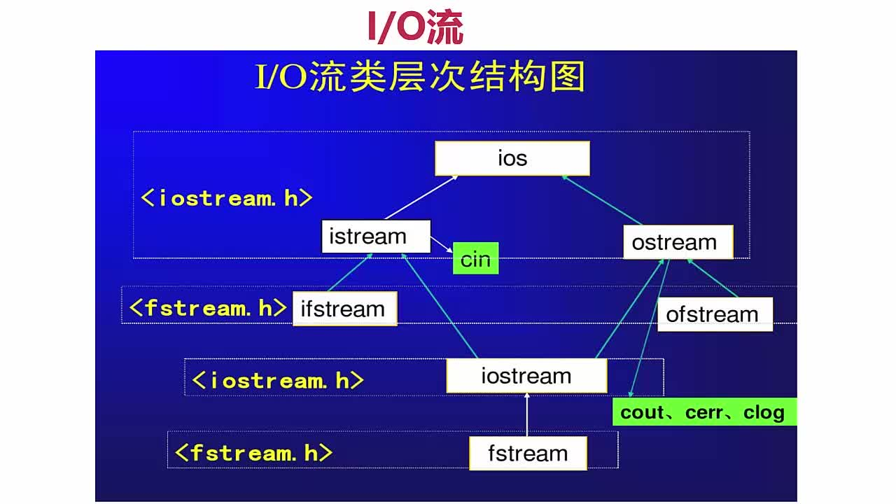

# 高级语法

## IO流
### IO流基础


### IO流类层次结构图


## 运算符重载举例
```cpp
#include <iostream>

using namespace std;

class Complex {
public:
    Complex();                                    // 默认构造函数
    Complex(double r, double i);      // 构造函数
    virtual ~Complex();                      // 析构函数
    Complex(const Complex &x);      // 拷贝构造
    Complex &operator=(const Complex &c); // =号运算符

    double GetReal() const { return _real; }

    void SetReal(double d) { _real = d; }

    double GetImage() const { return _image; }

    void SetImage(double i) { _image = i; }

    // 运算符重载
    Complex operator+(const Complex &c) const;

    Complex &operator+=(const Complex &c);

    Complex operator-(const Complex &c) const;

    Complex &operator-=(const Complex &c);

    Complex operator*(const Complex &c) const;

    Complex &operator*=(const Complex &c);

    Complex operator/(const Complex &c) const;

    Complex &operator/=(const Complex &c);

    bool operator==(const Complex &c) const;

    bool operator!=(const Complex &c) const;

    bool operator>(const Complex &c) const;

    bool operator>=(const Complex &c) const;

    bool operator<(const Complex &c) const;

    bool operator<=(const Complex &c) const;

    // 前置和后置++
    Complex &operator++();   //前置++
    Complex operator++(int); //后置++
    Complex &operator--();   //前置--
    Complex operator--(int); //后置--

//protected:

    friend ostream &operator<<(ostream &os, const Complex &x);

    friend istream &operator>>(istream &is, Complex &x);

private:
    double _real;             // 复数的实部
    double _image;         // 复数的虚部
};

Complex::Complex() {
    _real = 0.0;
    _image = 0.0;
    //cout << "Complex::Complex()" << endl;
}

Complex::Complex(double r, double i) {
    _real = r;
    _image = i;
    //cout << "Complex::Complex(double r, double i)" << endl;
}

Complex::Complex(const Complex &c) {
    _real = c._real;
    _image = c._image;
    //cout << "Complex::Complex(const Complex& c)" << endl;
}

Complex &Complex::operator=(const Complex &c) {
    if (this != &c) {
        _real = c._real;
        _image = c._image;
    }
    return *this;
}

Complex::~Complex() {
    _real = _image = 0.0;
    //cout << "Complex::~Complex()" << endl;
}

Complex Complex::operator+(const Complex &c) const {
    //Complex tmp;
    //tmp._real = _real + x._real;
    //tmp._image = _image + x._image;
    //return tmp;

    return Complex(_real + c._real, _image + c._image);
}


Complex &Complex::operator+=(const Complex &c) {
    _real += c._real;
    _image += c._image;

    return *this;
}

Complex Complex::operator-(const Complex &c) const {
    return Complex(_real - c._real, _image - c._image);
}

Complex &Complex::operator-=(const Complex &c) {
    _real -= c._real;
    _image -= c._image;

    return *this;
}

Complex Complex::operator*(const Complex &c) const {
    return Complex(_real * c._real - _image * c._image, _real * c._image + _image * c._real);
}

Complex &Complex::operator*=(const Complex &c) {
    Complex tmp(*this);  //拷贝构造函数
    _real = tmp._real * c._real - _image * c._image;
    _image = tmp._real * c._image + tmp._image * c._real;
    return *this;
}

Complex Complex::operator/(const Complex &c) const {
    double t = c._real * c._real + c._image * c._image;
    return Complex((_real * c._real - _image * (-c._image)) / t, (_real * (-c._image) + _image * c._real) / t);
}

Complex &Complex::operator/=(const Complex &c) {
    Complex tmp(*this);  //拷贝构造函数
    double t = c._real * c._real + c._image * c._image;
    _real = (tmp._real * c._real - tmp._image * (-c._image)) / t;
    _image = (tmp._real * (-c._image) + tmp._image * c._real) / t;
    return *this;
}

bool Complex::operator==(const Complex &c) const {
    return (_real == c._real) && (_image == c._image);
}

bool Complex::operator!=(const Complex &c) const {
    return !((_real == c._real) && (_image == c._image));
}

bool Complex::operator>(const Complex &c) const {
    return (_real > c._real) && (_image > c._image);
}

bool Complex::operator>=(const Complex &c) const {
    return (_real >= c._real) && (_image >= c._image);
}

bool Complex::operator<(const Complex &c) const {
    return (_real < c._real) && (_image < c._image);
}

bool Complex::operator<=(const Complex &c) const {
    return (_real <= c._real) && (_image <= c._image);
}


Complex &Complex::operator++() // 前置++
{
    _real++;
    _image++;
    return *this;
}

Complex Complex::operator++(int) // 后置++
{
    //Complex tmp(*this);
    //_real++;
    //_image++;
    //return tmp;
    return Complex(_real++, _image++);
}

Complex &Complex::operator--()   //前置--
{
    _real--;
    _image--;
    return *this;
}

Complex Complex::operator--(int) //后置--
{
    return Complex(_real--, _image--);
}

ostream &operator<<(ostream &os, const Complex &x) {
    os << "real value is  " << x._real << "  image value is " << x._image;
    return os;
}

istream &operator>>(istream &is, Complex &x) {
    is >> x._real >> x._image;
    return is;
}

}
```

## 7-16 深拷贝、浅拷贝、move语义的优化
### 基本概念
+ **浅拷贝**：只拷贝指针地址，C++默认拷贝构造函数与赋值运算符重载都是浅拷贝；节省空间，但是容易引起多次释放
+ **深拷贝**：重新分配堆内存，拷贝指针重新指向内容；缺点是浪费空间。但是不会导致多次释放

### 举例
> String.h
```cpp
#ifndef _CPP_STRING_H
#define _CPP_STRING_H

#include <iostream>
#include <string.h>

using namespace std;

class String
{
public:
    String(const char *str = NULL);                    // 普通构造函数
    String(const String &other);                       // 拷贝构造函数
    String(String&& other);                            // 移动构造函数
    ~String(void);                                     // 析构函数
    String& operator= (const String& other);           // 赋值函数
    String& operator=(String&& rhs)noexcept;		   // 移动赋值运算符

    friend ostream& operator<<(ostream& os, const String &c); // cout输出

private:
    char *m_data; // 用于保存字符串
};
#endif //_CPP_STRING_H
```

> String.cpp
```cpp
/***********************************************************
 * @Description : 深拷贝与浅拷贝
 * @author      : 梁山广(Liang Shan Guang)
 * @date        : 2020/10/7 21:50
 * @email       : liangshanguang2@gmail.com
***********************************************************/
#include "String.h"

// String 的普通构造函数
String::String(const char *str) {
    if (str == NULL) {
        m_data = new char[1];
        if (m_data != NULL) {
            *m_data = '\0';
        } else {
            exit(-1);
        }
    } else {
        int len = strlen(str);
        m_data = new char[len + 1];
        if (m_data != NULL) {
            strcpy(m_data, str);
        } else {
            exit(-1);
        }
    }
}

// 拷贝构造函数
String::String(const String &other) {
    int len = strlen(other.m_data);
    m_data = new char[len + 1];
    if (m_data != NULL) {
        strcpy(m_data, other.m_data);
    } else {
        exit(-1);
    }
}

// 移动构造函数
String::String(String &&other) {
    if (other.m_data != NULL) {
        // 资源让渡
        m_data = other.m_data;
        other.m_data = NULL;
    }
}


// 赋值函数
String &String::operator=(const String &other) {
    if (this == &other) {
        return *this;
    }
    // 释放原有的内容
    delete[] m_data;
    // 重新分配资源并赋值
    int len = strlen(other.m_data);
    m_data = new char[len + 1];
    if (m_data != NULL) {
        strcpy(m_data, other.m_data);
    } else {
        exit(-1);
    }

    return *this;
}

// 移动赋值运算符
String &String::operator=(String &&rhs) noexcept {
    if (this != &rhs) {
        delete[] m_data;
        m_data = rhs.m_data;
        rhs.m_data = NULL;
    }
    return *this;
}

// String 的析构函数
String::~String(void) {
    if (m_data != NULL) {
        delete[] m_data;
    }
}

ostream &operator<<(ostream &os, const String &c) {
    os << c.m_data;
    return os;
}
```