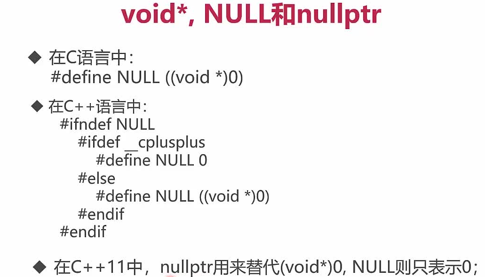

# 第8章 C++编程思想

## 8-7 `(void*) 0`、`NULL`与`nullptr`


C++中尽量用nullptr

举例如下：
```cpp
#include <iostream>

using namespace std;

void func(void *i) {
    cout << "func(void* i)" << endl;
}

void func(int i) {
    cout << "func(int i)" << endl;
}

int main() {
    int *pi = NULL;
    int *pi2 = nullptr;
    char *pc = NULL;
    char *pc2 = nullptr;
    // func(NULL);          // func(int i)
    func(nullptr);     // func(void* i)
    func(pi);             // func(void* i)
    func(pi2);            // func(void* i)
    func(pc);             // func(void* i)
    func(pc2);            // func(void* i)
    return 0;
}
```

## 8-8~8-10 C++的四种const
> C++ 的四种转换 : const_cast, static_cast, dynamic_cast, reinterpet_cast

### 1)、 const_cast
> 用于将const变成非cost,即去类型的const属性
```cpp
const int a = 10;
// a++;
int& b = const_cast<int &>(a);
b++;
cout << b << endl; // 11

int c = 10;
int d = 11;
const int* p = &c;

int * pp = const_cast<int *>(p);
(*pp)--;
cout << c << endl; // 9
```

### 2)、static_cast
+ 用于各种隐式转换，比如基本类型转换，比如非const转const，void*转指针等
+ static_cast能用于多态向上转化，即有继承关系类对象和类指针之间转换，由程序员来确保转换是安全的，如果向下转能成功但是不安全，结果未知。
+ 它不会产生动态转换的类型安全检查的开销

### 3)、dynamic_cast
用于动态类型转换，只能用于含有虚函数的类，用于类层次之间的向上和向下转换，只能转指针或引用，如果是非法的对于指针返回NULL，对于引用抛异常。
+ 向上转换：子类 转向 基类
+ 向下转换： 基类 转向 子类

它通过判断在执行到该语句的时候变量的运行时类型 和要转换的类型是否相同来判断是否能够向下转换。

### 4) 、reinterpret_cast
+ 重新解释类型，既不检查指向的内容，也不检查指针类型本身；
+ 要求转换前后的类型所占用的内存大小一致，否则将引发编译时错误

### 5)、为嘛这么多花里胡哨的呢，强制转换干嘛不用
C的强制转换表面上看起来功能强大什么都能转，但是转化不够明确，不能进行错误检查，容易出错。

一个完整的各种cast的例子如下：
```cpp
#include <iostream>

using namespace std;

int Test() {
    return 0;
}

class Base {
public:
    Base() : _i(0) { ; }

    virtual void T() { cout << "Base:T" << _i << endl; }

private:
    int _i;
};

class Derived : public Base {
public:
    Derived() : _j(1) { ; }

    virtual void T() { cout << "Derived:T" << _j << endl; }

private:
    int _j;
};

int main() {
    // C++ const_cast
    const int a = 10;
    //int* pA = &a;
    int *pA = const_cast<int *>(&a);
    *pA = 100;

    // C++ reinterpret_cast
    typedef void(*FuncPtr)();
    FuncPtr funcPtr;
    //funcPtr = &Test;
    funcPtr = reinterpret_cast<FuncPtr>(&Test);

    // static_cast
    int i = 6;
    double d = static_cast<double>(i);    //基本类型转换  int -> double
    double d2 = 5.6;
    int i2 = static_cast<int>(d2);        //基本类型转换  double -> int

    // static_cast与dynamic_cast
    int ii = 5;
    double dd = static_cast<double>(ii);
    double dd2 = 5.6;
    int ii2 = static_cast<int>(dd2);

    Base cb;
    Derived cd;
    Base *pcb;
    Derived *pcd;

    // 子类--》 父类，static_cast和dynamic_cast均可
    pcb = static_cast<Base *>(&cd);
    if (pcb == NULL) {
        cout << "unsafe dynamic_cast from Derived to Base" << endl;
    }
    pcb = dynamic_cast<Base *>(&cd);
    if (pcb == NULL) {
        cout << "unsafe dynamic_cast from Derived to Base" << endl;
    }

    // 父类--》 子类，只能用dynamic_cast
    pcd = static_cast<Derived *>(&cb);
    if (pcd == NULL) {
        cout << "unsafe dynamic_cast from Derived to Base" << endl;
    }
    pcd = dynamic_cast<Derived *>(&cb);
    if (pcd == NULL) {
        cout << "unsafe dynamic_cast from Derived to Base" << endl;
    }

    return 0;
}
```
