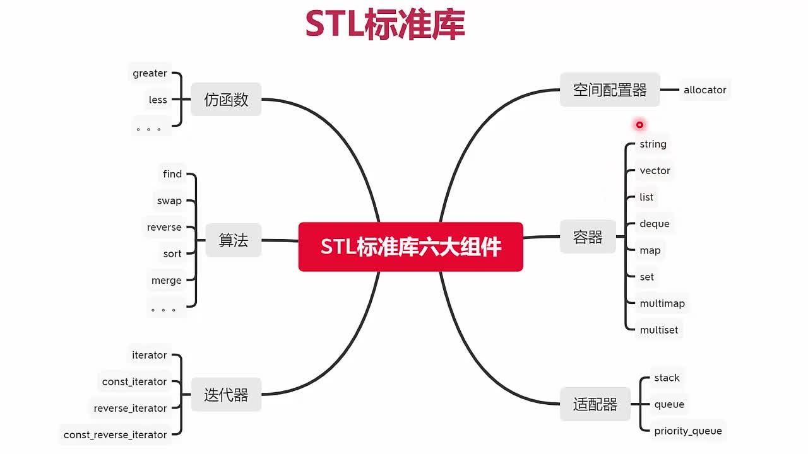
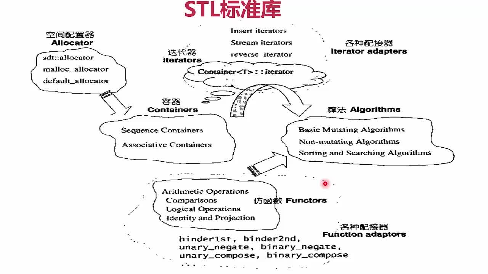
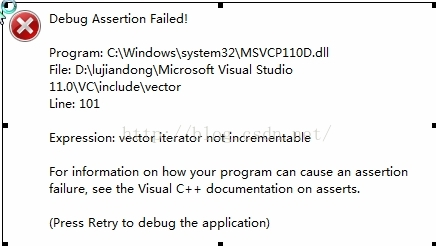

# C++进阶编程

## 9-1 STL标准简介
### STL结构

### STL最佳实践


## 9-4 迭代器失效的几种情况总结
> 参考：[C++迭代器失效的几种情况总结](https://www.cnblogs.com/fnlingnzb-learner/p/9300073.html)

### 一、序列式容器(数组式容器)
对于序列式容器(如vector,deque)，序列式容器就是数组式容器，删除当前的iterator会使后面所有元素的iterator都失效。

这是因为vetor,deque使用了连续分配的内存，删除一个元素导致后面所有的元素会向前移动一个位置。所以不能使用erase(iter++)的方式，

**还好erase方法可以返回下一个有效的iterator**，可以直接把返回的有效iterator覆盖原来的iterator

```cpp
for (iter = cont.begin(); iter != cont.end();)
{
   (*it)->doSomething();
   if (shouldDelete(*iter))
      iter = cont.erase(iter);  //erase删除元素，返回下一个迭代器
   else
      ++iter;
}
```

迭代器失效：

```cpp
void vectorTest() {
    vector<int> container;
    for (int i = 0; i < 10; i++) {
        container.push_back(i);
    }

    vector<int>::iterator iter;
    for (iter = container.begin(); iter != container.end(); iter++) {
        if (*iter > 3) container.erase(iter);
    }

    for (iter = container.begin(); iter != container.end(); iter++) {
        cout << *iter << endl;
    }
}
```

报错是：**vectoriterator not incrementable.**



```cpp
_Myiter operator++(int)
{
    _Myiter _Tmp=*this;
    ++*this;
    return (_Tmp);
}
```

对于序列式容器，比如vector，删除当前的iterator会使后面所有元素的iterator都失效。这是因为顺序容器内存是连续分配（分配一个数组作为内存），删除一个元素导致后面所有的元素会向前移动一个位置。（删除了一个元素，该元素后面的所有元素都要挪位置，所以，iter++，已经指向的是未知内存）。

但是erase方法可以返回下一个有效的iterator。所以代码做如下修改，就OK了。

```cpp
void vectorTest() {
    vector<int> container;
    for (int i = 0; i < 10; i++) {
        container.push_back(i);
    }

    vector<int>::iterator iter;
    for (iter = container.begin(); iter != container.end();) {
        if (*iter > 3) {
            iter = container.erase(iter); // 用返回的有效迭代器覆盖原来的迭代器
        } else {
            iter++;
        }

    }

    for (iter = container.begin(); iter != container.end(); iter++) {
        cout << *iter << endl;
    }
}
```

总结：vector是一个顺序容器，在内存中是一块连续的内存，当删除一个元素后，内存中的数据会发生移动，以保证数据的紧凑。所以删除一个数据后，其他数据的地址发生了变化，之前获取的迭代器根据原有的信息就访问不到正确的数据。

所以为了防止vector迭代器失效，常用如下方法：
```cpp
for (iter = container.begin(); iter != container.end(); )
{
    if (*iter > 3)
      iter = container.erase(iter);    //erase的返回值是删除元素下一个元素的迭代器
    else{
        iter++;
    }
}
```

这样删除后iter指向的元素后，返回的是下一个元素的迭代器，这个迭代器是vector内存调整过后新的有效的迭代器。

### 二、关联式容器
+ 对于关联容器(如map, set,multimap,multiset)，删除当前的iterator，仅仅会使当前的iterator失效，只要在erase时，递增当前iterator即可。
+ 这是因为map之类的容器，使用了红黑树来实现，插入、删除一个结点不会对其他结点造成影响。
+ erase迭代器只是被删元素的迭代器失效，但是返回值为void，所以要采用erase(iter++)的方式删除迭代器。

```cpp
for (iter = cont.begin(); it != cont.end();)
{
   (*iter)->doSomething();
   if (shouldDelete(*iter))
      cont.erase(iter++);
   else
      ++iter;
}

//测试错误的Map删除元素
void mapTest()
{
    map<int, string> dataMap;

    for (int i = 0; i < 100; i++)
    {
        string strValue = "Hello, World";

        stringstream ss;
        ss<<i;
        string tmpStrCount;
        ss>>tmpStrCount;
        strValue += tmpStrCount;
        dataMap.insert(make_pair(i, strValue));
    }

    cout<<"MAP元素内容为："<<endl;
    map<int, string>::iterator iter;
    for (iter = dataMap.begin(); iter != dataMap.end(); iter++)
    {
        int nKey = iter->first;
        string strValue = iter->second;
        cout<<strValue<<endl;
    }

    cout<<"内容开始删除："<<endl;
    //删除操作引发迭代器失效
    for (iter = dataMap.begin(); iter != dataMap.end();iter++)
    {
        int nKey = iter->first;
        string strValue = iter->second;

        if (nKey % 2 == 0)
        {
            dataMap.erase(iter);    //错误
        }
        /* cout<<iter->second<<endl;*/
    }
}
```

出错：


解析：dataMap.erase(iter)之后,iter就已经失效了，所以iter无法自增，即iter++就会出bug.解决方案，就是在iter失效之前，先自增。

```cpp
void mapTest()
{
    map<int, string> dataMap;

    for (int i = 0; i < 100; i++)
    {
        string strValue = "Hello, World";

        stringstream ss;
        ss<<i;
        string tmpStrCount;
        ss>>tmpStrCount;
        strValue += tmpStrCount;
        dataMap.insert(make_pair(i, strValue));
    }

    cout<<"MAP元素内容为："<<endl;
    map<int, string>::iterator iter;
    for (iter = dataMap.begin(); iter != dataMap.end(); iter++)
    {
        int nKey = iter->first;
        string strValue = iter->second;
        cout<<strValue<<endl;
    }

    cout<<"内容开始删除："<<endl;
    for (iter = dataMap.begin(); iter != dataMap.end();)
    {
        int nKey = iter->first;
        string strValue = iter->second;

        if (nKey % 2 == 0)
        {
            dataMap.erase(iter++);
            auto a = iter;

        }
        else {
            iter ++;
        }
    }
}
```

解析：dataMap.erase(iter++);这句话分三步走，先把iter传值到erase里面，然后iter自增，然后执行erase,所以iter在失效前已经自增了。

map是关联容器，以红黑树或者平衡二叉树组织数据，虽然删除了一个元素，整棵树也会调整，以符合红黑树或者二叉树的规范，但是单个节点在内存中的地址没有变化，变化的是各节点之间的指向关系。

所以在map中为了防止迭代器失效，在有删除操作时，常用如下方法：

```cpp
for (iter = dataMap.begin(); iter != dataMap.end(); )
{
     int nKey = iter->first;
     string strValue = iter->second;

     if (nKey % 2 == 0)
     {
         map<int, string>::iterator tmpIter = iter;
         iter++;
         dataMap.erase(tmpIter);
         //dataMap.erase(iter++) 这样也行

     } else
     {
        iter++;
     }
}
```

### 三、链表式容器
对于链表式容器(如list)，删除当前的iterator，仅仅会使当前的iterator失效，这是因为list之类的容器，使用了链表来实现，插入、删除一个结点不会对其他结点造成影响。只要在erase时，递增当前iterator即可，并且erase方法可以返回下一个有效的iterator。

+ 方式一:递增当前iterator
    ```cpp
    for (iter = cont.begin(); it != cont.end();)
    {
       (*iter)->doSomething();
       if (shouldDelete(*iter))
          cont.erase(iter++);
       else
          ++iter;
    }
    ```
+ 方式二:通过erase获得下一个有效的iterator
    ```cpp
    for (iter = cont.begin(); iter != cont.end();)
    {
       (*it)->doSomething();
       if (shouldDelete(*iter))
          iter = cont.erase(iter);  //erase删除元素，返回下一个迭代器
       else
          ++iter;
    }
    ```
  
### 四、总结
> 迭代器失效分三种情况考虑，也是分三种数据结构考虑，分别为数组型，链表型，树型数据结构。

+ **数组型数据结构**：该数据结构的元素是分配在连续的内存中，insert和erase操作，都会使得删除点和插入点之后的元素挪位置，所以，插入点和删除掉之后的迭代器全部失效，也就是说insert(*iter)(或erase(*iter))，然后在iter++，是没有意义的。解决方法：erase(*iter)的返回值是下一个有效迭代器的值。 iter =cont.erase(iter);
+ **链表型数据结构**：对于list型的数据结构，使用了不连续分配的内存，删除运算使指向删除位置的迭代器失效，但是不会失效其他迭代器.解决办法两种，erase(*iter)会返回下一个有效迭代器的值，或者erase(iter++).
+ **树形数据结构**： 使用红黑树来存储数据，插入不会使得任何迭代器失效；删除运算使指向删除位置的迭代器失效，但是不会失效其他迭代器.erase迭代器只是被删元素的迭代器失效，但是返回值为void，所以要采用erase(iter++)的方式删除迭代器。

注意：经过erase(iter)之后的迭代器完全失效，该迭代器iter不能参与任何运算，包括iter++,*ite

## 9-5 函数指针到仿函数模板
> https://blog.csdn.net/u010710458/article/details/79734558
### 1、何为仿函数
> 仿函数的主要功能是为了搭配STL算法使用，单独使用仿函数的情况比较少。

仿函数（functors）在C++标准中采用的名称是函数对象（function objects）。仿函数主要用于STL中的算法中，虽然函数指针虽然也可以作为算法的参数，但是函数指针不能满足STL对抽象性的要求，也不能满足软件积木的要求–函数指针无法和STL其他组件搭配，产生更灵活变化。仿函数本质就是类重载了一个operator()，创建一个行为类似函数的对象。

对于重载了`()`操作符的类，可以实现类似函数调用的过程，所以叫做仿函数，实际上仿函数对象仅仅占用1字节，因为内部没有数据成员，仅仅是一个重载的方法而已。实际上可以通过传递函数指针实现类似的功能，但是为了和STL内部配合使用，他提供了仿函数的特性。

```cpp
#include <iostream>

using namespace std;

// 仿函数
struct MyPlus {
    int operator()(const int &a, const int &b) const {
        return a + b;
    }
};

int main() {
    MyPlus myPlus;
    cout << MyPlus()(1, 2) << endl; // 1.通过产生临时对象调用重载运算符
    cout << myPlus.operator()(1, 2) << endl; // 2.通过对象显示调用重载运算符
    cout << myPlus(1, 2) << endl; // 3.通过对象类似函数调用，隐式地调用重载运算符
    return 0;
}
```

输出
```cpp
3
3
3
```

### 2、STL中基础仿函数
#### 2.1 仿函数定义自己型别
算法内部可能需要使用仿函数返回值或者输出值的类型参数，因此定义两个类
```cpp
// 一元函数的参数和返回值类型，通常被继承
template<class Arg, class Result>
struct unary_function {
    typedef Arg argument_type;
    typedef Result result_type;
};

// 二元函数的参数和返回值类型，通常被继承
template<class Arg1, class Arg2, class Result>
struct binary_function {
    typedef Arg1 first_argument_type;
    typedef Arg2 second_argument_type;
    typedef Result result_type;
};
```
上述两个类分别定义了一个一元和二元函数参数和返回值类型，对应的仿函数类仅仅需要继承此类即可

#### 2.2 算术类仿函数
STL标准库给我们定义了一些通用的仿函数，可以直接调用，生成对象，面向用户
```cpp
#include <iostream>

using namespace std;

///////////////////   算术类仿函数 + - * / %    ///////////////////
// 1.加法仿真函数，生成一个对象，里面仅有一个函数重载的方法
template<class T>
struct plu : public binary_function<T, T, T> {
    T operator()(const T &x, const T &y) const {
        return x + y;
    }
};

// 2.减法仿真函数，生成一个对象，里面仅有一个函数重载的方法
template<class T>
struct miu : public binary_function<T, T, T> {
    T operator()(const T &x, const T &y) const {
        return x - y;
    }
};

// 3.乘法仿真函数，生成一个对象，里面仅有一个函数重载的方法
template<class T>
struct mul : public binary_function<T, T, T> {
    T operator()(const T &x, const T &y) const {
        return x * y;
    }
};

// 4.除法仿真函数，生成一个对象，里面仅有一个函数重载的方法
template<class T>
struct did : public binary_function<T, T, T> {
    T operator()(const T &x, const T &y) const {
        return x / y;
    }
};

// 5.除法仿真函数，生成一个对象，里面仅有一个函数重载的方法
template<class T>
struct mod : public binary_function<T, T, T> {
    T operator()(const T &x, const T &y) const {
        return x % y;
    }
};

// 6.取反仿真函数，生成一个对象，里面仅有一个函数重载的方法
template<class T>
struct neg : public unary_function<T, T> {
    T operator()(const T &x) const {
        return -x;
    }
};

// 单独使用仿函数，通常将仿函数和算法单独分开使用
int main() {
    cout << plu<int>()(10, 5) << endl; // 15
    cout << miu<int>()(10, 5) << endl; // 5
    cout << mul<int>()(10, 5) << endl; // 50
    cout << did<int>()(10, 5) << endl; // 2
    cout << mod<int>()(10, 5) << endl; // 0
    cout << neg<int>()(10) << endl; // -10
    return 0;
}
```

#### 2.3、关系运算符仿函数
```cpp
//关系运算符仿函数
// x==y 仿函数
template<class T>
struct equal_to : public binary_function<T, T, bool> {
    bool operator()(const T &x, const T &y) const { return x == y; }
};

// x!=y 仿函数
template<class T>
struct not_equal_to : public binary_function<T, T, bool> {
    bool operator()(const T &x, const T &y) const { return x != y; }
};

// x>y 仿函数
template<class T>
struct greater : public binary_function<T, T, bool> {
    bool operator()(const T &x, const T &y) const { return x > y; }
};

// x<y 仿函数
template<class T>
struct less : public binary_function<T, T, bool> {
    bool operator()(const T &x, const T &y) const { return x < y; }
};

// x>=y 仿函数
template<class T>
struct greater_equal : public binary_function<T, T, bool> {
    bool operator()(const T &x, const T &y) const { return x >= y; }
};

// x<=y 仿函数
template<class T>
struct less_equal : public binary_function<T, T, bool> {
    bool operator()(const T &x, const T &y) const { return x <= y; }
};
```

自定义比较器和使用stl自带的比较器

```cpp
#include <iostream> // std::cout
#include <vector> // std::vector
#include <algorithm> // std::sort
#include <functional> // std::binary_function
#include <iterator>

using namespace std;

bool MyCmp(int i, int j) {
    return i > j;
}

// 单独使用仿函数，通常将仿函数和算法单独分开使用
int main() {
    int myints[] = {32, 71, 12, 45, 26, 80, 53, 33};
    vector<int> myvec(myints, myints + 8); // 创建vector，32 71 12 45 26 80 53 33

    // 使用默认的比较器，默认升序排列
    sort(myvec.begin(), myvec.begin() + 4);  // (12 32 45 71)26 80 53 33
    copy(myvec.begin(), myvec.end(), ostream_iterator<int>(cout, "\t")); // 输出数组
    cout << endl;

    // 使用自定义的比较器,自定义降序排列最后四个元素
    sort(myvec.begin() + 4, myvec.end(), MyCmp); // 12	32	45	71	80	53	33	26
    copy(myvec.begin(), myvec.end(), ostream_iterator<int>(cout, "\t")); // 输出数组
    cout << endl;

    // 使用系统自带的比较器，降序排列
    sort(myvec.begin(), myvec.end(), std::greater<int>());
    copy(myvec.begin(), myvec.end(), ostream_iterator<int>(cout, "\t")); // 输出数组
    return 0;
}
```

#### 2.4、逻辑运算符仿函数
```cpp
template <class T>
struct logical_and : public binary_function<T, T, bool> {
    bool operator()(const T& x, const T& y) const { return x && y; }
};

template <class T>
struct logical_or : public binary_function<T, T, bool> {
    bool operator()(const T& x, const T& y) const { return x || y; }
};

template <class T>
struct logical_not : public unary_function<T, bool> {
    bool operator()(const T& x) const { return !x; }
};
```

#### 2.5、证同、选择、投射仿函数
```cpp
///////////////////////////////////////////////////////////////////////////////////////////
//证同仿函数，主要用于RB或者hashmap里面 key = value情况
template <class T>
struct identity : public unary_function<T, T> {
  const T& operator()(const T& x) const { return x; }
};

//选择仿函数,主要用与RB和hashmap里面key 不为value情况，从pair种取出key
template <class Pair>
struct select1st : public unary_function<Pair, typename Pair::first_type> {
  const typename Pair::first_type& operator()(const Pair& x) const
  {
    return x.first;
  }
};

//选择仿函数,主要用与RB和hashmap里面key 不为value情况，从pair种取出value
template <class Pair>
struct select2nd : public unary_function<Pair, typename Pair::second_type> {
  const typename Pair::second_type& operator()(const Pair& x) const
  {
    return x.second;
  }
};

//投射函数，输入x和y返回x
template <class Arg1, class Arg2>
struct project1st : public binary_function<Arg1, Arg2, Arg1> {
  Arg1 operator()(const Arg1& x, const Arg2&) const { return x; }
};
//投射函数，输入x和y返回y
template <class Arg1, class Arg2>
struct project2nd : public binary_function<Arg1, Arg2, Arg2> {
  Arg2 operator()(const Arg1&, const Arg2& y) const { return y; }
};
/////////////////////////////////////////////////////////////////////
```

### 3、STL中仿函数适配器
> 仿函数适配器是通过将上述仿函数重新配置成含有新功能的模板函数

#### 3.1 对仿函数返回值进行否定适配器
> 传入仿函数对象即可，和以前一样使用，仅仅包装了一下子而已

```cpp
#include <iostream> // std::cout
#include <vector> // std::vector
#include <algorithm> // std::sort
#include <functional> // std::binary_function
#include <iterator>

//否定一元返回值
//模板参数传入仿函数类
template<class Predicate>
class unary_negate : public std::unary_function<typename Predicate::argument_type, bool> {
protected:
    Predicate pred; //对象
public:
    explicit unary_negate(const Predicate &x) : pred(x) {}

    bool operator()(const typename Predicate::argument_type &x) const {
        return !pred(x); //这里是调用的关键
    }
};

// 辅助函数，使得我们方便使用unary_negate<Pred>
// 传入对象，并返回临时对象。
template<class Predicate>
inline unary_negate<Predicate> not1(const Predicate &pred) {
    return unary_negate<Predicate>(pred); // 返回临时对象
}

// 辅助函数，识别传入对象，通过模板萃取其模板型别，然后声明模板声明临时对象并用传入对象初始化。
/////////////////////////////////////////////////////////////////////////
// 否定二元返回值
template<class Predicate>
class binary_negate
        : public std::binary_function<typename Predicate::first_argument_type, typename Predicate::second_argument_type, bool> {
protected:
    Predicate pred;
public:
    explicit binary_negate(const Predicate &x) : pred(x) {}

    bool operator()(const typename Predicate::first_argument_type &x,
                    const typename Predicate::second_argument_type &y) const {
        return !pred(x, y);
    }
};

template<class Predicate>
inline binary_negate<Predicate> not2(const Predicate &pred) {
    return binary_negate<Predicate>(pred);
}

```

> 找出不是奇数的数组元素个数

```cpp
struct IsOdd {
    bool operator()(const int &x) const { return x % 2 == 1; }

    typedef int argument_type;
};//类

int main() {
    int values[] = {1, 2, 3, 4, 5};
    int cx = std::count_if(values, values + 5, std::not1(IsOdd()));// 找出不是奇数的个数
    //IsOdd()产生临时对象a，not1返回临时对象并用a初始化。
    std::cout << "There are " << cx << " elements with even values.\n";
    return 0;
}
```

输出：
```txt
There are 2 elements with even values.
```

> 匹配的例子

```cpp
#include <iostream> // std::cout
#include <vector> // std::vector
#include <algorithm> // std::sort
#include <functional> // std::binary_function
#include <iterator>

int main() {
    int foo[] = {10, 20, 30, 40, 50};
    int bar[] = {0, 15, 30, 45, 60};

    std::pair<int *, int *> firstmatch, firstmismatch;

    firstmismatch = std::mismatch(foo, foo + 5, bar, std::equal_to<int>());// 返回第一个不匹配数值

    firstmatch = std::mismatch(foo, foo + 5, bar, std::not2(std::equal_to<int>()));// 返回第一个匹配的数值

    std::cout << "First mismatch in bar is " << *firstmismatch.second << '\n';
    std::cout << "First match in bar is " << *firstmatch.second << '\n';
    return 0;
}
```

输出：
```text
First mismatch in bar is 0
First match in bar is 30
```

#### 3.2、将仿函数某个参数绑定为固定值的适配器
```cpp
#include <iostream> // std::cout
#include <vector> // std::vector
#include <algorithm> // std::sort
#include <functional> // std::binary_function
#include <iterator>

//////////////////////////////////////绑定参数，将二元函数某个参数绑定为恒定值///////////////////////////////////////

//Operation前面讲解的仿函数类
template<class Operation>
class binder2nd : public std::unary_function<typename Operation::first_argument_type, typename Operation::result_type> {
protected:
    Operation op;//仿函数对象
    typename Operation::second_argument_type value;//第二个参数类型
public:
    // op(x)中传入的x是对象的引用，第二参数的引用
    binder2nd(const Operation &x, const typename Operation::second_argument_type &y) : op(x), value(y) {}

    typename Operation::result_type
    operator()(const typename Operation::first_argument_type &x) const {//传入x，底层调用op
        return op(x, value);//将value绑定为op的第二个参数
    }
};

//辅助函数，辅助产生绑定好的对象 bind2nd
template<class Operation, class T>
inline binder2nd<Operation> bind2nd(const Operation &op, const T &x) {
    typedef typename Operation::second_argument_type arg2_type;
    return binder2nd<Operation>(op, arg2_type(x));//仅仅产生临时对象，可以传给模板函数
}


//第一个参数绑定起来
template<class Operation>
class binder1st
        : public std::unary_function<typename Operation::second_argument_type, typename Operation::result_type> {
protected:
    Operation op;// 操作
    typename Operation::first_argument_type value;// 第一个参数类型
public:
    binder1st(const Operation &x, const typename Operation::first_argument_type &y) : op(x), value(y) {} // 构造
    typename Operation::result_type
    operator()(const typename Operation::second_argument_type &x) const {
        return op(value, x);
    }
};

// 辅助函数调用进行
template<class Operation, class T>
inline binder1st<Operation> bind1st(const Operation &op, const T &x) {
    typedef typename Operation::first_argument_type arg1_type;
    return binder1st<Operation>(op, arg1_type(x));
}
//////////////////////////////////////////////////////////////////////////////

int main() {
    int numbers[] = {10, -20, -30, 40, -50};
    int cx;
    int cx1;
    binder2nd<std::less<int> > IsNegative(std::less<int>(), 0);// 将less<int>重新包装产生新的对象binder2nd
    cx = count_if(numbers, numbers + 5, IsNegative);// 二者用法一样
    cx1 = count_if(numbers, numbers + 5, std::bind2nd(std::less<int>(), 0));
    std::cout << "There are " << cx << "  " << cx1 << " negative elements.\n"; // There are 3  3 negative elements.
    return 0;
}
```

#### 3.3、将两个仿函数合并成一个仿函数的适配器
```cpp
///////////////////////////////用于函数合成/////////////////////////////////////////////////
//一元仿函数合成操作
//h(x) = f( g(x) )
template <class Operation1, class Operation2>
class unary_compose : public std::unary_function<typename Operation2::argument_type, typename Operation1::result_type> {
protected:
    Operation1 op1;
    Operation2 op2;
public:
    unary_compose(const Operation1& x, const Operation2& y) : op1(x), op2(y) {}
    typename Operation1::result_type
    operator()(const typename Operation2::argument_type& x) const {
        return op1(op2(x));//类似f(g(x))
    }
};

template <class Operation1, class Operation2>
inline unary_compose<Operation1, Operation2> compose1(const Operation1& op1, const Operation2& op2) {
    return unary_compose<Operation1, Operation2>(op1, op2);//返回临时对象
}

//二元仿函数合成操作
//h(x) = f( g1(x) , g2(x) )
template <class Operation1, class Operation2, class Operation3>
class binary_compose: public std::unary_function<typename Operation2::argument_type, typename Operation1::result_type> {
protected:
    Operation1 op1;
    Operation2 op2;
    Operation3 op3;
public:
    binary_compose(const Operation1& x, const Operation2& y, const Operation3& z) : op1(x), op2(y), op3(z) { }
    typename Operation1::result_type
    operator()(const typename Operation2::argument_type& x) const {
        return op1(op2(x), op3(x));//返回临时对象
    }
};

template <class Operation1, class Operation2, class Operation3>
inline binary_compose<Operation1, Operation2, Operation3>
compose2(const Operation1& op1, const Operation2& op2, const Operation3& op3) {
    return binary_compose<Operation1, Operation2, Operation3>(op1, op2, op3);
}
```

#### 3.4、将函数指针合并成仿函数的适配器
```cpp
#include <iostream> // std::cout
#include <vector> // std::vector
#include <algorithm> // std::sort
#include <functional> // std::binary_function
#include <iterator>
#include <numeric>

///////////////////////////////用于函数指针/////////////////////////////////////////////////

//将一元函数指针包装成仿函数
template<class Arg, class Result>
class pointer_to_unary_function : public std::unary_function<Arg, Result> {
protected:
    Result (*ptr)(Arg);//函数指针变量
public:
    pointer_to_unary_function() {}

    explicit pointer_to_unary_function(Result (*x)(Arg)) : ptr(x) {}

    Result operator()(Arg x) const { return ptr(x); }
};

template<class Arg, class Result>
inline pointer_to_unary_function<Arg, Result> ptr_fun(Result (*x)(Arg)) {
    return pointer_to_unary_function<Arg, Result>(x);//传入函数指针、一元参数类型、返回值类型，返回一个仿函数对象
}

/////////////////////////////////////////////////////////

//将二元函数指针包装成仿函数
template<class Arg1, class Arg2, class Result>
class pointer_to_binary_function : public std::binary_function<Arg1, Arg2, Result> {
protected:
    Result (*ptr)(Arg1, Arg2);

public:
    pointer_to_binary_function() {}

    explicit pointer_to_binary_function(Result (*x)(Arg1, Arg2)) : ptr(x) {}

    Result operator()(Arg1 x, Arg2 y) const { return ptr(x, y); }
};

template<class Arg1, class Arg2, class Result>
inline pointer_to_binary_function<Arg1, Arg2, Result>
ptr_fun(Result (*x)(Arg1, Arg2)) {
    return pointer_to_binary_function<Arg1, Arg2, Result>(x);//返回对象即可
}

int main() {
    char *foo[] = {"10", "20", "30", "40", "50"};
    int bar[5];
    int sum;
    std::transform(foo, foo + 5, bar, ptr_fun(atoi));//将函数指针转换成仿函数对象，这里输入函数指针效果一样
    std::transform(foo, foo + 5, bar, atoi);
    sum = std::accumulate(bar, bar + 5, 0);
    std::cout << "sum = " << sum << std::endl; // sum = 150
    return 0;
}
```

#### 3.5、将成员函数指针提取出来包装成仿函数适配器
```cpp
#include <iostream> // std::cout
#include <vector> // std::vector
#include <algorithm> // std::sort
#include <functional> // std::binary_function
#include <iterator>
#include <numeric>
#include <string>
#include <unordered_map>

//函数指针类别：返回S 无输入  通过指针调用
template<class S, class T>
class mem_fun_t : public std::unary_function<T *, S> {
public:
    explicit mem_fun_t(S (T::*pf)()) : f(pf) {}//初始化
    S operator()(T *p) const { return (p->*f)(); }//调用，p里面对应的函数
private:
    S (T::*f)();//这是一个变量，这个函数指针变量
};

//辅助函数，直接通过模板萃取相应的型别，然后声明相应的对象
template<class S, class T>
inline mem_fun_t<S, T> mem_fun(S (T::*f)()) {
    return mem_fun_t<S, T>(f);//返回仿函数临时对象，真的很牛逼哦抽象出来了
}

// 小例子
// size_type length() const { return _M_string_length; }
//
// mem_fun(&string::length);//传入函数指针，::优先级大于&
//s 是 size_type  T是string  f是length，通过模板萃取出这些型别，即可产生相应的对象。

//有一个参数，通过指针调用
template<class S, class T, class A>
class mem_fun1_t : public std::binary_function<T *, A, S> {
public:
    explicit mem_fun1_t(S (T::*pf)(A)) : f(pf) {}

    S operator()(T *p, A x) const { return (p->*f)(x); }

private:
    S (T::*f)(A);
};

template<class S, class T, class A>
class const_mem_fun1_t : public std::binary_function<const T *, A, S> {
public:
    explicit const_mem_fun1_t(S (T::*pf)(A) const) : f(pf) {}

    S operator()(const T *p, A x) const { return (p->*f)(x); }

private:
    S (T::*f)(A) const;
};

int main() {
    std::vector<std::string *> numbers;

    // populate vector of pointers:
    numbers.push_back(new std::string("one"));
    numbers.push_back(new std::string("two"));
    numbers.push_back(new std::string("three"));
    numbers.push_back(new std::string("four"));
    numbers.push_back(new std::string("five"));

    std::vector<int> lengths(numbers.size());//预先分配内存空间

    transform(numbers.begin(), numbers.end(), lengths.begin(), mem_fun(&std::string::length));

    for (int i = 0; i < 5; i++) {
        std::cout << *numbers[i] << " has " << lengths[i] << " letters.\n";
    }

    // deallocate strings:
    for (auto &number : numbers) delete number;

    return 0;
}
```

输出：
```text
one has 3 letters.
two has 3 letters.
three has 5 letters.
four has 4 letters.
five has 4 letters.
```

### 4.慕课网课程的总结
+ 仿函数一般不会单独使用，主要是为了搭配STL算法使用
+ 函数指针不能满足STL对抽象性的要求，不能满足软件积木的要求，无法和其他STL组件搭配
+ 本质就是类重载了一个`operator()`，创建一个行为类似函数的对象

```cpp
#include <algorithm>
#include <iostream>

using namespace std;

bool MySort(int a, int b) {
    return a < b;
}

void Display(int a) {
    cout << a << " ";
}

template<class T>
inline bool MySortT(T const &a, T const &b) {
    return a < b;
}

template<class T>
inline void DisplayT(T const &a) {
    cout << a << " ";
}

struct SortF {
    bool operator()(int a, int b) {
        return a < b;
    }
};

struct DisplayF {
    void operator()(int a) {
        cout << a << " ";
    }
};

// C++仿函数模板
template<class T>
struct SortTF {
    inline bool operator()(T const &a, T const &b) const {
        return a < b;
    }
};

template<class T>
struct DisplayTF {
    inline void operator()(T const &a) const {
        cout << a << " ";
    }
};


int main() {
    // C++方式
    int arr[] = {4, 3, 2, 1, 7};
    sort(arr, arr + 5, MySort);
    for_each(arr, arr + 5, Display); // 1 2 3 4 7 
    cout << endl;

    // C++泛型
    int arr2[] = {4, 3, 2, 1, 7};
    sort(arr2, arr2 + 5, MySortT<int>);
    for_each(arr2, arr2 + 5, DisplayT<int>); // 1 2 3 4 7 
    cout << endl;

    // C++仿函数
    int arr3[] = {4, 3, 2, 1, 7};
    sort(arr3, arr3 + 5, SortTF<int>());
    for_each(arr3, arr3 + 5, DisplayTF<int>()); // 1 2 3 4 7 
    cout << endl;

    // C++仿函数模板
    int arr4[] = {4, 3, 2, 1, 7};
    sort(arr4, arr4 + 5, SortF());
    for_each(arr4, arr4 + 5, DisplayF()); // 1 2 3 4 7 
    cout << endl;

    return 0;
}
```