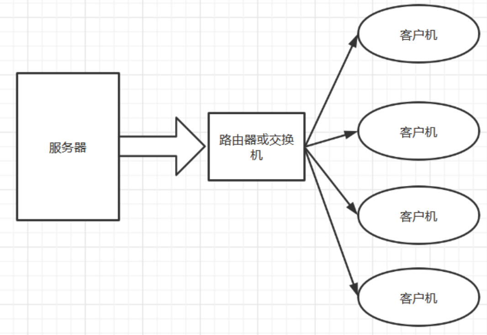
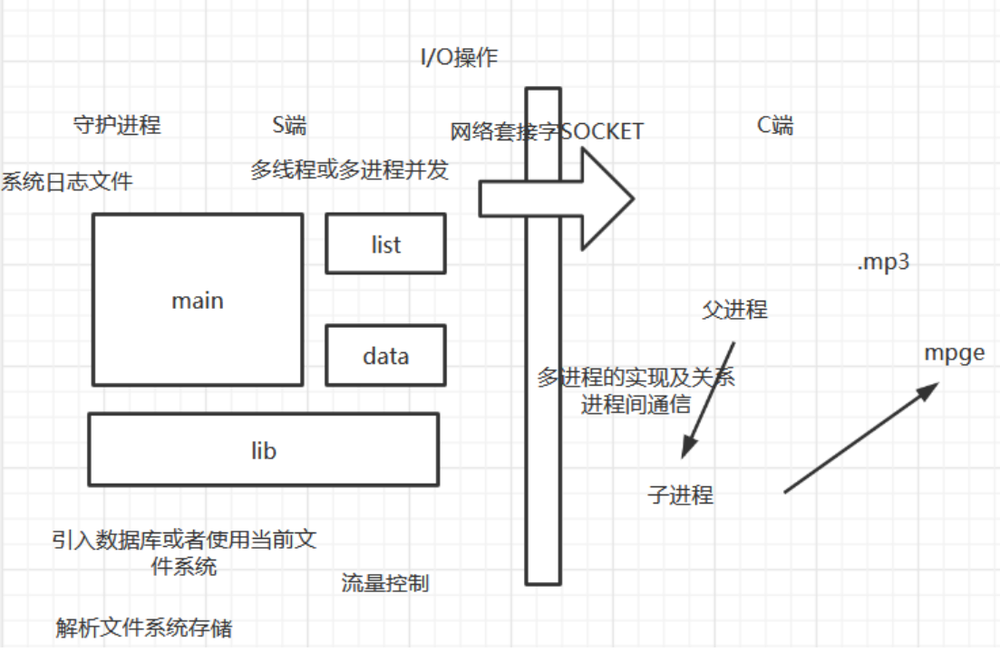

# 01_IPV4流媒体广播项目分析
> 笔记参考：https://blog.csdn.net/m0_46152793/article/details/122449326
## 1.项目名称：基于IPV4的流媒体广播系统

## 2.项目需求

目前需要实现基于客户机和服务器模型的网络音视频广播/点播系统

本音频系统可以广泛应用在语音教室和广播系统等多种场所。

该软件分为服务端和客户端，服务端运行在pc上，客户端可以运行在pc或者嵌入式设备上。

服务器以多播的方式向局域网中所有的客户机发送数据，客户机可以根据自己的选择来决定要接受的数据。如图简示：

## 3.技术架构

其中S端是服务器端，C端是客户端，从S端发送数据给C端，发送一个.mp3的文件。S端会发送一些节目单（类似发送广播节目一样）。data和list从lib传过来，用main将几个模块综合起来。广播是S端发过来，然后自己选择。点播是C端为主动。
C端父进程负责从网络上接受数据，传送给子进程，子进程负责来播放，其中用到了进程间通信（管道，共享，消息队列）。