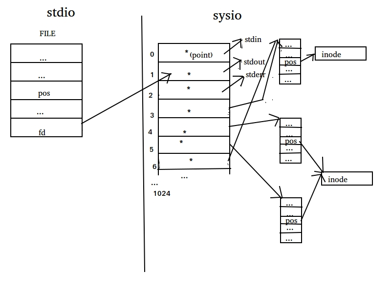

# 系统IO(sysio)
> 参考文档：https://www.cnblogs.com/0xcafebabe/p/4426126.html

上一章讨论了标准 IO，今天主要说说系统 IO。

## 1.文件描述符

在 SYSIO 中贯穿了一个整形数，它就是文件描述符。对内核而言，所有打开的文件都是通过文件描述符引用的。它的作用与 STDIO 中的 FILE 结构体类似，但是它们的工作原理是完全不同的。它实际上是一个由内核保存的数组下标，所以不会是负数，下面我会用一张图来表示它的作用。



图1 SYSIO 文件描述符

图是在 Ubuntu 下好不容易找到了一个画图软件画的，质量不怎么样，小伙伴们先凑合着看吧。

我解释下图上画的东西。

图片一共分为标准 IO 和系统 IO 两部分，系统 IO 部分有一个数组，这个数组中的指针指向了内核中具体描述文件信息的结构体，而通过这些结构体再引用具体的文件(inode)。而操作系统提供给我们的文件描述符就是这个数组的下标。这个数组的长度是 1024，也就表示一个进程最多可以打开 1024 个文件，当然这个上限可以通过 ulimit 命令修改，具体用法这里不再赘述。

当产生一个文件描述符时，优先采用当前最小的可用数值。假设当前已经占用的文件描述符为1、2、3、5，那么再次产生的文件描述符就是 4。

还要注意一点，上面这个文件描述符数组在每个进程中都会持有一份，所以理论上是每个进程最多可以打开 1024 个文件，而不是系统中所有的进程一共只能打开 1024 个文件。

 

## 2.fileno()

```c
#include <stdio.h>

int fileno(FILE *stream);

   Feature Test Macro Requirements for glibc (see feature_test_macros(7)):

       fileno(): _POSIX_C_SOURCE >= 1 || _XOPEN_SOURCE || _POSIX_SOURCE
```

这个函数的作用是从 STDIO 的 FILE 结构体指针中获得 SYSIO 的文件描述符。

## 3.fdopen()

```c
#include <stdio.h>

FILE *fdopen(int fd, const char *mode);

　　Feature Test Macro Requirements for glibc (see feature_test_macros(7)):

     fdopen(): _POSIX_C_SOURCE >= 1 || _XOPEN_SOURCE || _POSIX_SOURCE
```

这个函数和上面的 flieno() 函数的功能是反过来的，作用是把 SYSIO 的文件描述符转换为 STDIO 的 FILE 结构体指针。mode 参数的作用与 fopen() 中的 mode 参数相同，这里不再赘述。

虽然这两个函数可以在 STDIO 与 SYSIO 之间互相转换，但是并**不推荐对同一个文件同时采用两种方式操作**。因为 STDIO 和 SYSIO 之间它们处理文件的私有数据是不同步的，如果同时使用两种方式操作同一个文件则可能带来不可预知的后果，具体可以参考上一篇博文中提到的那个合并系统调用的例子。


## 4.open()
### 4.1 原型
```c
// open - open and possibly create a file or device

#include <sys/types.h>
#include <sys/stat.h>
#include <fcntl.h>

int open(const char *pathname, int flags);
int open(const char *pathname, int flags, mode_t mode);
```

### 4.2 功能
想要使用 SYSIO 操作文件或设备，要先通过 open() 函数获得一个文件描述符。**注意博文中在函数上方标识出来的头文件，大家在使用这个函数的时候一定要一个不少的全部包含到源代码中**。

### 4.3 参数
+ pathname：要打开的文件路径。
+ flags：指定文件的操作方式，多个选项之间用按位或( | )运算符链接。
  + 必选项，三选一：**O_RDONLY, O_WRONLY, O_RDWR**
  + 可选项：可选项有很多，这里只介绍常用的，想要查看完全的可选项，可以查阅 man 手册。

    | 选项        | 说明                                                         |
    | ----------- | ------------------------------------------------------------ |
    | O_APPEND    | 追加到文件尾部。                                             |
    | O_CREAT     | 创建新文件。                                                 |
    | O_DIRECT    | 最小化缓冲。关于缓冲区的解释：buffer 是写操作的加速机制，cache 是读操作的加速机制。 |
    | O_DIRECTORY | 强调一定要打开一个目录，如果 pathname 不是目录则会打开失败。 |
    | O_LARGEFILE | 打开大文件的时候要加这个，会将 off_t 定义为 64 bit，当然也可以在编译的时候使用上一篇博文提到的宏定义来指定 off_t 的长度。 |
    | O_NOFOLLOW  | 如果 pathname 是符号链接则不展开，也就是说打开的是符号链接文件本身，而不是符号链接指向的文件。 |
    | O_NONBLOCK  | 非阻塞形式。阻塞是读取不到数据时死等，非阻塞是尝试读取，无论能否读取到数据都返回。 |
    | O_TRUNC     | 将已存在的普通文件长度截断为0（也就是将文件内容清空）。      |

 

mode：8 进制文件权限。当 flags 包含 O_CREAT 选项时必须传这个参数，否则可以不用传这个参数。当然系统在创建文件的时候不会直接这个参数，而是通过如下的公式计算得到最终的文件权限：

> mode & ~(umask)

　　具体的 umask 的值可以通过 umask 命令获得。通过这样的公式进行计算可以避免程序中创建出权限过高的文件。

不知道小伙伴们注意到没有，这个函数有一个有趣的地方。C 语言中是没有**函数重载**这个概念的，那么为什么这两个 open(2) 函数很像重载的函数呢？实际上它们是用可变长参数列表来实现的。

顿时让我想起来一道面试题：如何确定一个函数是用重载实现的还是用变长参数实现的？答案是给它多传几个参数嘛，如果报错了那一定是函数重载，否则就是变长参数实现的呗。

 

## 5.close()

```c
// close - close a file descriptor

#include <unistd.h>

int close(int fd);
```

 关闭文件描述符。

参数是要关闭的文件描述符。注意当一个文件描述符被关闭之后就不能再使用了，虽然 fd 这个变量的值没有变，但是内核已经将相关的资源释放了，这个 fd 相当于一个野指针了。

返回值：

　　成功为0，失败为-1。但很少对它的返回值做校验，一般都认为不会失败。

 

## 6.read()

```c
// read - read from a file descriptor

#include <unistd.h>

ssize_t read(int fd, void *buf, size_t count);
```

这是 SYSIO 读取文件的函数，作用是从文件描述符 fd 中读取 count 个字节的数据到 buf 所指向的空间。

返回值：返回成功读取到的字节数；0 表示读取到了文件末尾；-1 表示出现错误并设置 errno。

注意 read() 函数与 STDIO 中的 fread() 函数的返回值是有区别的，fread() 返回的是成功读取到了多少个对象，而 read() 函数返回的是成功读取到的字节数量。

## 7.write()

```c
// write - write to a file descriptor

#include <unistd.h>

ssize_t write(int fd, const void *buf, size_t count);
```

write() 是 SYSIO 向文件中写入数据的函数，作用是将 buf 中 count 字节的数据写入到文件描述符 fd 所对应的文件中。

返回值：返回成功写入的字节数；0 并不表示写入失败，仅仅表示什么都没有写入；-1 才表示出现错误并设置 errno。

注意 write() 函数与 STDIO 中的 fwrite() 函数的返回值是有区别的，fwrite() 返回的是成功写入了多少个对象，而 write() 函数返回的是成功写入的字节数量。

大家想一想，为什么会出现写入的值是 0 的情况呢？

其实原因有很多，其中一个原因是当写入的时候发生了阻塞，而阻塞中的 write() 系统调用恰巧被一个信号打断了，那么 write() 可能没有写入任何数据就返回了，所以返回值会是0。至于什么是阻塞，什么是信号，LZ 会在后面的博文中讲解。

## 8.lseek()
### 8.1 原型
```c
// lseek - reposition read/write file offset

#include <sys/types.h>
#include <unistd.h>

off_t lseek(int fd, off_t offset, int whence);
```

### 8.2 功能
通过上一篇博文大家知道了**文件位置指针**这个概念，它是系统为了方便我们读写文件而设定的一个标记，随着我们通过函数对文件的读写，它会自动相应的向文件尾部偏移。

那么是不是说当我们读取过文件的一段内容之后，就没办法回去再次读取同一段内容了呢？

其实不是的，通过 lseek() 函数就可以让我们随心所欲的控制文件位置指针了。

### 8.3 参数列表：
+ fd：要操作的文件描述符；
+ offset：相对于 whence 的偏移量；
+ whence：相对位置；三选一：SEEK_SET、SEEK_CUR、SEEK_END
  + SEEK_SET 表示文件的起始位置；
  + SEEK_CUR 表示文件位置指针当前所在位置；
  + SEEK_END 表示文件末尾；

### 8.4 返回值：
成功时返回文件首相对于移动结束之后的文件位置指针所在位置的偏移量；失败时返回 -1 并设置 errno；

这个函数的 offset 参数和返回值都对基本数据类型进行了封装，这一点要比标准库的 fseek() 更先进。

写一段伪代码来说明这个函数的使用方法。

```c
lseek(fd, -1024, SEEK_CUR); // 从文件位置指针当前位置向前偏移 1024 个字节
lseek(fd, 1024, SEEK_SET); // 从文件起始位置向后偏移 1kb
lseek(fd, 1024UL*1024UL*1024UL*5UL, SEEK_SET); // 产生一个 5GB 大小的空洞文件
```

## 9.time()

之前讨论过 STDIO 与 SYSIO 的效率问题，所以在这里聊一聊 time命令。

这个命令可不是用来查看系统当前时间的，想要查看系统时间得使用 date 命令，这个不是我们今天要讨论的内容，所以就不说了。

time命令的作用是监视一个程序的用户时间，从而可以粗略的帮助我们分析这个程序的执行效率。


```c
while ((readlen = read(srcfd, buf, BUFSIZE)) > 0) {
    pos = 0;
    while (readlen > 0) {
        writelen = write(destfd, buf+pos, readlen);
        if (writelen < 0) {
            err = errno;
            goto e_write;
        }
        pos += writelen;
        readlen -= writelen;
    }
}
```

 这是一个模仿 cp 命令的程序的核心部分代码，其中的 buf 是一个 char 数组，用来作为数据读写的缓存。当 buf 的容量不同时文件拷贝的效率也是不同的，因为过于频繁的执行系统调用和使用过大的缓存都会使效率下降。如果通过不停的修改 buf 的容量的方式测试 buf 为多大的时候拷贝效率最高的话，就可以使用 time(1) 命令监视程序的执行时间。

```shell
> \>$ gcc -Wall mycp_sysio.c -o mycp_sysio
> \>$ time ./mycp_sysio rhel-server-6.4-x86_64-dvd.iso tmp.iso
> real 1m30.014s
> user 0m0.003s
> sys 1m29.003s
```
+ sys 是程序在内核态消耗的时间，也就是执行系统调用所消耗的时间。 
+ user 是程序在用户态消耗的时间，也就是程序本身的代码所消耗的时间。
+ real 是用户等待的总时间，是 sys + user + CPU 调度时间，所以 real 时间会稍微比 sys + user 时间长一点。一个程序从提高响应素的的方式提高用户体验，一般指的就是提高 real 时间。

## 10.文件共享

文件共享就是指多个进程共同处理同一个文件，就是 图1 中第二个文件表项和第三个文件表项共同指向同一个 inode 的图示，不过这两个文件表项来自于不同的进程表项时才叫做文件共享。

## 11.原子操作

通俗来讲，原子操作就是将多个动作一气呵成的做完，中间不会被打断，要么执行完所有的步骤，要么一步也不会执行。这里用创建临时文件来举个栗子。

```c
// tmpnam, tmpnam_r - create a name for a temporary file

#include <stdio.h>

char *tmpnam(char *s);
```

如果我们需要创建一个临时文件，那么首先需要由操作系统提供一个文件名，然后再创建这个文件。

tmpnam() 函数就是用来获得临时文件的文件名的。为什么要通过这个函数由操作系统来为我们生成文件名呢？就是因为系统中进程比较多，临时文件也比较多，怕文件重名嘛。

但是这个函数只负责生成一个目前系统中不存在的临时文件名，并不负责创建一个文件，所以创建文件的任务要由我们自己使用 fopen() 或 open() 等手段创建。

假设在我们拿到这个文件名的时候，临时文件还没有在磁盘上真正创建，另一个进程拿到了一个与我们相同的文件名，那么这个时候再创建文件就是有问题的了。

这就是因为获得文件名与创建文件这个动作**不原子**造成的，如果获得唯一的文件名和创建文件这个动作一气呵成中间不会被打断，则这个问题就不会发生，我们创建好文件之后另一个进程就再也拿不到相同的文件名了。

```c
// tmpfile - create a temporary file

#include <stdio.h>

FILE *tmpfile(void);
```

既然使用 tmpnam() 函数无法原子的创建临时文件，那么就没有原子的方式来避免上面描述的问题了吗？当然有办法，那就是使用 tmpfile() 函数来创建临时文件。

tmpfile() 函数是获得文件名和创建临时文件的动作一气呵成的，它直接会返回一个创建好的 FILE 结构体指针给我们，这样一来妈妈再也不用担心我们的文件名会被别人抢占了。:)

当然系统中有许多地方需要原子操作，不仅仅是创建临时文件，所以系统还有其它函数提供了原子操作，遇到的时候我们再讲解，这里不再详述。


## 12.dup()、dup2()

```c
// dup, dup2 - duplicate a file descriptor

#include <unistd.h>

int dup(int oldfd);
int dup2(int oldfd, int newfd);
```
这两个函数是用来复制文件描述符的，就是 图1 中 文件描述符 3 和 6 指向了同一个文件表项的情况。

举个栗子，用 dup() 实现输出的重定向。


```c
#include <stdio.h>
#include <unistd.h>

int main (void)
{                                                                               
    /* 要求在不改变下面的内容的情况下，使输出的内容到文件中  */

    puts("dup test.");

    return 0;
}
```

puts() 函数是将参数字符串写入到标准输出 stdout（文件描述符是 1） 中，而标准输出默认目标是我们的 shell。如果想要让 puts() 的参数输出到一个文件中，

实现思路是：首先打开一个文件获得一个新的文件描述符，然后关闭标准输出文件描述符(1)，然后使用 dup() 函数族复制产生一个新的文件描述符，此时的 1 号文件描述符就不是标准输出的文件描述符了，而是我们自己创建的文件的描述符了。还记得我们之前提到过吗，文件描述符优先使用可用范围内最小的。进程中当前打开的文件描述符有标准输入(0)、标准输出(1)、标准错误(2)和我们自己打开的文件(3)，当我们关闭了 1 号文件描述符后，当前可用的最小文件描述符是 1，所以新复制的文件描述符就是 1。而标准库函数 puts() 在调用系统调用 write() 函数向 1 号文件描述符打印时，正好是打印到了我们所指定的文件中。


```c
#include <stdio.h>
#include <unistd.h>
#include <fcntl.h>

#include <sys/types.h>
#include <sys/stat.h>

int main (void)
{
    int fd = -1;

    fd = open("tmp", O_WRONLY | O_CREAT | O_TRUNC, 0664);
    /* if error */

    #if 0
    close(1); // 关闭标准输出
    dup(fd);
    #endif
    dup2(fd, 1);
    close(fd);

    /* 要求在不改变下面的内容的情况下，使输出的内容到文件中  */

    puts("dup test.");

    return 0;
}
```
由于题目的要求是 puts() 上面注释以下的内容都不能修改，原则上 1 号文件描述符在这里使用完毕也需要 close()，所以这里造成了一个内存泄漏，但并不影响对 dup() 函数族的解释和测试。

上面的代码用 close() + dup() 的方式或者 dup2() 的方式都可以实现。

dup() 和 dup2() 的作用是相同的，区别是 dup2() 函数可以用第二个参数指定新的文件描述符的编号。

如果新的文件描述符已经被打开则先关闭它再重新打开。

如果两个参数相同，则 dup2() 函数会返回原来的文件描述符，而不会关闭它。

另外一点比较重要，close() + dup() 的方式不原子，而 dup2() 这两步动作是原子的，在并发的情况下可能会出现问题。后面的博文我们会通过信号和多线程来讨论并发。

 

## 13.sync()

```c
// sync, syncfs - commit buffer cache to disk

#include <unistd.h>

void sync(void);
```

sync() 函数族的函数作用是全局催促，将 buffer 和 cache 刷新和同步到 disk，一般在设备即将卸载的时候使用。这个函数族的函数不是很常用，所以用到的时候再具体讨论，这里不再详述。

 

## 14.fcntl()

```c
// fcntl - manipulate file descriptor

#include <unistd.h>
#include <fcntl.h>

int fcntl(int fd, int cmd, ... /* arg */ );
```

这是一个管家级别的函数，根据不同的 cmd 和 arg 读取或修改对已经打开的文件的操作方式。具体的命令和参数请查阅 man 手册，这里不再花费大量篇幅赘述。


## 15.ioctl()

```c
// ioctl - control device

#include <sys/ioctl.h>

int ioctl(int d, int request, ...);
```

Linux 的一切皆文件的设计原理将所有的设备都抽象为一个文件，当一个设备的某些操作不能被抽象成打开、关闭、读写、跳过等动作时，其它的动作都通过 ioctl() 函数控制。

例如将声卡设备抽象为一个文件，录制音频和播放音频的动作则可以被抽象为对声卡文件的读、写操作。但是像配置频率、音色等功能无法被抽象为对文件的操作形式，那么就需要通过 ioctl() 函数对声卡设备进行控制，具体的控制命令则由驱动程序提供。

## 16. /dev/fd

/dev/fd 是一个虚拟目录，它里面是当前进程所使用的文件描述符信息。如果用 ls() 查看，则里面显示的是 ls() 这个进程所使用的文件描述符信息。而打开里面的文件则相当于复制文件描述符。

文件 IO 部分到此就结束了，如有问题欢迎大家斧正。:)