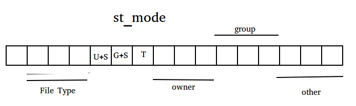
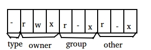
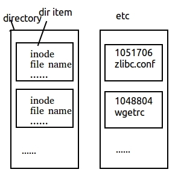
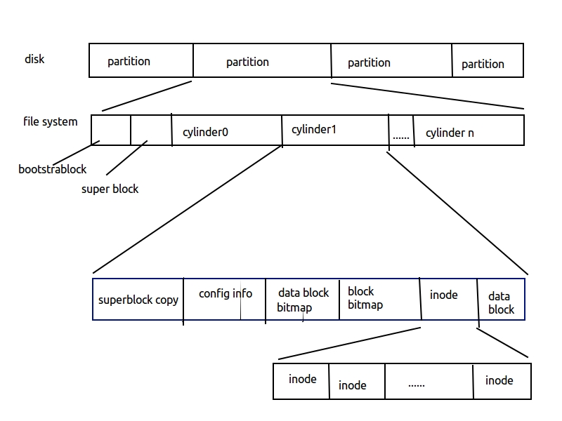
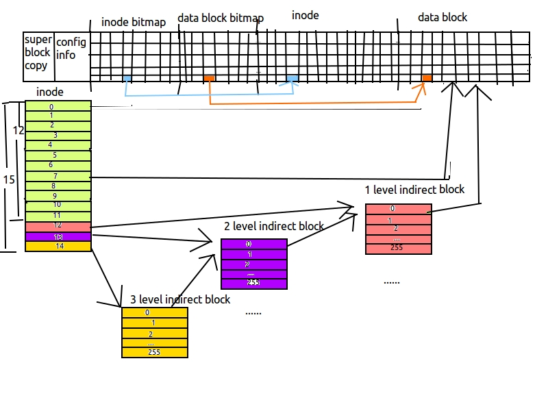

# 03.文件系统(FS:File System)
> 参考文档：https://www.cnblogs.com/0xcafebabe/p/4430632.html

前面两篇讲了文件 IO 的基本操作，但是它们操作的都是文件本身所存储的有效数据。而文件系统保存文件的时候不仅仅要存储文件内的数据，还要存储许多**亚数据**，即文件属性和其它特征数据。下面就带领大家讨论文件系统亚数据的操作。

## 1.stat()
```c
// stat, fstat, lstat - get file status

#include <sys/types.h>
#include <sys/stat.h>
#include <unistd.h>

int stat(const char *path, struct stat *buf);
int fstat(int fd, struct stat *buf);
int lstat(const char *path, struct stat *buf);
```

stat() 函数族是专门用来获取文件的亚数据信息的。系统中 stat 命令就是利用这个函数实现的。

它们会根据文件的路径(path)或是已打开的文件的文件描述符(fd)得到该文件的亚数据，并将他们回填到 struct stat 类型的结构体中供调用者使用。

下面介绍下 struct stat 的字段含义：

```c
struct stat {
    dev_t     st_dev;     /* ID of device containing file */
    ino_t     st_ino;     /* inode 号 */
    mode_t    st_mode;    /* 权限和文件类型，位图，权限位9位，类型3位，u+s 1位，g+s 1位，粘滞位(T位)1位。位图是用一位或几位数据表示某种状态。许多要解决看似不可能的问题的面试题往往需要从位图着手。*/
    nlink_t   st_nlink;   /* 硬链接数量 */
    uid_t     st_uid;     /* 文件属主 ID */
    gid_t     st_gid;     /* 文件属组 ID */
    dev_t     st_rdev;    /* 设备号，只有设备文件才有 */
    off_t     st_size;    /* 总大小字节数，编译时需要指定宏 -D_FILE_OFFSET_BITS=64，否则读取大文件可能导致溢出 */
    blksize_t st_blksize; /* 文件系统块大小 */
    blkcnt_t  st_blocks;  /* 每个 block 占用 512B，则整个文件占用的 block 数量。这个值是文件真正意义上所占用的磁盘空间 */
    // 下面三个成员都是大整数，实际使用时需要先转换
    time_t    st_atime;   /* 文件最后访问时间戳 access time */
    time_t    st_mtime;   /* 文件最后修改时间戳 modify time */
    time_t    st_ctime;   /* 文件亚数据最后修改时间戳 change time */
}
```

**在 Linux 系统中，一个文件实际占用了多大的磁盘空间要看 st_blocks 的数量，而不是看 st_size 的大小。**

一般情况下文件系统的一个 block 的大小为 4KB，而每个 st_blocks 是 512B，所以一个有效文件占用磁盘空间最小的大小为 8 个 st_blocks。

下面我们用前面学过的函数举个栗子来说明 blocks 这个东西。


```c
#include <stdio.h>
#include <unistd.h>
#include <fcntl.h>

#include <sys/types.h>
#include <sys/stat.h>

int main (void)
{
    int fd = -1;

    fd = open("tmp", O_RDWR | O_CREAT, 0664);
    lseek(fd, 1024UL*1024UL*1024UL*5UL-1UL, SEEK_SET); // 指定文件指针到某个位置
    write(fd, "", 1);
    close(fd);

    return 0;
}
```

```shell
> \>$ gcc -Wall lseek.c -o lseek
> \>$ ./lseek
> \>$ ls -lh tmp
> -rw-rw-r-- 1 yuhuashi yuhuashi 5.0G 4月 15 23:26 tmp
>
> \>$ stat tmp
>
> File: ‘tmp’
> Size: 5368709120 Blocks: 8 IO Block: 4096 regular file
> Device: 13h/19d Inode: 222778 Links: 1
> Access: (0664/-rw-rw-r--) Uid: ( 1000/yuhuashi) Gid: ( 1000/yuhuashi)
> Access: 2015-04-15 23:28:38.532203798 +0800
> Modify: 2015-04-15 23:28:38.532203798 +0800
> Change: 2015-04-15 23:28:38.532203798 +0800
> Birth: -
```

这段代码的功能是生成一个 5GB 大小的空洞文件（即内容全部为 \0 的文件）。

实现方法很简单，首先创建一个文件，然后将文件位置指针向后偏移 5GB - 1byte，使用 UL 是为了防止数据类型溢出，然后用系统调用写入最后一字节，关闭文件，完成。

为什么最后要使用系统调用 write() 函数写入一个字节在上一篇博文中已经解释过了，如果不发生系统调用，则生成的文件 blocks 为 0，即不占用实际的磁盘空间。

用 ls命令可以看到，文件的大小为 5GB，但是用 stat 命令查看，虽然 Size 是 5368709120，但 Blocks 却只有 8，这说明文件实际只占用了磁盘空间的 4KB。

那么既然 st_size 表示的不是实际的文件大小，那它又有什么用途呢？它其实只是文件系统记录的一个属性而已，并没有什么特别之处。

类似 stat()、fstat()、lstat() 函数族这种命名的函数在 Linux 系统中有很多这一点值得大家注意，总结出了这样的规律，以后大家在见到新的函数的时候就能大致做到“见名知义”。

+ stat()：一般函数族中函数名称不带前缀的表示普通的用法，比如 stat() 函数通过文件路径 path 参数读取并解析一个文件的亚数据。
+ fstat()：一般函数族中某个函数名称以 f 开头的表示解析的文件来源不再是文件路径 path，而是已打开的文件对应的文件描述符了(fd)。
+ lstat()：一般函数族中某个函数名称以 l 开头的表示如果 path 参数指定的文件是一个符号链接则不要展开它，而是直接处理符号链接文件本身。上面两个函数如果拿到的是一个符号链接，则会展开它，读取符号链接所指向的真实文件的亚数据。

## 2.文件类型

通过 struct stat 结构体的 st_mode 成员可以获得文件类型信息。

Linux 系统中的文件共分为 7 种类型：dcb-lsp

+ d 目录
+ c 字符设备文件
+ b 块设备文件
+ - 普通文件
+ l 符号链接文件
+ s 套接字文件
+ p 管道文件

是不是很奇怪这些符号是什么？其实当你使用 ls 命令查看文件详细信息的时候就应该注意到了，权限位的第一个符号就是上面这些符号，也就是下面标红的部分。


```shell
>$ touch file1.txt
>$ mkdir files
>$ mkfifo fifo
>$ sudo mknod fileb b 10 20
>$ sudo mknod filec c 10 21
>$ ln -s /etc/services services
>$ nc -Ul socet
>$ ls -l
total 0
prw-rw-r-- 1 yuhuashi yuhuashi      0  4月 16 16:46 fifo
-rw-rw-r-- 1 yuhuashi yuhuashi      0  4月 16 16:24 file1.txt
brw-r--r-- 1 root     root     10, 20  4月 16 16:30 fileb
crw-r--r-- 1 root     root     10, 21  4月 16 16:31 filec
drwxrwxr-x 2 yuhuashi yuhuashi     40  4月 16 16:24 files
lrwxrwxrwx 1 yuhuashi yuhuashi     13  4月 16 16:31 services -> /etc/services
srwxrwxr-x 1 yuhuashi yuhuashi      0  4月 16 16:39 socet
```


st_mode 是使用位图的形式来保存文件的类型和权限信息的，那么位图是什么？

位图就是用某一位或几位来表示不同状态的一种手段。如果某一位为 1 则认为某个功能是使能的，为 0 则认为对应的功能是 disable 的。



图1 st_mode 位图

其中 0-2 位表示 Other 权限，3-5 位表示 Group 权限，6-8 位表示 Owner 权限，9 位表示粘着位（T位），10 位表示 G+S 位，11 位表示 U+S 位，12-14 位表示上面所述的7种文件类型，15 位预留。

好吧其实画完了才发现这图的高低位画反了，**本图的左侧为高位，右侧为低位**。

st_mode 位图介绍完了，下面我们来说说其中的文件类型位。

系统提供了一些宏来操作这个位图，其中下面的八个宏专门用于提取 12-14 位。

+  `S_IFMT`     0170000　　bit mask for the file type bit fields　从 st_mode 中提取出文件类型位，其它位清零
+  `S_IFSOCK`  0140000　　socket　　　　　　　　　　　　　  套接字文件
+  `S_IFLNK`    0120000　　symbolic link　　　　　　　　　　　符号链接文件
+  `S_IFREG`    0100000　　regular file　　　　　　　　　　　　普通文件
+  `S_IFBLK`    0060000　　block device　　　　　　　　　　　块设备文件
+  `S_IFDIR`    0040000　　directory　　　　　　　　　　　　　目录
+  `S_IFCHR`    0020000　　character device　　　　　　　　　字符设备
+  `S_IFIFO`     0010000　　FIFO　　　　　　　　　　　　　　管道文件


```c
struct stat info;
lstat("file.txt", &info);
// 假如 st_mode 的值是 0100664，0 开头表示以八进制形式表示
info.st_mode & S_IFMT // == 0100000        直接取出 file.txt 的文件类型位，其它位清零
info.st_mode & S_IFDIR // == 0             获得 file.txt 是否为目录
info.st_mode & S_IFREG // == 0100000       获得 file.txt 是否为普通文件
S_ISDIR(info.st_mode) // == 0              使用宏判断 file.txt 是否为目录
S_ISREG(info.st_mode) // == 1              使用宏判断 file.txt 是否为普通文件
```

系统也提供了七个带参数的宏，可以帮我们直接判断文件的类型：

+ `S_ISREG(m)`     is it a regular file?                     是否为普通文件
+ `S_ISDIR(m)`     directory?                            是否为目录
+ `S_ISCHR(m)`     character device?                     是否为字符设备文件
+ `S_ISBLK(m)`     block device?                         是否为块设备文件
+ `S_ISFIFO(m)`    FIFO (named pipe)?                    是否为管道文件
+ `S_ISLNK(m)`     symbolic link? (Not in POSIX.1-1996.)     是否为符号链接文件
+ `S_ISSOCK(m)`   socket? (Not in POSIX.1-1996.)           是否为套接字文件

在使用这些宏的时候只需要将 st_mode 作为参数传入即可，如果是某个类型的文件，它们会返回 1，否则返回 0，可以方便的在 if 语句中使用。


## 3.设置用户 ID 和设置组 ID

这一节说的是 st_mode 位图中的 U+S 位和 G+S 位。

可以使用下面的宏获得这两位的状态，相信大家都能看得懂，用法和上面介绍的文件类型位是一样的，具体的就不再赘述了。

+ `S_ISUID` 0004000 set-user-ID bit
+ `S_ISGID` 0002000 set-group-ID bit (see below)

## 4.文件访问权限

文件访问权限就是 st_mode 位图中的低 9 位。

大家都知道，在 Linux 系统中文件的权限分为 3 个组：文件属主权限、文件属组权限、其它用户权限，而每个组又分为 4 种权限：读取(r)、写入(w)、执行(x)、无权(-)。

所以在使用 ls -l 命令时可以得到类似 -rwx-r-xr-x 的权限标志，这个标志就是这样来的。



图2 权限标志


就像文件类型一样系统提供了宏供我们方便的从 st_mode 中得到对应的权限位：

+ S_IRWX`U`    00700     mask for file owner permissions  用户文件权限掩码，当 st_mode & 这个宏时，计算结果将只保留 st_mode 中的文件属主权限，其它位全部被清零。注意只是将计算结果中其它位清零，并不是把 st_mode 本身的数据清零。
+ S_I`R`USR     00400     owner has read permission  用户有读权限
+ S_I`W`USR    00200    owner has write permission  用户有写权限
+ S_I`X`USR     00100     owner has execute permission 用户有执行权限
+ 
+ S_IRWX`G`    00070     mask for group permissions 组权限掩码
+ S_I`R`GRP     00040     group has read permission 用户组有读权限
+ S_I`W`GRP    00020     group has write permission 用户组有写权限
+ S_I`X`GRP     00010     group has execute permission 用户组有执行权限
+ 
+ S_IRWX`O`    00007     mask for permissions for others (not in group) 其他人权限掩码
+ S_I`R`OTH     00004     others have read permission 其他人有读权限
+ S_I`W`OTH    00002     others have write permission 其他人有写权限
+ S_I`X`OTH     00001     others have execute permission 其他人有执行权限

 

## 5.access()

```c
// access - check real user's permissions for a file

#include <unistd.h>

int access(const char *pathname, int mode);
```

测试当前进程对 pathname 文件是否具有 mode 权限，成功返回 0，失败返回 -1 并设置具体的 errno。

如果 pathname 是符号链接，则不会展开，而是测试符号链接文件本身。

mode 可以选择：

+ F_OK：检测文件是否存在；
+ R_OK：检测是否具有读权限；
+ W_OK：检测是否具有写权限；
+ X_OK：检测是否具有执行权限；

## 6.umask()

```c
// umask - set file mode creation mask

#include <sys/types.h>
#include <sys/stat.h>

mode_t umask(mode_t mask);
```

用于设定进程文件模式的掩码（又称屏蔽字），并返回之前的值。`umask 值越大`，权限越低。umask命令就是用这个函数封装的。

参数 mask 由以下位构成，使用按位或运算符指定多个模式：

| st_mode 屏蔽          | 含义                 |
| --------------------- | -------------------- |
| S_IRUSRS_IWUSRS_IXUSR | 属主读属主写属主执行 |
| S_IRGRPS_IWGRPS_IXGRP | 属组读属组写属组执行 |
| S_IROTHS_IWOTHS_IXOTH | 其他读其他写其他执行 |

表1 st_mode 掩码


## 7.chmod()

```c
// chmod, fchmod - change permissions of a file

#include <sys/stat.h>

int chmod(const char *path, mode_t mode);
int fchmod(int fd, mode_t mode);
```

 

chmod() 函数族的函数用于更改现有文件的访问权限。看到这两个文件的命名方式是不是觉得似曾相识？

没错，上面我们讲 stat() 系统调用的时候就说过这种命名约定，fun()、ffun()、lfun()等等见名知义，系统中还有很多函数都是遵循这样的约定的。

chmod 命令就是使用 chmod() 函数族封装的，mode 参数位图与 表1 中的掩码是一致的，另外还支持 S_ISUID (U+S)、S_ISGID (G+S) 和 S_ISVTX (T位)。多个位使用按位或的方式进行计算再传参。

## 8.粘着位

粘滞位是在早期的 Unix 系统中为常用的可执行程序（bin）设置的，这样可以将使用频繁的程序驻留在内存中。现在 Unix 使用了 Page Cache 技术，可以使常用的数据块驻留在内存中了，所以粘滞位的作用越来越弱化了。

## 9.chown()
> change owner
```c
// chown, fchown, lchown - change ownership of a file

#include <unistd.h>

int chown(const char *path, uid_t owner, gid_t group);
int fchown(int fd, uid_t owner, gid_t group);
int lchown(const char *path, uid_t owner, gid_t group);
```

chown() 函数族用来修改文件所有者。修改成功返回 0，修改失败返回 -1 并设置 errno。

修改文件所有者这件事在 Linux 中只有超级用户能做，这是为什么呢？举个简单的栗子：

假设系统中有 A 和 B 两个用户，而系统对用户磁盘进行了配额限制。如果 chown() 这件事任何人都可以做，那么当 A 用户的磁盘配额不够用的时候，他就可以创建一个具有 0777 权限的文件夹，然后将这个文件夹的所有者修改为 B 用户，这样自己依然可以使用这个文件夹，但是却绕过了磁盘配额的限制，将帐算在了 B 用户的头上。

所以为了安全起见， chown() 只能由超级用户来做，普通用户不仅无法修改别人文件的所有者，也无权修改自己文件的所有者。


## 10.truncate()

```c
// truncate, ftruncate - truncate a file to a specified length

#include <unistd.h>
#include <sys/types.h>

int truncate(const char *path, off_t length);
int ftruncate(int fd, off_t length);
```

truncate() 函数族的文件用于截断 path 所指定的文件到 length 个字节。

如果想要清空一个文件，可以在 open() 的时候指定 flags 为 O_TRUNC。

+ 如果 length 参数小于文件之前的长度，则 length 个字节后面的数据将被丢弃。
+ 如果 length 参数大于文件之前的长度，则在文件末尾用 '\0' 填充，使文件达到 length 指定的长度，也就是在文件的尾部创建了一个空洞。


## 11.古老的 UFS 文件系统

FAT 是大家所熟悉的 Dos 文件系统，它是顺序存储的单链表结构，所以单链表的缺点就是 FAT 文件系统的缺点。只能从前往后访问，不能反向访问，而且无法管理大文件。

UFS 文件系统是一个与 FAT 同时代的 Unix 文件系统，但是 UFS 文件系统却是与 FAT 完全不同的文件系统，它可以很好的支持大文件，但小文件的管理却是它的弱点。

下面我们介绍一下 UFS 文件系统。

目录也是一个文件， 它存储的内容是一个个的目录项，而每一个目录项记录的是目录中文件的 inode 和文件名等信息，如图 3 所示。



图3 目录

所以目录中并不是存储文件的数据，而是存储文件的信息。

而 UFS 文件系统是如何管理磁盘的呢？见下图，图4 是参照 APUE 第三版 91 页图4-13 画的。



图4 磁盘、分区和文件系统

画图工具无法输入中文，只能画成英文的了，而且画上去的东西撤销掉有时候会留下痕迹，我也是醉了。。

上图中的蓝框部分是我要详细介绍的部分。

下面我把蓝框的部分单独画一幅图出来详细说明一下，它是每一个柱面组的组成部分，柱面组就是上图第二行的 cylinder。



图5 柱面组

现在我解释一下图上画的都是什么东西。

上面横着的表格：

+ data block：文件数据的逻辑存储块，每个块的大小是 4KB 的倍数。
+ data block bitmap：这是一个位图，为了提高数据块的查找速度而设计的。位图中的每一位对应 data block 中的一个块，当某一位为 1 时表示对应的块被占用，为 0 时表示对应的块可用。
+ inode：包含文件的所有信息，除了文件名，因为文件名是包含在目录文件中的。
+ inode bitmap：与 block 位图一样，也是为了提高 inode 的访问速度而设计的。位图中的每一位对应 inode 区域的一块数据，当某一位为 1 时表示对应的 inode 被占用，为 0 时表示对应的 inode 可用。

图下半部分的表格：

+ inode：inode 中记录数据存储位置的部分。是一个包含 15 个磁盘块地址的数组，其中前 12 个地址是**直接地址**，它们直接指向 data block 的数据块。如果使用 12 个数据逻辑存储块无法容纳下一个文件，那么就会启用数组中第 13 个元素，它不直接指向数据块，而是指向一级**间接块**的。
+ 1 level indirect block：一级间接块。包含 256 个磁盘块地址的数组，每个元素指向 data block 区域的一个数据逻辑存储块。如果依然无法容纳下一个文件，那么将启用 inode 中的第14个元素，它指向二级间接块。
+ 2 level indirect block：二级间接块。包含 256 个磁盘块地址的数组，每个元素指向一个一级间接块数组。如果依然无法容纳下一个文件，那么将启用 inode 中的第15个元素，它指向三级间接块。
+ 3 level indirect block：三级间接块。包含 256 个磁盘块地址的数组，每个元素指向一个二级间接块数组。

这回知道为什么 UFS 文件系统不惧怕大文件了吧？但是——UFS 文件系统不善于管理小文件，这是为什么呢？

答案其实很简单，因为文件系统中数据块的数量远比 inode 块多得多，所以一个 inode 块才能够对应多个 data block。而如果小文件太多，会导致在 data block 还有大量剩余空间的情况下就把 inode 耗尽了。

有些人认为 UFS 无法管理小文件，其实这是不正确的，只是 UFS 的设计策略使它不善于管理小文件而已。

现在知道为什么同时代的文件系统，*nix 的要远比 win 的先进了吧。

关于上面这幅图我有一点需要补充说明一下，图画得有不明确的地方：

左侧 inode 数组中第 12 个元素指向的右侧粉色标识的一级间接块数组，而图上中间紫色标识的二级间接块数组中的成员也指向粉色的一级间接块数组。其实紫色二级间接块数组中的成员并非同样指向了 inode 数组中第 12 个元素所指向的位置，图上的意思是二级间接块数组中的每个成员都指向了一个一级间接块数组，而并非是指向了与 inode[12] 的指向相同的地址！左侧黄色标识的三级间接块同理。


## 12.函数 link()、unlink() 和 remove()
```c
// link - make a new name for a file
#include <unistd.h>
int link(const char *oldpath, const char *newpath);


// unlink - delete a name and possibly the file it refers to
#include <unistd.h>
int unlink(const char *pathname);

// remove - remove a file or directory
#include <stdio.h>
int remove(const char *pathname);
```

Linux 系统中 ln 命令是用来创建文件链接的。

+ `ln` 产生**硬链接**。

+ `ln -s` 产生**符号链接**，s 是 symbol，不是 soft，所以不是**软链接**而是符号链接。
  > 硬链接和符号链接(`也称软链接`)有什么区别呢？
  + 硬链接的 inode 号没有改变，inode 号是文件的唯一标识。所以创建硬链接没有产生新文件，硬链接就是目录项的同义词，实际上就是在当前的目录项上多写了一条记录。硬链接不能跨分区，不能为目录文件建立硬链接。
  + 符号链接产生了新的 inode 号，说明产生了新的文件，但并不分配磁盘块(block)。符号链接可以跨分区，可以为目录文件建立符号链接。
+ link()、unlink() 函数用于创建和删除符号链接。
+ remove() 相当于 rm() 命令，它是使用 unlink() 、rmdir() 函数封装的。它在删除文件的时候其实并没有立即将文件的**数据块**从磁盘上移除，而是在被删除的文件没有任何进程引用的时候才将它的数据块释放。

## 13.rename()

```c
// rename - change the name or location of a file
#include <stdio.h>
int rename(const char *oldpath, const char *newpath);
```
rename() 函数用于重命名文件或目录。

## 14.utime()

```c
// utime - change file last access and modification times

#include <sys/types.h>
#include <utime.h>

int utime(const char *filename, const struct utimbuf *times);
```

utime() 函数用于修改文件的最后访问时间戳和最后修改时间戳。

个人感觉这个函数没什么实际用途，除非是在干坏事的时候想要擦除脚印，避免被别人发现。否则有什么理由能去修改一个文件的最后访问时间和最后修改时间呢？

 

## 15.mkdir()、rmdir()
```c
// mkdir - create a directory
#include <sys/stat.h>
#include <sys/types.h>
int mkdir(const char *pathname, mode_t mode);


// rmdir - delete a directory
#include <unistd.h>
int rmdir(const char *pathname);
```

与 mkdir() 和 rmdir() 命令一样，用于创建和删除目录。但是 rmdir() 只能删除空白目录，如果想要删除非空目录需要自行递归实现。

## 16.chdir()

```c
// chdir, fchdir - change working directory

#include <unistd.h>

int chdir(const char *path);
int fchdir(int fd);
```

用于改变进程的工作目录，参数 path 和 fd 表示要修改到的目标目录。cd 命令就是用这个函数封装的。这个函数在后面我们讲守护进程的时候会再次用到。

有人认为 chdir() 这个函数接口不应该被公开，因为它可以穿透假根技术(chroot())，带来一定的安全隐患。

## 17.getcwd()

```c
// getcwd - get current working directory

#include <unistd.h>

char *getcwd(char *buf, size_t size);
```

用于获取进程当前工作路径的绝对路径，pwd 命令是用该函数封装的。

 

## 18.glob() 

### 18.1 功能
读目录,所谓读目录其实是读取出目录中的文件列表，对目录的访问分为两种方式：glob() 和 xxxxdir() 函数族。

我们先来说说使用 glob() 的方式访问目录。

```c
// glob,  globfree  -  find pathnames matching a pattern, free memory from glob()

#include <glob.h>

int glob(const char *pattern, int flags, int (*errfunc) (const char *epath, int eerrno), glob_t *pglob);
void globfree(glob_t *pglob);
```

### 参数列表
+ pattern：匹配文件路径的表达式，可以是通配符。比如输入 "/home/*"，glob(3) 函数会解析到 /home/ 目录下所有的文件列表。
+ flags：特殊要求。
  > 很多函数都支持特殊要求的设置，在遇到可以设定特殊要求的函数时，如果没有特殊要求，如果它是一个位图就传入0，如果它是一个指针就传入 NULL。glob() 函数有很多特殊要求，常用的只有以下几个：
  + GLOB_NOSORT：不排序，解析到哪个就是哪个。默认是排序的，使用这个选项可以提高效率。
  + GLOB_APPEND：将多次调用 glob(3) 解析到的结果追加到一起。但是第一次调用的时候不能传入这个参数，否则会导致 glob(3) 动态内存分配失败。
  + GLOB_NOCHECK：不检查是否匹配到文件，与 GLOB_APPEND 参数一同使用时，可以把 pglob 参数看作是一个像 argv 一样的可变长数组，可以存储任何字符串。
+ errfunc：当 glob() 函数出错的时候的回调函数，如果不需要异常处理可以传入 NULL。
+ pglob：将解析的结果回填到这个参数中。
    ```c
    typedef struct {
        size_t   gl_pathc;    /* Count of paths matched so far  */
        char   **gl_pathv;    /* List of matched pathnames.  */
        size_t   gl_offs;     /* Slots to reserve in gl_pathv.  */
    } glob_t;
    ```

大家看 gl_pathc 和 gl_pathv 有木有觉得眼熟？是不是跟 argc 和 argv 很像？其实它们的用法和很相似。

gl_pathv 中存放的是根据 pattern 参数解析出来的所有文件列表的路径，而 gl_pathc 就是 gl_pathv 的数量。

一个目录中存放的文件的数量是不确定的，所以 gl_pathv 中的成员数量一定也是不确定的，那么它一定用到了 malloc(3) 函数族使用动态内存来保存解析出来的数据。根据**“谁申请，谁释放”**的原则， glob(3) 还提供了一个释放它所申请的资源的函数：globfree(3)。

globfree() 函数的使用就很明了了，将 glob() 函数产生在 pglob 参数中所申请的内存释放掉。

下面写个简单的栗子，用于获取某个目录下所有文件占用磁盘的空间(blocks / 2)，模仿 du(1) 命令的实现。du(1) 命令是做了权限处理的，而我们的 mydu 没有处理文件权限，所以得出的结果可能略有差异。


```c
#include <stdio.h>
#include <stdlib.h>
#include <glob.h>
#include <unistd.h>
#include <string.h>

#include <sys/types.h>
#include <sys/stat.h>

#define BUFSIZE    1024

int path_noloop (const char *path) {
    // 去除 . 和 ..
    char *pos = strrchr(path, '/');
    if (pos) {
        if ((!strcmp("/.", pos))
                || (!strcmp("/..", pos))) {
            return 0;
        }
    } else if ((!strcmp(".", path)) || (!strcmp("..", path))) {
        return 0;
    }

    return 1;
}

int mydu(const char *path)
{// /a/b/c/d/f/g
    static char str[BUFSIZE] = "";
    glob_t globt;
    int i = 0, ret = 0;
    struct stat buf;

    lstat(path, &buf);

    // path为目录文件
    if (S_ISDIR(buf.st_mode))
    {
        // 非隐藏文件
        snprintf(str, BUFSIZE, "%s/*", path);
        glob(str, 0, NULL, &globt);

        // 隐藏文件，将两次解析的结果追加到一块，所以特殊要求使用 GLOB_APPEND
        snprintf(str, BUFSIZE, "%s/.*", path);
        glob(str, GLOB_APPEND, NULL, &globt);

        ret = buf.st_blocks;

        for (i = 0; i < globt.gl_pathc; i++) {
            // 递归目录的时候要注意，目录并不是一个典型的树状结构，它是具有回路的，所以向下递归时遇到 . 和 .. 的时候不要进行递归
            if (path_noloop(globt.gl_pathv[i])) {
                ret += mydu(globt.gl_pathv[i]);
            }
        }

        // 用完了不要忘记释放资源
        globfree(&globt);
    } else { // path 为非目录文件
        ret = buf.st_blocks;
    }

    return ret;
}

int main(int argc, char **argv)
{
    printf("%d\n",mydu(argv[1]) / 2);

    exit(0);
}     
```


这里补充一点关于递归的优化：

递归会将在代码段定义的局部变量重复的压栈，所以减少局部变量的数量和占用的空间则可以增加压栈的层数。

所以只在递归点之前或递归点之后使用的局部变量可以定义为 static，这样可以节省每次递归栈帧的空间；横跨递归点的变量不能定义为 static。


访问目录的第二种方式是通过 xxxxdir(3) 函数族的函数。下面我们一一介绍它们。

```c
// opendir, fdopendir - open a directory

#include <sys/types.h>
#include <dirent.h>

DIR *opendir(const char *name);
DIR *fdopendir(int fd);


// readdir - read a directory

#include <dirent.h>

struct dirent *readdir(DIR *dirp);


// closedir - close a directory

#include <sys/types.h>
#include <dirent.h>

int closedir(DIR *dirp);


// telldir - return current location in directory stream

#include <dirent.h>

long telldir(DIR *dirp);


// seekdir  - set the position of the next readdir() call in the directory stream.

#include <dirent.h>

void seekdir(DIR *dirp, long loc);
```


看到它们的名字，是不是觉得和文件的访问函数族很像？其实他们的使用比文件的操作简单得多。

opendir() 函数用于打开一个目录，并返回一个指向目录的结构体指针：DIR。

readdir() 函数用于读取目录项。每次调用会返回一个目录项，循环调用就可以读取出一个目录中的所有目录项，返回 NULL 表示目录中的目录项读取完毕了。

注意系统调用也有一个 readdir() 函数，不要弄混了哟，这里说的是标准库的 readdir()。

closedir() 函数用于回收资源，它和 opendir() 函数是成对使用的。在前两篇博文中学习各种 IO 的过程中，相信小伙伴们对于这种方式出现的函数已经不陌生了。

而 telldir() 和 seekdir() 函数是用来定位目录项位置指针的，使用场景很少。

下面这个栗子也是模仿 du() 命令，运行结果和上面的栗子是一样的，不过这次是用 xxxxdir() 函数族的函数实现的。

```c
#define NEWPATHSIZE        1024

int64_t mydudir (const char *path)
{
    int64_t sum = 0;
    struct stat buf;
    struct dirent *de;
    struct stat subbuf;
    char newpath[NEWPATHSIZE];

    if (lstat(path, &buf) < 0)
    {
        perror("lstat");
        exit(1);
    }

    if (S_ISDIR(buf.st_mode)) // 文件夹
    {
        sum = buf.st_blocks;
        DIR *dirp = opendir(path);
        if (NULL == dirp)
        {
            perror("opendir");
            //exit(1);
            return sum;
        }

        while (NULL != (de = readdir(dirp)))
        {
            if (NULL != de)
            {
                snprintf(newpath, NEWPATHSIZE, "%s/%s", path, de->d_name);
                if (DT_DIR == de->d_type) // 文件夹
                {
                    if (strcmp(".", de->d_name) && strcmp("..", de->d_name))
                    {
                        strncat(newpath, "/", NEWPATHSIZE);
                        sum += mydudir(newpath);
                    }
                }
                else // 文件
                {
                    if (lstat(newpath, &subbuf) < 0)
                    {
                        perror("lstat-sub");
                        //exit(1);
                        return sum;
                    }
                    sum += subbuf.st_blocks;
                }
            }
        }
        closedir(dirp);
    }
    else // 文件
    {
        sum = buf.st_blocks;
    }

    return sum;
}
```


好了，到这里文件和目录部分也结束了，有什么问题欢迎小伙伴们在评论中进行讨论。