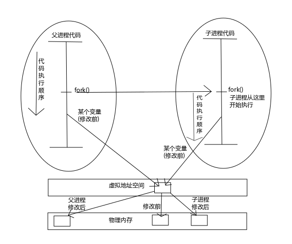

# 06.进程控制
> 参考博客：https://www.cnblogs.com/0xcafebabe/p/4434218.html

上一篇博文中我们讨论了进程环境，相信大家对进程已经有了初步的认识。

今天讨论进程控制这一章，也是进程中最终要的一部分，其实主要就是围绕着 fork()、exec()、wait() 这三个函数来讨论 *nix 系统是如何管理进程的。

## 1.ps命令
ps 命令可以帮助我们分析本章中的一些示例，所以简单介绍一些参数的组合方式，更详细的信息请查阅 man 手册。

+ `ps axf` 主要用于查看当前系统中进程的 PID 以及执行终端(tty)和状态等信息，更重要的是它能显示出进程的父子关系。
+ `ps axj`  主要用于查看当前系统中进程的 PPID、PID、PGID、SID、TTY 等信息。
+ `ps axm` 显示进程的详细信息，PID 列下面的减号(-)是这个进程中的线程。
+ `ps ax -L` 以 Linux 的形式显示当前系统中的进程列表。

PID 是系统中进程的唯一标志，在系统中使用 pid_t 类型表示，它是一个非负整型。

1号 init 进程是所有进程的祖先进程（但不一定是父进程），内核启动后会启动 init 进程，然后内核就会像一个库一样守在后台等待出现异常等情况的时候再出来处理一下，其它的事情都由 init 进程创建子进程来完成。

进程号是不断向后使用的，当进程号达到最大值的时候，再回到最小一个可用的数值重新使用。

## 2.获取进程ID的函数
在讲 fork() 函数之前先来认识两个函数：

```c
// getpid, getppid - get process identification

#include <sys/types.h>
#include <unistd.h>

pid_t getpid(void);
pid_t getppid(void);
```

+ getpid() 获得当前进程 ID。
+ getppid() 获得父进程 ID。

## 3.创建子进程：fork()

现在轮到我们今天的主角之一：frok() 函数上场了。

```c
// fork - create a child process

#include <unistd.h>

pid_t fork(void);
```

fork() 函数的作用就是创建子进程。

调用 fork() 创建子进程的时候，刚开始父子进程是一模一样的，就连代码执行到的位置都是一模一样的。

**fork() 执行一次，但返回两次。**
+ 它在父进程中的返回值是子进程的 PID，在子进程中的返回值是 0。
+ 子进程想要获得父进程的 PID 需要调用 getppid() 函数。

一般来说调用fork后会执行 if(依赖fork的返回值) 分支语句，用来区分下面的哪些代码由父进程执行，哪些代码由子进程执行。

我们画幅图来辅助解释上面说的一大坨是什么意思。

 

图1 fork() 与写时拷贝

结合上图，我们来聊聊 fork() 的前世今生。

最初的 fork() 函数在创建子进程的时候会把父进程的数据空间、堆和栈的副本等数据统统给子进程拷贝一份，如果父进程携带的数据量特别大，那么这种情况创建子进程就会比较耗费资源。

这还不是最要命的，万一费了这么大劲创建了一个子进程出来，结果子进程没有使用父进程给它的数据，而只是打印了一句 “Hello World!” 就结束退出了，岂不是白白的浪费了之前的资源开销？

于是聪明的程序猿们想出了一个办法来替代：让父子进程共享同一块数据空间，这样创建子进程的时候就不必担心复制数据耗费的资源较高的问题了，这就是传说中的 vfork() 函数实现的效果。

那么问题来了，如果子进程修改了数据会发生什么情况呢？Sorry，这个标准里没说，天知道会发生什么事情，所以 vfork() 通常被认为是过时了的函数，已经不推荐大家使用了。

既然上面两个办法都不完美，程序猿们只好再次改良 fork() 函数，这次虽然效率稍微比 vfork() 稍稍低了那么一点点，但是安全性是可以保证的，这就是**写时拷贝**技术。

**写时复制（Copy-On-Write，COW）** 就是 图1 里下面的部分，fork() 函数刚刚创建子进程的时候父子进程的数据指向同一块物理内存，但是内核将这些内存的访问变为只读的了，**当父子进程中的任何一个想要修改数据的时候，内核会为修改区域的那块内存制作一个副本，并将自己的虚拟地址映射到物理地址的指向修改为副本的地址**，从此父子进程自己玩自己的，谁也不影响谁，效率也提高了许多。新分配的副本大小通常是虚拟存储系统中的一“页”。

当然，写时复制技术中所谓制作一个副本，这个是在物理地址中制作的，并非是我们在程序中拿到的那个指针所指向的地址，我们的指针所指向的地址其实是虚拟地址，所以这些动作对用户态程序员是透明的，不需要我们自己进行管理，内核会自动为我们打点好一切。

好了，罗嗦了这么多都是说父进程通过复制一份自己创建了子进程，难道父子进程就是一模一样的吗？

**当然其实父子进程之间是有五点不同的**：

+ (1) fork() 的返回值不同；
+ (2) 父子进程的 PID 不相同；
+ (3) 父子进程的 PPID 不相同； // PPID 就是父进程 PID
+ (4) 在子进程中资源的利用量清零，否则如果父进程打开了很多资源，子进程能使用的资源量就很少了；
+ (5) 未决信号和文件锁不继承。

父进程与子进程谁先运行是不确定的，这个执行顺序是由进程调度器决定的，不过 vfork() 会保证子进程先运行。进程调度器不是一个工具，是在内核中的一块代码。


写个简单的小栗子：

```c
#include <stdio.h>
#include <stdlib.h>
#include <unistd.h>

#include <unistd.h>

int main (void)
{
    pid_t pid;

    printf("[%d] Start!\n", getpid());

    pid = fork();
    if (pid < 0) {
        perror("fork()");
        exit(1);
    } else if (0 == pid) { // child
        printf("[%d] Child process.\n", getpid());
    } else { // parent
        printf("[%d] Parent process.\n", getpid());
    }

    sleep(1000);

    puts("End!");

    return 0;
}
```

执行结果：


```shell
>$ make 1fork
cc     1fork.c   -o 1fork
>$ ./1fork
[3713] Start!
[3714] Child process.
[3713] Parent process.
[3713] End!
[3714] End!
```

新打开一个终端，验证它们的父子进程关系：

```shell
>$ ps axf
 3565 pts/1    Ss     0:00  \_ bash
 3713 pts/1    S+     0:00  |   \_ ./1fork
 3714 pts/1    S+     0:00  |       \_ ./1fork
```

 从 ps命令可以看出来，3713 进程确实产生了一个子进程 3714。

但是这里面有一个问题，我们重新执行一遍这个程序，这次将输出重定向到文件中。

```shell
>$ ./1fork > result.txt
>$ cat result.txt
[3807] Start!
[3807] Parent process.
End!
[3807] Start!
[3808] Child process.
End!
```

 发现有什么不同了吗？父进程竟然输出了两次 Start!，这是为什么呢？

其实第二次 Start! 并不是父进程输出的，而是子进程输出的。但是为什么 PID 却是父进程的呢？

其实这是因为行缓冲变成了全缓冲导致的，之前我们讲过，标准输出是行缓冲模式，而系统默认的是全缓冲模式。所以当我们将它输出到控制台的时候是可以得到预期结果的，但是一旦重定向到文件的时候就由行缓冲模式变成了全缓冲模式，而子进程产生的时候是会复制父进程的缓冲区的数据的，所以子进程刷新缓冲区的时候子进程也会将从父进程缓冲区中复制到的内容刷新出来。因此，**在使用 fork() 产生子进程之前一定要使用 fflush(NULL) 刷新所有缓冲区！**

那么大家再考虑一个问题，当程序运行的时候，为什么子进程的输出结果是在当前 shell 中，而没有打开一个新的 shell 呢？

这是因为子进程被创建的时候会复制父进程所有打开的文件描述符，所谓的“复制”是指就像执行了 dup() 函数一样，父子进程每个相同的打开的文件描述符共享一个文件表项。

而父进程默认开启了 0(stdin)、1(stdout)、2(stderr) 三个文件描述符，所以子进程中也同样存在这三个文件描述符。

既然子进程会复制父进程的文件描述符，也就是说如果父进程在创建子进程之前关闭了三个标准的文件描述符，那么子进程也就没有这三个文件描述符可以使用了。

从上面的ps命令执行结果可以看出来，我们的父进程是 bash 的子进程，所以我们父进程的三个标准文件描述符是从 bash 中复制过来的。


再看一个栗子：

```c
#include <stdio.h>
#include <stdlib.h>
#include <unistd.h>

#include <sys/types.h>

int main (void)
{
    pid_t pid;
    int i = 0;

    for (i = 0; i < 10; i++) {
        fflush(NULL);
        pid = fork();
        if (pid < 0) {
            perror("fork()");
            exit(1);
        } else if (0 == pid) {
            printf("pid = %d\n", getpid());
            exit(0);
        }
    }

    sleep(100);

    return 0;
}
```

运行：


```shell
>$ make 2fork
cc     2fork.c   -o 2fork
>$ ./2fork 
pid = 5101
pid = 5103
pid = 5105
pid = 5107
pid = 5108
pid = 5106
pid = 5104
pid = 5102
pid = 5110
pid = 5109
# ... 这里父进程处于 sleep 状态，便于我们新打开一个终端查看进程状态
>$ ps axf
 3565 pts/1    Ss     0:00  \_ bash
 5100 pts/1    S+     0:00  |   \_ ./2fork
 5101 pts/1    Z+     0:00  |       \_ [2fork] <defunct>
 5102 pts/1    Z+     0:00  |       \_ [2fork] <defunct>
 5103 pts/1    Z+     0:00  |       \_ [2fork] <defunct>
 5104 pts/1    Z+     0:00  |       \_ [2fork] <defunct>
 5105 pts/1    Z+     0:00  |       \_ [2fork] <defunct>
 5106 pts/1    Z+     0:00  |       \_ [2fork] <defunct>
 5107 pts/1    Z+     0:00  |       \_ [2fork] <defunct>
 5108 pts/1    Z+     0:00  |       \_ [2fork] <defunct>
 5109 pts/1    Z+     0:00  |       \_ [2fork] <defunct>
 5110 pts/1    Z+     0:00  |       \_ [2fork] <defunct>
>$
```

 从执行结果来看，子进程的状态已经变为 Z+ 了，说明子进程执行完成之后变成了“僵尸进程”。

那么为什么子进程会变为僵尸进程呢？是因为子进程比父进程先结束了，它们必须得等待父进程为其“收尸”才能彻底释放。

在现实世界中白发人送黑发人通常会被认为是件不吉利的事情，但是在计算机的世界中，父进程是需要为子进程收尸的。

如果父进程先结束了，那么这些子进程的父进程会变成 1 号 init 进程，当这些子进程运行结束时会变成僵尸进程，然后 1 号 init 进程就会及时为它们收尸。

我们修改下上面的栗子，将 sleep(100) 这行代码移动到子进程中，让父进程创建完子进程后直接退出，使子进程变成孤儿进程。代码很简单我就不重复贴出来了，直接贴测试的结果。

```shell
>$ make 2fork
cc     2fork.c   -o 2fork
>$ ./2fork 
pid = 5245
pid = 5247
pid = 5251
pid = 5254
>$ pid = 5252  # 这里会输出一个提示符，是因为父进程退出了，shell 已经为我们的父进程收尸了，所以提示符被。而我们的父进程没有为子进程收尸，所以子进程会继续输出。
pid = 5250
pid = 5253
pid = 5248
pid = 5249
pid = 5246

# 下面我们打开一个新的 shell 查看进程状态
>$ ps -axj
 PPID   PID  PGID   SID TTY      TPGID STAT   UID   TIME COMMAND
    1  5296  5295  3565 pts/1     3565 S      501   0:00 ./2fork
    1  5297  5295  3565 pts/1     3565 S      501   0:00 ./2fork
    1  5298  5295  3565 pts/1     3565 S      501   0:00 ./2fork
    1  5299  5295  3565 pts/1     3565 S      501   0:00 ./2fork
    1  5300  5295  3565 pts/1     3565 S      501   0:00 ./2fork
    1  5301  5295  3565 pts/1     3565 S      501   0:00 ./2fork
    1  5302  5295  3565 pts/1     3565 S      501   0:00 ./2fork
    1  5303  5295  3565 pts/1     3565 S      501   0:00 ./2fork
    1  5304  5295  3565 pts/1     3565 S      501   0:00 ./2fork
    1  5305  5295  3565 pts/1     3565 S      501   0:00 ./2fork
>$
```

从上面 ps 命令的执行结果来看，所有子进程的父进程都变成了 1 号 init 进程。

很多人会认为僵尸进程不应该出现，它们会占用大量的资源。其实不然，它们在内核中仅仅保留一个结构体，也就是自身的状态信息，其它的资源都释放了。但是它占用了一个重要的系统资源：PID，因为系统中 PID 的数量是有限的，所以及时释放僵尸进程还是很有必要的。

我们的父进程没有对子进程进行收尸，所以才会出现这样的情况。其实对于这种转瞬即逝的程序而言不会有什么危害，但是假设父进程是一个要不断执行一个月的程序，而它却又不为子进程收尸，那么子进程就会占用这些 PID 一个月之久，那么就可能出现问题了。

所以在一个完善的程序中，父进程是要为子进程收尸的，至于如何为子进程收尸，下面我们会讲，fork() 函数就先讨论到这里。


## 4.vfork()

```c
// vfork - create a child process and block parent

#include <sys/types.h>
#include <unistd.h>

pid_t vfork(void);

Feature Test Macro Requirements for glibc (see feature_test_macros(7)):

    vfork():
        Since glibc 2.12:
            _BSD_SOURCE ||
                (_XOPEN_SOURCE >= 500 ||
                    _XOPEN_SOURCE && _XOPEN_SOURCE_EXTENDED) &&
                !(_POSIX_C_SOURCE >= 200809L || _XOPEN_SOURCE >= 700)
        Before glibc 2.12:
            _BSD_SOURCE || _XOPEN_SOURCE >= 500 ||
            _XOPEN_SOURCE && _XOPEN_SOURCE_EXTENDED
```

 vfork() 函数在上面介绍写时拷贝技术的时候我们就提到了它的工作方式，并且也说了这是一个过时的函数，不推荐大家使用了，简单了解一下就可以了。

使用 vfork() 函数创建的子进程除了与父进程共享数据外，vfork() 还保证子进程先运行，在子进程调用 `exec()` 函数族 或 `exit()`(`_exit()`、`_Exit()`) 函数前父进程处于休眠状态。

另外，**使用 vfork() 创建的子进程是不允许使用 return 语句返回的，只能使用 exit(3) 函数族的函数结束，否则会被信号杀死，父进程则不受这个限制。**


## 5.进程等待函数wait()
```c
// wait, waitpid, waitid - wait for process to change state

#include <sys/types.h>
#include <sys/wait.h>

pid_t wait(int *status);

pid_t waitpid(pid_t pid, int *status, int options);
```

wait() 阻塞的等待子进程资源的释放，相当于上面提到的“收尸”。

每次调用 wait() 函数会为一个子进程收尸，而 wait() 函数并没有让我们指定是哪个特定的子进程。如果想要为特定的子进程收尸，需要调用 waitpid() 函数。

**收尸这件事只能是父进程对子进程做，而且只能对自己的子进程做。子进程是不能为父进程收尸的，父进程也不能为别人的子进程收尸。**

参数列表：

+ status：由函数回填，表示子进程的退出状态。如果填 NULL，表示仅回收资源，并不关心子进程的退出状态。
   > status 参数可以使用以下的宏进行解析：

    | 宏                   | 描述                                                                                  |
    | -------------------- | ------------------------------------------------------------------------------------- |
    | WIFEXITED(status)    | 返回真表示子进程正常终止，返回假表示子进程异常终止。正常与异常终止的8种方式上面讲过。 |
    | WEXITSTATUS(status)  | 返回子进程的退出码。只有上一个宏返回正常终止时才能使用，异常终止是不会有返回值的。    |
    | WTERMSIG(status)     | 可以获得子进程具体被哪个信号杀死了。                                                  |
    | WIFSTOPPED(status)   | 子进程是否被信号 stop 了。stop 和杀死是不同的，stop 的进程可以被恢复(resumed)。       |
    | WSTOPSIG(status)     | 如果子进程是被信号 stop 了，可以查看具体是被哪个信号 stop 了。                        |
    | WIFCONTINUED(status) | 如果子进程被 stop 了，可以查看它是否被 resumed 了。                                   |

    表1 解析 wait(2) 函数 status 参数的宏

+ pid：一共分为四种情况：
    | pid 参数 | 解释                                                                |
    | -------- | ------------------------------------------------------------------- |
    | < -1     | 为归属于进程组 ID 为 pid 参数的绝对值的进程组中的任何一个子进程收尸 |
    | == -1    | 为任意一个子进程收尸                                                |
    | == 0     | 为与父进程同一个进程组中的任意一个子进程收尸                        |
    | > 0      | 为一个 PID 等于参数 pid 的子进程收尸                                |

    表2 wait() 函数 pid 参数的取值说明

+ options：为特殊要求；这个参数是这个函数的设计精髓。可以通过 WNOHANG 宏要求 waitpid(2) 函数以非阻塞的形式为子进程收尸，这个也是最常用的特殊要求。


```c
#include <stdio.h>
#include <stdlib.h>
#include <unistd.h>

#include <sys/types.h>
#include <sys/wait.h>

int main (void)
{
    pid_t pid;
    int i = 0;

    for (i = 0; i < 10; i++) {
        fflush(NULL);
        pid = fork();
        if (pid < 0) {
            perror("fork()");
            exit(1);
        } else if (0 == pid) {
            printf("pid = %d\n", getpid());
            exit(0);
        }
    }

    // 为所有的子进程收尸
    for (i = 0; i < 10; i++) {
        wait(NULL);
    }

    return 0;
}
```

大家有没有想过为什么要由父进程为子进程收尸呢，为什么不让子进程结束后自动释放所有资源？试想如果没有收尸这步会发生什么。

假设父进程需要创建一个子进程并且要让它做 3 秒钟的事情，很不巧子进程刚启动就出现了一个异常然后就挂掉了，并且直接释放了自己的资源。
而此时系统 PID 资源紧张，很快已死掉的子进程的 PID 被分配给了其它进程，而父进程此时并不知道手里的子进程的 PID 已经不属于它了。

如果这时候父进程后悔执行子进程了，它要 kill 掉这个子进程。。。。。后果就是系统大乱对吧。

而使用了**收尸技术之后，子进程状态改变时会给父进程发送一个 SIGCHLD 信号，wait() 函数其实就是阻塞等待被这个信号打断，然后为子进程收尸。**

系统通过收尸这种机制来保证父进程未执行收尸动作之前，手里拿到的子进程 PID 一定是有效的了（即使子进程已死掉，但是这个 PID 依然是属于父进程的子进程的，而不会归属于别人）。


## 6.exec()
终于轮到我们今天第三个主角：exec() 函数上场了。


```c
// execl, execlp, execle, execv, execvp, execvpe - execute a file

#include <unistd.h>

extern char **environ;

int execl(const char *path, const char *arg, ...);
int execlp(const char *file, const char *arg, ...);
int execle(const char *path, const char *arg, ..., char * const envp[]);
int execv(const char *path, char *const argv[]);
int execvp(const char *file, char *const argv[]);
int execvpe(const char *file, char *const argv[], char *const envp[]);

//Feature Test Macro Requirements for glibc (see feature_test_macros(7)):

// execvpe(): _GNU_SOURCE
```

我们再来看上面第一个 fork() 代码的栗子执行时使用 ps -axf 命令查看父子依赖关系的结果：

```shell
>$ ps axf
 3565 pts/1    Ss     0:00  \_ bash
 3713 pts/1    S+     0:00  |   \_ ./1fork
 3714 pts/1    S+     0:00  |       \_ ./1fork
>$
```

 

我们知道 fork() 创建出来的子进程是通过复制父进程的形式实现的，但是我们的父进程又是 bash 的子进程，为什么 bash 没有创建出来一个与自己一模一样的子进程呢？

这就是 exec() 函数族的功劳了。

它可以使调用的它进程“外壳”不变，“内容物”改变为新的东西。“外壳”就是父子关系、PID 等东西，“内容物”其实是指一个新的可执行程序。也就是说 exec() 函数会将调用它的进程完全(整个4GB虚拟内存空间，即代码段、数据段、堆栈等等)变成另一个可执行程序，但父子关系、PID 等东西不会改变。

在执行了 exec() 函数族的函数之后，整个进程的地址空间会立即被替换，所以 exec() 下面的代码全部都不会再执行了，替代的是新程序的代码段。

缓冲区也会被新的程序所替换，所以**在执行 exec() 之前要使用 fflush(NULL)刷新所有的缓冲区。**这样父进程才会让它缓冲区中的数据到达它们该去的地方，而不是在数据到达目的地之前缓冲区就被覆盖掉。

参数列表：

+ path：要执行的二进制程序路径
+ arg：传递给 path 程序的 argv 参数，第一个是 argv[0]，其它参数从第二个开始。
+ ...：argv 的后续参数，最后一个参数是 NULL，表示变长参数列表的结束。

看上去 execl()、execlp() 像是变参函数，execle() 像是定参函数，其实正好是反过来的，execl() 和 execlp() 是定参的，而 execle() 函数是变参的。

## 7.下面我们来看一个 fork() + exec() + wait() 最经典的用法：
```c
#include <stdio.h>
#include <stdlib.h>
#include <unistd.h>

/**
 * 创建子进程 date，参数是 +%s
 * 相当于在 shell 中执行 date +%s 命令
 */
int main()
{
    pid_t pid;

    puts("Begin!");

    fflush(NULL);

    pid = fork();
    if(pid < 0) {
        perror("fork()");
        exit(1);
    }

    if(pid == 0)    // child
    {
        execl("/bin/date","date","+%s",NULL);
        perror("execl()");
        exit(1);
    }

    wait(NULL);    

    puts("End!");

    exit(0);
}
```

fork()、exec()、wait() 函数可以让我们创建任何进程来执行任何命令了，如此看来，整个 *nix 世界都是由 fork()、exec()、wait() 这三个函数搭建起来的，现在大家可以尝试用这三个函数来执行一些命令了。

 

## 8.shell 的内部命令与外部命令

像 cd、exit、|、> 牵涉到环境变量改变等动作这样的命令叫做内部命令，而使用 which 命令能查询到的在磁盘上存在的命令就是外部命令。

学会了 fork()、exec()、wait() 函数的使用，大家已经可以尝试编写一个 shell 程序了，基本可以执行所有的外部命令了。

但是一个 shell 不仅仅支持外部命令，还支持很多内部命令，对内部命令的支持才是 shell 的难点。

关于内部命令的内容多数都在《APUE》第三版 的第九章中，感兴趣的童鞋可以自行查阅。

更改用户 ID 和更改组 ID

在 *nux 系统中，特权和访问控制是基于用户 ID 和用户组 ID 的，所以当我们需要使用特权或访问无权访问的文件时需要切换用户 ID 或用户组 ID。

uid

+ r(real) 用于保存用户权限
+ e(effective) 鉴定用户权限时使用
+ s 与 real 相同，所以有些系统不支持

gid

+ r(real) 用于保存用户组权限
+ e(effective) 鉴定用户组权限时使用
+ s 与 real 相同，所以有些系统不支持

比如普通用户没有查看 /etc/shadow 文件，但是为什么有权限修改自己的密码呢？

```shell
>$ which passwd 
/usr/bin/passwd
>$ ls -l /usr/bin/passwd 
-rwsr-xr-x 1 root root 47032  2月 17  2014 /usr/bin/passwd
$ ls -l /etc/shadow
---------- 1 root root 1899 Apr 1 16:25 /etc/shadow
```


这是因为 passwd 命令是具有 U+S 权限的，用户在使用这个程序的时候身份会切换为这个程序文件所有者的身份。

G+S 与 U+S 类似，只不过执行的瞬间身份会切换为与程序归属用户组相同的组权限。

改变用户 ID 和组 ID 可以使用 setuid() 和 setgid() 函数实现，这两个函数使用起来都比较简单，需要用的童鞋自己查阅 main 手册吧。

 

## 9.解释器文件

解释器文件其实就是脚本。

做一个系统级开发工程师需要具备的素质至少精通2门语言，一门面向过程，一门面向对象，还要精通至少一门脚本语言，如 shell、python等，还要具备扎实的网络知识和一点硬件知识。

**解释器**是一个二进制的可执行文件。就是为了用一个可执行的二进制文件解释执行**解释器文件**中的命令。

`#!` 用于装载解释器

例如：

`#!/bin/shell` 装载了 /bin/shell 作为解释器

`#!/bin/cat` 装载了 /bin/cat 作为解释器

那么装载解释器之后为什么不会递归执行装载解释器这行代码呢？因为根据约定，脚本中的 # 表示注释，所以解释器在解析这个脚本的时候不会看到这行装载解释器的命令。

装载解释器的步骤由内核 exec() 系统调用来完成，如果使用 exec() 函数来调用解释器文件，实际上 exec() 函数并没有执行解释器文件，而是执行了解释器文件中装载的解释器，由它来执行解释器文件中的指令。


## 10.system()

```c
// system - execute a shell command

#include <stdlib.h>

int system(const char *command);
```

 该函数可以执行一条系统命令，是通过调用 /bin/sh -c command 实现的。

其实我们可以猜测一下 system() 命令是如何实现的，下面是伪代码：

```c
pid_t pid;

pid = fork();
if(pid < 0)
{
    perror("fork()");
    exit(1);
}

if(pid == 0)    // child
{
    // system("date +%s");
    execl("/bin/sh","sh","-c","date +%s",NULL);
    perror("execl()");
    exit(1);
}

wait(NULL);

exit(0);
```


进程会计

连 POSIX 标准都不支持，是方言中的方言。

它是典型的事实标准，各个系统的实现都不统一，所以建议少用为妙。

## 11.acct()
```c
// acct - switch process accounting on or off

#include <unistd.h>

int acct(const char *filename);
```

作用是将进程的相关信息写入到 filename 所指定的文件中。

## 12.用户标识函数

```c
// getlogin, getlogin_r, cuserid - get username

#include <unistd.h>

char *getlogin(void);
int getlogin_r(char *buf, size_t bufsize);
```

 

能够**不受任何因素影响**的获取当前终端的用户名。

不受任何因素影响是指，比如我们用 su等命令切换了用户，getlogin()函数获得到的仍然是原始的用户名。

 

## 12.进程调度

用于控制进程调度优先级，一般不会调整进程的优先级。


## 13.进程时间

```c
// times - get process and waited-for child process times

#include <sys/times.h>

clock_t times(struct tms *buffer);
```

该函数获得的是进程的执行时间。

clock_t 是滴答数。位于秒级以下，具体的与秒的换算值需要通过 sysconf(_SC_CLK_TCK) 宏获得。