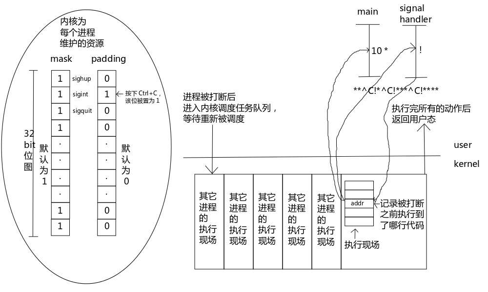

# 08.信号：相当于单片机中的中断
> 信号是模拟硬件中断的原理在软件层面上进行的实现
> 参考博客：https://www.cnblogs.com/0xcafebabe/p/4441592.html

从信号这章开始情况就开始变得复杂了，所以从这篇开始后面的博文大家一天可能就无法学习完毕了，大家可以把每篇博文分为两天到三天的时间来学习，要给自己充足的时间练习才能掌握这些内容。

所以一定不要手懒，想要学会唯一的办法就是多写多练习。

如果前面的东西你还没有掌握，那么从这部分开始到后面的内容就先不要看了，一定要回去把前面的部分掌握了再开始看后面的内容。

因为 APUE 的东西是前后呼应的，如果前面没有学扎实，后面有些东西是不太容易理解的。

说实话前面的内容几乎都没有难度，只有从信号开始才算是有一点难度了，APUE 的东西多写多练很容易掌握的，所以不要害怕。


## 0.同步与异步、多进程多线程与信号
到目前为止，之前写的程序还没有一个是**异步**运行的，全部都是**同步**运行的。

在第一篇博文中我们就介绍过了，Linux 环境中的并发可以分为 多进程+信号 和 多线程两种，信号属于初级异步，多线程属于强烈异步。

在实际项目中信号和多线程基本不会一块儿使用，要么使用 多进程+信号 的形式，要么采用多线程的形式。

+ **同步程序的特点**：是程序的执行流程、分支都是明确的。
+ **异步事件的特点**：事件到来的时间不确定，到来之后产生的结果是不确定的。比如在俄罗斯方块游戏中需要异步接收用户的方向控制输入，你永远无法知道用户什么时候按下方向键，以及按下哪个方向键。

 

异步事件的获取方式通常只有两种：**查询法，通知法**。

假如我们使用一个烟雾传感器监测库房中是否发生了火灾，火灾的到来的时间就是一种异步事件。

我们可以通过两种方式获取是否发生了火灾：

+ 1）查询法：传感器将状态写到一个位图当中，我们不停的查询位图的状态来得到传感器的最新监测结果。
+ 2）通知法：当检测到火灾时传感器推送一个消息给我们，这样我们就不用不停的查询位图了。

那么什么情况使用查询法更好，什么情况使用通知法更好呢？

+ 异步事件到来的频率比较**高**的情况考虑使用**查询法**，因为撞到异步事件到来的概率比较高。
+ 异步事件到来的频率比较**稀疏**的情况考虑**通知法**，因为比较经济实惠。

所有的通知法都需要配合一个监听机制才行。否则比如你在垂钓，放下一个鱼竿之后你就走了，就算鱼上钩了你也不可能知道。

即使计算机中没有连接任何外部硬件设备，内核每秒钟也会发生成百上千个中断来打断正在运行的程序。

时间片调度其实就是通过中断打断程序的执行，把时间片耗尽的进程移动到队列中等待。所以任何一个进程在执行的过程中都是磕磕绊绊的不断被打断的，程序在任何地方都可能被打断，唯独一条机器指令是无法被打断的（机器指令是原子的）。

比如你在执行一句 printf("Hello World!\n"); 的时候，看似是很流畅的打印出来了，但是执行过程中已经被打断很多次了。

所以在单核 CPU 上其实是不存在真正意义上的异步的，你感受到的异步无非就是时间片切换给你带来的错觉。你以为你边听音乐边写程序，这两件事是同时进行的吗？其实内核在快速的不断的打断其中一个程序，然后再让另一个程序运行一会儿，如此往复，给你一种两件事情在同时发生的错觉。

## 1.信号概述

**信号不是中断**，中断只能由硬件产生，信号是模拟硬件中断的原理在软件层面上进行的实现。

可以使用 kill命令向其它进程查看或发送信号。

```shell
>$ kill -l
 1) SIGHUP          2) SIGINT          3) SIGQUIT         4) SIGILL          5) SIGTRAP
 6) SIGABRT         7) SIGBUS          8) SIGFPE          9) SIGKILL        10) SIGUSR1
11) SIGSEGV        12) SIGUSR2        13) SIGPIPE        14) SIGALRM        15) SIGTERM
16) SIGSTKFLT      17) SIGCHLD        18) SIGCONT        19) SIGSTOP        20) SIGTSTP
21) SIGTTIN        22) SIGTTOU        23) SIGURG         24) SIGXCPU        25) SIGXFSZ
26) SIGVTALRM      27) SIGPROF        28) SIGWINCH       29) SIGIO          30) SIGPWR
31) SIGSYS         34) SIGRTMIN       35) SIGRTMIN+1     36) SIGRTMIN+2     37) SIGRTMIN+3
38) SIGRTMIN+4     39) SIGRTMIN+5     40) SIGRTMIN+6     41) SIGRTMIN+7     42) SIGRTMIN+8
43) SIGRTMIN+9     44) SIGRTMIN+10    45) SIGRTMIN+11    46) SIGRTMIN+12    47) SIGRTMIN+13
48) SIGRTMIN+14    49) SIGRTMIN+15    50) SIGRTMAX-14    51) SIGRTMAX-13    52) SIGRTMAX-12
53) SIGRTMAX-11    54) SIGRTMAX-10    55) SIGRTMAX-9     56) SIGRTMAX-8     57) SIGRTMAX-7
58) SIGRTMAX-6     59) SIGRTMAX-5     60) SIGRTMAX-4     61) SIGRTMAX-3     62) SIGRTMAX-2
63) SIGRTMAX-1     64) SIGRTMAX
>$
```

其中 
+ `1~31`是标准信号
+ `34-64`是实时信号

我们下面讨论的内容如果没有特殊说明则都是针对标准信号。

**信号有五种不同的默认行为：终止、终止+core、忽略、停止进程、继续。**

 core 文件就是程序在崩溃时由操作系统为它生成的内存现场映像和调试信息，主要是用来调试程序的，可以使用 ulimit命令设置允许生成的 core 文件的最大大小。

+ 1）终止：使程序异常结束。还记得我们在前面的博文中提到的程序的 3 种异常终止情况吗？其中被信号杀死就是异常终止的一种。
+ 2）终止+core：杀死进程，并为其产生一个 core dump 文件，可以使用这个 core dump 文件获得程序被杀死的原因。
+ 3）忽略：程序会忽略该信号，不作出任何响应。
+ 4）停止进程：将运行中的程序中断。被停止的进程就像被下了一个断点一样，停止运行并不会再被调度，直到收到继续运行的信号。当按下 Ctrl+Z 时就会将一个正在运行的前台进程停止，其实就是向这个进程发送了一个 SIGTSTP 信号。
+ 5）继续：使被停止的进程继续运行。只有 SIGCONT 信号具有这项功能。

这里介绍下常用的标准信号，但是有时间所有的信号都要仔细的看（见《APUE》第三版 P252 - P256）。

| 信号                         | 默认动作  | 说明                                                                                                                                                                                      |
| ---------------------------- | --------- | ----------------------------------------------------------------------------------------------------------------------------------------------------------------------------------------- |
| SIGABRT                      | 终止+core | 调用 abort() 函数会向自己发送该信号使程序异常终止，通常在程序自杀时使用。                                                                                                                |
| SIGALRM                      | 终止      | 调用 alarm() 或 setitimer() 定时器超时时向自身发送的信号。 setitimer() 设置 which 参数的值为 ITIMER_REAL 时，超时后会发送此信号。                                                      |
| SIGCHLD（某些平台是 SIGCLD） | 忽略      | 当子进程状态改变系统会将该信号发送给其父进程。 状态改变是指由运行状态改变为暂停状态、由暂停状态改变为运行状态、由运行状态改变为终止状态等等。                                             |
| SIGHUP                       | 终止      | 如果终端接口检测到链接断开则将此信号发送给该终端的控制进程，通常会话首进程就是该终端的控制进程。                                                                                          |
| SIGINT                       | 终止      | 当用户按下中断键(Ctrl+C)时，终端驱动程序产生此信号并发送给前台进程组中的每一个进程。 大家经常使用 Ctrl + C 来杀死进程，这回知道是什么原理了吧？                                           |
| SIGPROF                      | 终止      | setitimer() 设置 which 参数的值为 ITIMER_PROF 时，超时后会发送此信号。                                                                                                                   |
| SIGQUIT                      | 终止+core | 当用户在终端上按下退出键(Ctrl+\)时，终端驱动程序产生此信号并发送给前台进程组中的所有进程。该信号与 SIGINT 的区别是，在终止进程的同时为它生成 core dump 文件。                             |
| SIGTERM                      | 终止      | 使用 kill命令发送信号时，如果不指定具体的信号，则默认发送该信号。                                                                                                                     |
| SIGUSR1                      | 终止      | 用户自定义的信号。 有童鞋说不明白什么是用户自定义的信号， 其实所谓自定义的信号就是系统不赋予它什么特殊的意义，你想用它来做什么都行， 根据你的程序逻辑为它定义好相应的信号处理函数就行了。 |
| SIGUSR2                      | 终止      | 另一个用户自定义的信号，作用同上。                                                                                                                                                        |
| SIGVTALRM                    | 终止      | setitimer() 设置 which 参数的值为 ITIMER_VIRTUAL 时，超时后会发送此信号。                                                                                                                |

表1 常见的标准信号 

## 2. 信号注册函数：signal()
### 2.1 原型
```c
// signal - ANSI C signal handling

#include <signal.h>

/* man 手册中定义的写法 */

typedef void (*sighandler_t)(int);

sighandler_t signal(int signum, sighandler_t handler);

/* APUE 课本上的写法 */
void (*signal (int signo, void (*func) (int))) (int);
```

### 2.2 功能
signal() 函数的作用是为某个信号注册一个信号处理函数。

课本上的写法比 man 手册中的写法更好，因为 sighandler_t 这个名字纯属手册捏造出来的，如果某一天标准库发布了一个函数的名字恰巧也叫 sighandler_t，那么手册就出问题了，这是C 语言名空间管理不善导致的。

### 2.3 参数列表：

+ singno：1-31 是标准信号，34-64 是实时信号，当然也可以使用 kill -l 所列出的宏名；
+ func：收到信号时的处理行为，也就是信号处理函数；也可以使用 SIG_DEF 和  SIG_IGN 两个宏来替代。SIG_DEF 表示使用信号的默认处理行为。SIG_IGN 表示忽略该信号。

### 2.4 返回值:原来的信号处理函数。
有时候我们在定义自己的信号处理函数之前会把原来的信号处理函数保存下来，这样当我们的库使用完之后需要还原原来注册的信号处理函数，避免因为调用了我们的库而导致别人的库失效的问题。

我们先来看下面的代码：
```c
#include <stdio.h>
#include <signal.h>
#include <unistd.h>

static void handler (int s)
{
    write(1, "!", 1);
}

int main(void)
{
    int i = 0;

    signal(SIGINT, handler);

    for (i = 0; i < 10; i++)
    {
        write(1, "*", 1);
        sleep(1);
    }

    return 0;
}
```

这个程序运行起来之后，每秒钟会打印一个星号（*），当按下 Ctrl+C 时会打印一个感叹号（!），直到 10 秒钟后程序退出，下面是不停的按 Ctrl+C 的运行结果。


```shell
>$ gcc -Wall signal.c
>$ time ./a.out 
*^C!*^C!*^C!*^C!*^C!*^C!*^C!*^C!*^C!*^C!
real    0m1.656s
user    0m0.000s
sys    0m0.002s
>$
```


通过 time命令可以测试出来，程序并没有持续 10 秒钟才结束，这是因为信号会打断阻塞的系统调用，也就是说 SIGINT 这个信号打断了 sleep()。

比如使用 read() 函数读取一个设备的时候，当设备中没有充足的数据供读取时，read() 函数会进入阻塞等待数据的状态，这时候如果收到了一个信号就会打断阻塞中的 read() 函数，它会设置 EINTR 的 errno。**所以收到函数报错的时候往往需要判断一下是否被信号打断了，如果是被信号打断的，还要重新再执行一次。**

 

## 3.竞争

当学习了信号之后，我们的程序中就出现异步的情况了，只要是异步的程序就可能会出现竞争，先来了解下什么是竞争。

竞争：一个十字路口没有红绿灯，两辆不同方向驶来车可能会发生碰撞，而且碰撞可能很严重也可能很轻微。当安装上红绿灯之后就相当于增加了一个协议，如果没有这个协议的限制，大家就可以随意的使用公共资源了，你在十字路口中间跳广场舞也可以。所以为了避免竞争带来的后果，我们会使用一些协议来避免竞争的发生。

当然，避免竞争的办法我们后面会讨论。

 

## 4.不可靠的信号

很多人看到了不可靠的信号这一章节，就认为因为信号会丢失所以是不可靠的，其实这么理解是不对的，不可靠的信号是指信号的行为不可靠。

信号的处理就好比现在 LZ 正在写这篇博文，忽然来了一个电话，于是打断了手头的工作，先接电话去了。

信号处理函数的执行现场不是程序员布置的，而是内核布置的，因为程序中不会有调用信号处理函数的地方。

同一个信号处理函数的执行现场会被布置在同一个地方，所以当一次信号处理函数未执行完成时再次触发了相同的信号，信号处理函数发生了第二次调用，则第一次调用的执行现场会被覆盖。


## 5.可重入函数

函数重入乍一看上去像是递归，但又是有区别的，递归调用的现场是程序员布置的，而重入是在一个函数执行未结束时再次发生了调用并且进入了同一个函数现场。

重入时函数会发生错误的函数称为“**不可重入函数**”，重入不会出现错误的函数叫做“**可重入函数**”。

**所有的系统调用都是可重入函数**，所以信号处理函数中可以放心的使用系统调用。但并不是说所有的非系统调用都是不可重入的。

man 手册所有的函数中如果有一个同名的带 _r 后缀的函数
+ 那么不带 `_r` 后缀的函数是不可重入的函数
+ 而带 `_r` 后缀的函数是可重入的函数。

比如下面这两个常见的函数：

```c
// strerror,  strerror_r - return string describing error number

#include <string.h>

char *strerror(int errnum);

int strerror_r(int errnum, char *buf, size_t buflen); /* XSI-compliant */

char *strerror_r(int errnum, char *buf, size_t buflen); /* GNU-specific */
```

## 6.可靠信号术语和语义

这是信号这章比较重要的内容，通过这个我们来了解信号在 Linux 系统中是如何实现的。

 

图1 标准信号的处理过程


呼，累死了，这么简单的一张图竟然画了一个小时。。下面且听 LZ 解释上图的内容。

mask 和 pending 位图是一一对应的，它们用于反映当前进程信号的状态。每一位代表了一个标准信号。

+ mask 位图用于记录哪些信号可以响应。1 表示该信号可以响应，0 表示该信号不可响应（会被忽略）。

+ pending 位图用于记录收到了哪些信号。1 表示收到了该信号，0 表示没有收到该信号。

前面说过了，程序在执行的过程中会被内核打断无数次，也就是说程序被打断后要停止手头的工作，进入一个队列排队等待再次被调度才能继续工作。

当进程获得调度机会后，从内核态返回到用户态之前要做很多事情，其中一件事就是将 mask 位图和 pending 位图进行 & 运算，当计算的结果不为 0 时就需要调用相应的信号处理函数或执行信号的默认动作。

这就是 Linux 的信号处理机制，从这个机制中，我们可以总结出几个信号的特点：

+ 1）如果想要屏蔽某个信号，只需将对应的 mask 位 置为 0 即可。这样当程序从内核态返回用户态进行 mask & pending 时，该信号位的计算结果一定为 0。

+ 2）信号从收到到响应是存在延迟的，一般最长延迟 10 毫秒。因为只有程序被打断并且重新被调度的时候才有机会发现收到了信号，所以当我们向一个程序按下 Ctrl+C 时程序并没有立即挂掉，只不过这个时间非常短暂我们一般情况下感觉不到而已，我们自己以为程序是立即挂掉了。其实想要实验也很容易，写一个死循环不断打印一个字符，然后在它跑起来的时候按下 Ctrl+C，你会发现并不是打印了 ^C 之后程序会立即停止，而是继续打印了一些字符之后才停止。

+ 3)当一个信号没有被处理时，无论再次接受到多少个相同的信号都只能保留一个，因为 pending 是位图，位图的特点就是只能保留最后一次的状态。这一点说的就是标准信号会丢失的特点，如果想要不丢失信号就只能使用实时信号了。

+ 4）信号处理函数轻易不允许使用 longjmp() 进行跨函数跳转。因为处理信号之前系统会把 mask 对应的位设置为 0 来避免信号处理函数重入，当信号处理完成之后系统会把对应的 mask 位设置为 1 恢复进程对该信号的响应能力。如果进行了长跳转系统就不会恢复 mask 位图了，也就再也无法收到该信号了。其实这个图只是一个草图，信号实际上是线程级别的（这个我们在后面讲到线程的时候会详细讨论），所以即使 mask 位图在处理前被置为 0，依然有可能出现重入的现象，因为无法保证兄弟线程也同步屏蔽了相应的位。

+ 5）信号处理函数的执行时间越短越好，因为信号处理函数是在用户态执行的，在它的执行过程中也会不停的被内核打断，所以如果信号处理函数执行的时间过长会使情况变得复杂。

+ 6）信号的响应是嵌套执行的。就是说假设进程先收到了 SIGINT 信号，当它的信号处理函数还没有执行完毕时又收到了另一个信号 SIGQUIT，那么当进程从内核态返回到用户态时会优先执行 SIGQUIT 的信号处理函数，等 SIGQUIT 的信号处理函数执行完毕后再回到 SIGINT 信号处理函数上次被打断时的地方继续执行，函数调用栈看上去就像在 SIGINT 的信号处理函数中调用了 SIGQUIT 的信号处理函数一样。这也是上面所说的为什么信号处理函数的执行时间要越短越好，要尽量避免这种复杂的情况发生。

+ 7）如果同时到来多个优先级差不多的信号，无法保证优先响应哪个信号，它们的响应没有严格意义上的顺序。除非是收到了优先级较高的信号，系统会保证高优先级的先被处理。

 

## 7. kill()

### 7.1 原型

```c
// kill - send a signal to a process or a group of processes

#include <signal.h>

int kill(pid_t pid, int sig);
```

### 7.2 功能

kill() 函数的作用是将指定的信号(sig)发送给指定的进程(pid)。

大家一看到 kill 就觉得有杀死进程的意味，其实未必如此，kill() 也负责给进程发送各种信号。

### 7.3 参数

+ pid：接收信号的进程 ID。可填的内容详见下表： 

    | 值   | 说明                                                                                                                                                                                            |
    | ---- | ----------------------------------------------------------------------------------------------------------------------------------------------------------------------------------------------- |
    | >0   | 接收信号的进程 ID。                                                                                                                                                                             |
    | ==0  | 发送信号给当前进程所在进程组的所有进程。                                                                                                                                                        |
    | ==-1 | 发送信号给当前进程有权向它们发送信号的所有进程，1 号 init 进程除外。相当于一个全局广播信号，发送这种信号一般只有 1 号 init 会做，比如在关机的时候 init 进程会发送全局广播信号通知大家该结束了。 |
    | <-1  | 将 pid 的绝对值作为组 ID，给这个组中所有的进程发送信号。                                                                                                                                        |

    表2 kill() 函数 pid 参数的取值

+ sig：要发送的信号，可以使用 kill -l 所列出的信号。
  
  > 如果 sig 是 0 会执行所有的错误检查，但并不真正发送信号。所以通常使用 0 值检查一个进程是否仍然存在，如果该进程不存在则返回 -1 并将 errno 设置为 ESRCH。需要注意的是这种检查并不原子，当 kill() 返回测试结果的时候也许被测试的进程已经终止了。当然也可以测试当前进程是否对目标进程有权限发送信号，如果 errno 为 EPERM 表示被测试的进程存在但当前进程无权限访问。

### 7.4 返回值
+ 成功为 0
+ 失败为 -1，并设置 errno。

## 8. pause()

```c
// pause - suspend the thread until a signal is received

#include <unistd.h>

int pause(void);
```

专门用于阻塞当前进程，等待一个信号来打断它。

## 9. alarm()

```c
// alarm - schedule an alarm signal

#include <unistd.h>

unsigned alarm(unsigned seconds);
```

 指定  seconds 秒，发送一个 SIGALRM 信号给自己。

seconds 为 0 的时候，表示取消这个定时器，并且新设置的值会覆盖上次设置的值。所以当程序中出现了多个对 alarm() 的调用时，计时是不准确的。

注意，SIGALRM 信号默认动作是杀死进程。


我们来看看代码 count_alarm.c、count_time.c，哪个效率更高。
```c
/* count_alarm.c */
#include <stdio.h>
#include <stdlib.h>
#include <unistd.h>
#include <signal.h>

long long count = 0;
static volatile int flag = 1;

void alarm_handler (int s)
{
    flag = 0;
}

int main (void)
{
    signal(SIGALRM, alarm_handler);
    alarm(5);

    flag = 1;

    while (flag)
    {
        count++;
    }

    printf("%lld\n", count);

    return 0;
}
```

```c
/* count_time.c */
#include <stdio.h>
#include <time.h>

int main (void)
{
    long long count = 0;
    time_t t;

    t = time(NULL) + 5;

    while (time(NULL) < t) {
        count++;
    }

    printf("%lld\n", count);

    return 0;
}
```


编译运行：

```shell
>$ make count_alarm count_time
cc     count_alarm.c   -o count_alarm
cc     count_time.c   -o count_time
>$ time ./count_alarm
2374311494

real    0m5.004s
user    0m4.780s
sys    0m0.194s
>$ time ./count_time
2139947

real    0m4.152s
user    0m4.116s
sys    0m0.021s
>$
```


通过执行结果可以看出来，alarm() 的方式和 time() 的方式执行效率竟然差了 1000 多倍，当然这个简单的测试精度是不高的。

上面的代码通过 gcc count_alarm.c -O1 优化之后就无法正确执行了。

我们先把 count_alarm.c 编译成汇编代码再讨论它为什么被优化之后无法正确执行了。

优化前：

```shell
>$ gcc -S count_alarm.c -o count_alarm.S
>$ vim count_alarm.S
    ; ...... 省略不相关代码

alarm_handler:
.LFB0:
    .cfi_startproc
    pushq    %rbp
    .cfi_def_cfa_offset 16
    .cfi_offset 6, -16
    movq    %rsp, %rbp
    .cfi_def_cfa_register 6
    movl    %edi, -4(%rbp)
    movl    $0, flag(%rip)   ; 修改 flag 的值
    leave
    .cfi_def_cfa 7, 8
    ret
    .cfi_endproc

    ; ...... 省略不相关代码

main:
.LFB1:
    .cfi_startproc
    pushq    %rbp
    .cfi_def_cfa_offset 16
    .cfi_offset 6, -16
    movq    %rsp, %rbp
    .cfi_def_cfa_register 6
    movl    $alarm_handler, %esi
    movl    $14, %edi
    call    signal
    movl    $5, %edi
    call    alarm
    movl    $1, flag(%rip)
    jmp    .L4
.L5:
    movq    count(%rip), %rax
    addq    $1, %rax
    movq    %rax, count(%rip)
.L4:
    movl    flag(%rip), %eax
    testl    %eax, %eax        ; 每次循环会检测 flag 的值是否改变
    jne    .L5
    movq    count(%rip), %rdx
    movl    $.LC0, %eax
    movq    %rdx, %rsi
    movq    %rax, %rdi
    movl    $0, %eax
    call    printf
    movl    $0, %eax
    leave
    .cfi_def_cfa 7, 8
    ret
    .cfi_endproc

    ; ...... 省略不相关代码
```

优化后：

```shell
>$ gcc -S count_alarm.c -O1 -o count_alarm1.S
>$ vim count_alarm1.S
    ; ...... 省略不相关代码

alarm_handler:
.LFB21:
    .cfi_startproc
    movl    $0, flag(%rip)    ; 修改 flag 的值
    ret
    .cfi_endproc

    ; ...... 省略不相关代码

main:
.LFB22:
    .cfi_startproc
    subq    $8, %rsp
    .cfi_def_cfa_offset 16
    movl    $alarm_handler, %esi
    movl    $14, %edi
    call    signal
    movl    $5, %edi
    call    alarm
    movl    $1, flag(%rip)
.L4:
    jmp    .L4                ; 变成了死循环
    .cfi_endproc

    ; ...... 省略不相关代码
```


从上面的代码不难看出，优化时编译器认为 flag 的值一直没有改变，所以直接把 flag 的值拿过来作为循环条件了，每次循环的时候不再从 flag 变量所在的内存位置取值了。

**为了避免编译器犯这种错误，我们需要把 flag 定义成 volatile 变量，volatile 关键字表示一定要到变量定义的位置取变量的值，而不要轻信曾经拿到的值。**

 

## 10.流量控制

### EINTR错误：

慢系统调用(slow system call)：此术语适用于那些可能永远阻塞的系统调用。永远阻塞的系统调用是指调用有可能永远无法返回，多数网络支持函数都属于这一类。如：若没有客户连接到服务器上，那么服务器的accept调用就没有返回的保证。

EINTR错误的产生：当阻塞于某个慢系统调用的一个进程捕获某个信号且相应信号处理函数返回时，该系统调用可能返回一个EINTR错误。例如：在socket服务器端，设置了信号捕获机制，有子进程，当在父进程阻塞于慢系统调用时由父进程捕获到了一个有效信号时，内核会致使accept返回一个EINTR错误(被中断的系统调用)。

当碰到EINTR错误的时候，可以采取有一些可以重启的系统调用要进行重启，而对于有一些系统调用是不能够重启的。例如：accept、read、write、select、和open之类的函数来说，是可以进行重启的。不过对于套接字编程中的connect函数我们是不能重启的，若connect函数返回一个EINTR错误的时候，我们不能再次调用它，否则将立即返回一个错误。针对connect不能重启的处理方法是，必须调用select来等待连接完成。

播放音乐和电影的时候都要按照播放的速率读取文件，而不能像 cat 命令一样，直接将交给它的文件用最快的速度读取出来，否则你听到的音乐就转瞬即逝了。

### 我们先通过一个栗子了解下什么是流量控制：
> 每s从指定的文件中读取10个字符打印到控制台上
```c
#include <stdio.h>
#include <unistd.h>
#include <fcntl.h>
#include <errno.h>
#include <signal.h>

#include <sys/types.h>
#include <sys/stat.h>

#define BUFSIZE    10

static volatile int loop = 0;

static void alarm_handler (int s)
{
    alarm(1); // 定时1s后发出alarm信号
    loop = 0; // loop置为0，退出main中的while循环
}

int main (int argc, char **argv)
{
    int fd = -1;
    char buf[BUFSIZE] = "";
    ssize_t readsize = -1;
    ssize_t writesize = -1;
    size_t off = 0;

    if (argc < 2)
    {
        fprintf(stderr, "Usage %s <filepath>\n", argv[0]);
        return 1;
    }

    do {
        fd = open(argv[1], O_RDONLY); // 程序执行时后面跟一个要读取的文件路径如 "./a.out hello.txt"
        if (fd < 0) {
            if (EINTR != errno) { // 当不是阻塞类的异常时，可以认为是打开文件失败了
                perror("open()");
                goto e_open; // 打开失败地话直接退出程序
            }
        }
    } while (fd < 0); // 打开失败就不断尝试打开文件

    loop = 1;
    signal(SIGALRM, alarm_handler); // 注册alarm信号处理函数
    alarm(1); // 定时1s后出发alarm信号  定时器①

    while(1) {
        // while (loop); // 忙等
        // 非忙等
        while (loop) { // 上面定时器①在1s后把loop置为0，此处while循环退出
            pause();
        }
        loop = 1; // 再把loop重置为1，方便下次while循环再阻塞1s

        while ((readsize = read(fd, buf, BUFSIZE)) < 0) { // 读取BUFSIZE个字节到数组buf中
            if (readsize < 0) {
                if (EINTR == errno) {
                    continue;
                }
                perror("read()");
                goto e_read; // 出异常了记得关闭文件标志符
            }
        }
        if (!readsize) { // 读取为0说明文件读取完了，直接退出
            break;
        }

        off = 0;
        do {
            writesize = write(1, buf + off, readsize); // 标准输出文件stdout的fd为1，所以这行实际是把从文件中读取的内容buf输出到控制台
            off += writesize;
            readsize -= writesize; // 不断服务
        } while (readsize > 0); // 一直到读取完毕
    }

    close(fd);

    return 0;

e_read:
    close(fd);
e_open:
    return 1;
}
```


程序的运行结果我就不贴出来了，各位童鞋一定要在自己的电脑上运行一下（为了加强练习，最好不要直接复制代码）。

等你运行完了上面的代码就可以继续往下看了，否则你会不知道我在说什么。

前面文件 IO 的部分我们做过一个栗子 mycp，用来模仿 cp 命令。这次我们把它修改为 mycat，用来模仿 cat命令，并且是慢慢的 cat，每秒钟输出 10 个字节的数据。

这个流控方案就是**漏桶**：当没有数据可读的时候就是闲着，并没有积攒权限，所以当数据再次可读的时候它的速率不会变。

我们前面提到过，stream 这种东西并非像小河流水一样是非常均匀的潺潺细流，而是要么没有数据，要么一下子来一大坨。如果用漏桶处理这种情况速度会非常慢，那么有没有什么更好的流控方案呢？当然有，用**令牌桶**来处理就可以很好的解决这种流量激增的情况。

**令牌桶闲着的时候在积攒权限**，所以实际使用时令牌桶比漏桶用得更普遍。

具体要用哪种桶需要根据实际需求来决定，比如在线听音乐的时候网速不好，不能等数据来了的时候用最快的速度把之前积攒了权限的数据一下子都播放出来，应当还保持原来的速率播放，所以这时候选择漏桶就更加合适了。

下面我们重构一下上面的漏桶流控代码，把它改成令牌桶的实现：

```c
#include <stdio.h>
#include <unistd.h>
#include <fcntl.h>
#include <errno.h>
#include <signal.h>

#include <sys/types.h>
#include <sys/stat.h>

#define BUFSIZE     10   // 流量速率
#define MAXTOKEN    1024 // 令牌上限

static volatile int token = 0; // 积攒的令牌数量

static void alarm_handler (int s)
{
    alarm(1); // 这行决定了每隔1s就会进入一次alarm_handler
    if (token < MAXTOKEN) {
        token++; // 每秒钟(即每次alarm定时器中断)增加令牌
    }
}

int main (int argc, char **argv)
{
    int fd = -1;
    char buf[BUFSIZE] = "";
    ssize_t readsize = -1;
    ssize_t writesize = -1;
    size_t off = 0;

    if (argc < 2)
    {
        fprintf(stderr, "Usage %s <filepath>\n", argv[0]);
        return 1;
    }

   do {
        fd = open(argv[1], O_RDONLY); // 程序执行时后面跟一个要读取的文件路径如 "./a.out hello.txt"
        if (fd < 0) {
            if (EINTR != errno) { // 当不是阻塞类的异常时，可以认为是打开文件失败了
                perror("open()");
                goto e_open; // 打开失败地话直接退出程序
            }
        }
    } while (fd < 0); // 打开失败就不断尝试打开文件

    signal(SIGALRM, alarm_handler); // 注册alarm信号处理函数
    alarm(1); // 定时1s后出发alarm信号，进入alarm_handler，类似定时器使能

    while(1) {
        while (token <= 0) { // 如果令牌数量不足则等待添加令牌
            pause(); // 因为添加令牌是通过信号实现的，所以可以使用 pause() 实现非忙等（通知法），pause()作用：让进程暂停直到信号出现
        }
        token--; // 每次读取 BUFSIZE 个字节的数据时要扣减令牌

        while ((readsize = read(fd, buf, BUFSIZE)) < 0) { // 读取BUFSIZE个字节到数组buf中
            if (readsize < 0) {
                if (EINTR == errno) {
                    continue;
                }
                perror("read()");
                goto e_read; // 出异常了记得关闭文件标志符
            }
        }
        if (!readsize) { // 读取为0说明文件读取完了，直接退出
            break;
        }

        off = 0;
        do {
            writesize = write(1, buf + off, readsize); // 标准输出文件stdout的fd为1，所以这行实际是把从文件中读取的内容buf输出到控制台
            off += writesize;
            readsize -= writesize; // 不断服务
        } while (readsize > 0); // 一直到读取完毕
    }

    close(fd);

    return 0;

e_read:
    close(fd);
e_open:
    return 1;
}
```


当然这只是一个简单的令牌桶的雏形，不过已经足以让我们了解令牌桶的工作原理了。

**令牌桶的三要素：令牌、令牌上限、流量速率（CPS）。**

从上面的代码可以看出来：
+ SIGALRM 的回调函数负责向令牌桶中添加令牌
+ 每次读取数据之前要先检查令牌的剩余数量。
  + 如果令牌充足则扣减令牌后开始读取数据
  + 如果令牌数量不足则阻塞等待 
+ SIGALRM 回调函数向令牌桶中补充令牌。

设计令牌上限是为了防止令牌桶溢出，通常没必要让令牌无限制的上涨。

## 11. getitimer() 和 setitimer() 函数
### 11.1 原型
```c
// getitimer, setitimer - get or set value of an interval timer

#include <sys/time.h>

int getitimer(int which, struct itimerval *curr_value);
int setitimer(int which, const struct itimerval *new_value, struct itimerval *old_value);
```

setitimer() 函数可以用来替代 alarm() 函数。

setitimer() 函数主要有两点比 alarm() 函数更好：

+ 1）setitimer() 函数可以使用精度更高的微秒为计时单位；
+ 2）从 it_interval 赋值给 it_value 是采用原子操作的。

### 11.2 功能
setitimer() 直接可以构成一个类似 alarm() 链的执行结构。也就是说当 it_value 的值被递减为 0 时会发送一个信号给当前进程，并且自动将 it_interval 的值赋给 it_value 使计时重新开始。

### 11.3 参数列表：

#### ① which：使用不同的时间，并发送不同的信号；详见下表（其实在 表1 中我们也提到它们了）

| which 可选宏值 | 对应的信号 |
| -------------- | ---------- |
| ITIMER_PROF    | SIGPROF    |
| ITIMER_REAL    | SIGALRM    |
| ITIMER_VIRTUAL | SIGVTALRM  |

表3 which 与对应的信号

#### ② new_value：新的定时器周期；这个结构体的定义可以见下面的说明。

#### ③ old_value：由该函数回填以前设定的定时器周期，不需要保存可以设置为 NULL；


```c
struct itimerval {
    struct timeval it_interval; /* next value */
    struct timeval it_value;    /* current value */
};

struct timeval {
    time_t      tv_sec;         /* seconds */
    suseconds_t tv_usec;        /* microseconds */
};
```
递减的是 it_value 的值，当 it_value 被递减为 0 的时候将 it_interval 的值 **原子化** 的赋给 it_value。

tv_sec 表示以秒为单位；tv_usec 表示以微秒为单位。使用一种计时方式时，另一种必须设置为 0。

## 12.信号集

信号集就是一种能表示一组信号的数据类型，一般都是用在批量设置信号掩码时使用。

信号集使用 **sigset_t** 类型表示，有一组函数可以操作它。

```c
// sigemptyset, sigfillset, sigaddset, sigdelset, sigismember - POSIX signal set operations

#include <signal.h>

int sigemptyset(sigset_t *set);

int sigfillset(sigset_t *set);

int sigaddset(sigset_t *set, int signum);

int sigdelset(sigset_t *set, int signum);

int sigismember(const sigset_t *set, int signum);
```


这一组函数的作用无非就是对信号集中的信号进行增删改查，这里 LZ 就不再赘述了，具体的用法各位可以自行查阅 man 手册。


## 13.sigprocmask()
### 13.1 原型
```c
sigprocmask - examine and change blocked signals

#include <signal.h>

int sigprocmask(int how, const sigset_t *set, sigset_t *oldset);
```

### 13.2 功能
前面我们提到过我们可以人为的干扰信号 mask 位图，唯一的途径就是通过这个函数实现。但是 pending 位图是无法人为干扰的。

我们不能保证信号什么时候来，使用这个函数的目的就是为了让我们来决定什么时候响应信号。

### 13.3 参数

#### ① how：指定如何来干扰 mask 位图，可以使用下表中三个宏中的任何一个来指定；

| 宏          | 含义                                                                                |
| ----------- | ----------------------------------------------------------------------------------- |
| SIG_BLOCK   | 将当前进程的信号屏蔽字和 set 信号集中的信号全部屏蔽，也就是将它们的 mask 位设置为 0 |
| SIG_UNBLOCK | 将 set 信号集中与当前信号屏蔽字重叠的信号解除屏蔽，也就是将它们的 mask 位设置为 1   |
| SIG_SETMASK | 将 set 信号集中的信号 mask 位设置为 0，其它的信号全部恢复为 1                       |

表4 干扰 mask 位图的方式

#### ② set：需要被干扰 mask 位图的信号集；

#### ③ oldset：由该函数回填之前被干扰的信号集。

### 13.4 举例
使用这个函数，我们来重构上面那个打印星号和感叹号的程序，新需求是这样的：

每行打印 5 个星号，然后停止。期间如果收到了 SIGINT 信号不会立即响应，而是等待本行打印结束后再响应，并且在收到信号之后再打印下一行。


```c
#include <stdio.h>
#include <stdlib.h>
#include <signal.h>
#include <unistd.h>

static void int_handler(int s)
{
    write(1,"!",1);
}

int main()
{
    sigset_t set,oset,saveset;
    int i,j;

    signal(SIGINT,int_handler);

    sigemptyset(&set);
    sigaddset(&set,SIGINT);    

    sigprocmask(SIG_UNBLOCK,&set,&saveset);

    sigprocmask(SIG_BLOCK,&set,&oset);
    for(j = 0 ; j < 10000; j++)
    {
        for(i = 0 ; i < 5; i++)
        {
            write(1,"*",1);
            sleep(1);
        }
        write(1,"\n",1);

        // 相当于下面三行的原子操作
        sigsuspend(&oset);
    /*
        sigset_t tmpset;
        sigprocmask(SIG_SETMASK,&oset,&tmpset);
        pause();
        sigprocmask(SIG_SETMASK,&tmpset,NULL);
    */
    }

    sigprocmask(SIG_SETMASK,&saveset,NULL);

    exit(0);
}
    
```


大致的实现思路是：开始打印每行星号之前先屏蔽信号，当打印完成之后再恢复信号，然后等待被信号打断，再重新屏蔽信号，打印星号。

但是在测试的时候会发现，这样只能实现当一行信号打印完毕时可以停住，然后按下 Ctrl+C 发送信号，可以继续打印下一行。但是当一行没有打印完成时就按 Ctrl+C 发送信号，下一行会在行首打印感叹号，但是却并不继续开始打印星号。

这是什么原因导致的呢？其实仔细分析一下信号的处理过程就明白了，在开始打印星号之前我们屏蔽了信号的 mask 位，当接收到信号时对应的 pending 位被置1，由于 mask 位是 0 所以程序不会响应信号。当星号打印完成时 mask 位被置为 1，程序会再次看到信号，所以会打印感叹号并进入 pause 状态等待被信号打断，所以程序只打印了一个感叹号却没有继续打印星号。

**归根结底还是因为 解除信号屏蔽 --- 等待被信号打断 --- 屏蔽信号 的这三个步骤不原子导致的。**

sigsuspend() 函数我们在这篇博文的最后面还会讲解。

当使用 sigsuspend(2) 函数使这三个步骤原子化时我们再来分析一下程序的执行过程：

开始打印星号之前将 mask 位设置为 0，开始打印星号，此时如果接收到了信号 pending 被设置为 1，但是由于 mask 为 0 所以程序不会响应信号。当程序打印完星号时将 mask 位设置为 1，此时响应信号打印出感叹号，并原子化的解除信号屏蔽 + 被信号打断 + 重新屏蔽信号，然后继续开始打印下一行星号。

我们再来看另一种情况：开始打印星号之前将 mask 位设置为 0 并开始打印星号，当一行星号打印完成时没有收到信号，那么原子化的解除信号屏蔽并等待被信号打断。当信号到来时重新屏蔽信号并继续开始打印下一行星号。

根据上面的分析，只要 解除信号屏蔽 --- 等待被信号打断 --- 屏蔽信号 的这三个步骤原子化后就没问题了。**当某件事情需要信号驱动时，在该事件未处理完成时又不希望再次被信号打断的时候，就可以采用类似的这种方式。**

当然，这个这个程序是用标准信号实现的，所以标准信号的特点也被它继承了下来：当连续接收到多个信号时只能驱动打印一行星号，而不能收到多少个信号就打印多少行星号，因为标准信号会丢失。

如果想要让程序收到多少个信号就打印多少行星号，其实代码别的地方都不用修改，直接把信号集中的标准信号替换成实时信号就可以了，因为**实时信号的特点是不丢失**。代码很简单 LZ 就不贴出来了，感兴趣的小伙伴可以自己实验一下。

 

## 14. sigpending()
### 14.1 原型
```c
// sigpending - examine pending signals

#include <signal.h>

int sigpending(sigset_t *set);
```

### 14.2 功能
用于获取当前收到但是没有响应的信号。

它是一个系统调用，所以当它从内核中返回的时候需要对信号位图做 & 操作，相应的信号已经被处理了，所以当它返回用户态的时候，它带回来的结果可能已经不准确了。

除非调用它之前先把所有的信号都 block 住，然后再调用它，返回的结果才是准确的。

LZ 目前还未发现这个函数在实际开发当中有什么作用，主要有两个理由：

+ 1）该函数没有后续操作；
+ 2）没有上面说的手段，取出来的信号集是不准确的。

如果小伙伴们发现了它的用途，请在评论中告知 LZ 哈。

## 15. sigaction() 
### 15.1 原型
```c
// sigaction - examine and change a signal action

#include <signal.h>

int sigaction(int signum, const struct sigaction *act, struct sigaction *oldact);
```

### 15.2 功能
这个函数也是信号这章比较重要的一个函数。sigaction() 是用来替换 signal() 函数的。因为 signal() 有一些设计上的缺陷，所以小伙伴们学过了这个函数之后以后就尽量不要再使用 signal() 函数了。

### 15.3 参数
+ signum：要设定信号处理函数的信号；
+ act：对信号处理函数的设定；
+ oldact：由函数回填之前的信号处理函数设定，备份用，如果不需要可以填 NULL。

下面看看 struct sigaction 这个结构体的成员表示什么意思：

```c
struct sigaction {
    // 前两个是信号处理函数，二选一，在某些平台上是一个共用体。
    void     (*sa_handler)(int); // 为了兼容 signal(2) 函数
    void     (*sa_sigaction)(int, siginfo_t *, void *); // 第二个参数可以获得信号的来源和属性。第三个参数最原始时是 ucontext_t* 而不是 void*，与 setcontext(3) 有关，目前该参数已经禁止使用。
    sigset_t   sa_mask; // 信号集位图，指定要处理的信号集，并且信号集中的任何一个信号被触发时，信号集中的其它成员同时会被 block，避免像 signal(2) 的信号处理函数一样当多个信号同时到来时发生重入。
    int        sa_flags; // 特殊要求。如果使用三参的信号处理函数，需要指定为 SA_SIGINFO
    void     (*sa_restorer)(void); // 基本被废弃了，不用管
};
```

实际上一个参数的信号处理函数和三个参数的信号处理函数使用哪个都行，一般一个参数的就够用了。假设你的程序需要区分信号的来源或属性信息，那么就需要使用三参的信号处理函数了。 


我们再来说说 signal() 函数哪里不靠谱。

还记得使用 signal() 函数注册的信号处理函数的原型吗？它的参数 s 的作用被设计出来的目的是为了让信号处理函数区别出来是哪个信号触发了它，也就是允许多个不同的信号共用同一个信号处理函数，并且动作可以不一样，可以根据 s 的不同做不同的事。

下面举一个简单的小栗子给大家演示一下如何使用 sigaction() 代替 signal()，以及为什么说 signal() 函数是不靠谱的。

```c
#include <stdio.h>
#include <stdlib.h>
#include <unistd.h>
#include <fcntl.h>
#include <syslog.h>
#include <errno.h>
#include <signal.h>
#include <string.h>

#include <sys/types.h>
#include <sys/stat.h>

#define FNAME        "/tmp/out"

static FILE *fp;

static int daemonize(void)
{
    pid_t pid;    
    int fd;

    pid = fork();
    if(pid < 0)
//      syslog(LOG_ERR,"fork():%s",strerror(errno));
        return -1;    
    
    if(pid > 0)
        exit(0);

    fd = open("/dev/null",O_RDWR);
    if(fd < 0)
        return -2;
            
    dup2(fd,0);    
    dup2(fd,1);    
    dup2(fd,2);    

    if(fd > 2)
        close(fd);

    setsid();
    
    chdir("/");
    umask(0);

    return 0;

}

static void daemon_exit(int s)
{
    fclose(fp);
    closelog();
    syslog(LOG_INFO,"daemonize exited.");
    exit(0);
}

int main()
{
    int i;
    struct sigaction sa;

//    如果使用 signal(2) 函数则是这样注册信号处理函数
//    signal(SIGINT,daemon_exit);
//    signal(SIGTERM,daemon_exit);
//    signal(SIGQUIT,daemon_exit);    


//  现在改用 sigaction(2) 来替代 signal(2) 函数
    sa.sa_handler = daemon_exit;
    sigemptyset(&sa.sa_mask);
    sigaddset(&sa.sa_mask,SIGQUIT);
    sigaddset(&sa.sa_mask,SIGTERM);
    sigaddset(&sa.sa_mask,SIGINT);
    sa.sa_flags = 0;
    sigaction(SIGINT,&sa,NULL);
    /*if error*/
    sigaction(SIGTERM,&sa,NULL);
    /*if error*/
    sigaction(SIGQUIT,&sa,NULL);
    /*if error*/


    openlog("mydaemon",LOG_PID,LOG_DAEMON);

//  启动守护进程
    if(daemonize())
    {
        syslog(LOG_ERR,"daemonize() failed.");
        exit(1);
    }    
    else
    {
        syslog(LOG_INFO,"daemonize() successed.");
    }

    fp = fopen(FNAME,"w");
    if(fp == NULL)
    {
        syslog(LOG_ERR,"fopen():%s",strerror(errno));
        exit(1);
    }
    
    for(i = 0 ; ; i++)
    {
        fprintf(fp,"%d\n",i);
        fflush(fp);
        syslog(LOG_DEBUG,"%d was printed.",i);
        sleep(1);
    }


    exit(0);
}
```


这段代码很简单，就是启动一个守护进程每秒钟向 /tmp/out 文件输出一个序列。

上面的代码动机是好的，注册了三个信号处理函数，企图将异常结束行为改变为正常结束行为。但是信号处理函数中并不需要区分不同的信号，只要任何一个信号到来想要杀死进程的时候把资源释放掉再结束即可。

所以有一个**重要的缺陷**：当多个信号同时到来的时候，一定会发生内存泄漏。因为 signal() 函数在一个信号到来的时候不会把其它注册了同一个信号处理函数的信号屏蔽掉。

上面已经说过了，sigaction() 在收到信号集中的任何一个信号的时候，都会将信号集中的其它信号屏蔽掉，所以就会避免信号处理函数发生重入。上面的代码改成使用 sigaction(2) 的方式实现就变得安全了。

 

## 16. setjmp() 和 sigsetjmp() 函数
```c
// setjmp, sigsetjmp - save stack context for nonlocal goto

#include <setjmp.h>

int setjmp(jmp_buf env);

int sigsetjmp(sigjmp_buf env, int savesigs);
```
我们前面说过，在信号处理函数中是不能使用跨函数的长跳转的还记得吗？是因为进入处理函数之前系统会帮我们屏蔽对应的信号掩码，而当信号处理完成的时候系统会帮我们还原信号掩码。如果我们在信号处理函数中跳走了，那么信号掩码就不会被还原了，可能会造成当前进程再也无法接收到该信号了。

setjmp() 在 FreeBSD 平台上和其他平台上的实现不一致。FreeBSD 在跳转的时候还会保存信号掩码，并且在跳转的时候恢复信号掩码，所以在 FreeBSD 上使用 setjmp() 从信号处理函数中跳转是安全的。

由于其它平台的实现在跳转时不支持恢复信号掩码，大家一定猜到了为什么又出现了一个 sigsetjmp() 函数了。

果然标准再一次跳出来和稀泥了，制定了 sigsetjmp(3) 函数。

sigsetjmp() 函数的参数：如果 savesigs 为真，表示与 FreeBSD 平台的 setjmp(3) 实现相同，否则跳转时不保存信号掩码。就这么一点差别，仅此而已。


```c
#include <stdio.h>
#include <setjmp.h>
#include <signal.h>
#include <unistd.h>

static sigjmp_buf env;

static void fun (void)
{
    long long i = 0;

    sigsetjmp(env, 1);

    printf("before %s\n", __FUNCTION__);
    for (i = 0; i < 1000000000; i++);
    printf("end %s\n", __FUNCTION__);
}

static void handler (int s)
{
    printf("before %s\n", __FUNCTION__);
    siglongjmp(env, 1);
    printf("end %s\n", __FUNCTION__);
}

int main (void)
{
    long long i = 0;

    signal(SIGINT, handler);

    fun();

    for (i = 0; ; i++)
    {
        printf("%lld\n", i);
        pause();
    }

    return 0;
}
```

编译运行：

```shell
>$ gcc -Wall siglongjmp.c -o siglongjmp
>$ ./siglongjmp 
before fun
^Cbefore handler
before fun
^Cbefore handler
before fun
^Cbefore handler
before fun
end fun
0
^Cbefore handler
before fun
end fun
Segmentation fault (core dumped)
>$
```


从上面的执行结果可以看出来，第一次执行 fun() 函数的时候设置了跳转点，在 fun() 函数执行完成之前发送 SIGINT 信号使程序切换到 handler() 函数运行，并且在 handler() 函数中再次跳转到 fun() 函数。在 fun() 函数运行结束之前再次发送信号依然可以被程序看到，说明 siglongjmp(3) 在跳转的时候确实恢复信号掩码了。

但是继续往下看，当 fun() 函数执行完毕时再次发送 SIGINT 信号给程序，handler() 函数会再次被调用，但是当从 handler() 跳转到 fun() 函数的时候出现段错误了！

为什么呢？经过 LZ 实验发现：**siglongjmp(3) 函数只能从信号处理函数中跳转到当前被打断的函数，而不能随意跳转到其它函数中！**（信号处理的过程可以见上面的图1）

也就是说当 fun() 函数在运行时被打断，从内核态回到用户态时发现收到了信号，这时候跳转到信号处理函数中运行，这个信号处理函数如果使用 siglongjmp(3) 函数进行跳转，则只能跳转到 fun() 函数中，否则会报段错误。

同理，上面的代码当 fun() 函数运行结束时回到 main() 函数继续运行，在 main() 被打断后进入内核排队等待被调度，当它获得调度机会从内核态回到用户态时发现收到了信号并且需要处理，这个时候信号处理函数 handler() 开始运行，如果信号处理函数需要使用 siglongjmp(3) 进行跳转，那么它只能选择跳转到 main() 函数中，而不能跳转到其它函数中。因为前面 LZ 说了，当前被打断的是 main() 函数，谁被打断就只能跳转到谁那去。这时候信号处理函数依然选择跳转到 fun() 函数中，所以引发了段错误。

为什么会有这么奇怪的现象 LZ 也不明白，估计跟执行现场有关系，各位如果知道是什么原因的话请在留言中告诉 LZ 哈。

 

## 17.abort()

```c
// abort - cause abnormal process termination

#include <stdlib.h>

void abort(void);
```

给调用者发送一个 SIGABRT 信号，收到这个信号的默认动作是终止 + 产生 coredump 文件。

我们在上面的 表1 中提到过它，一般都是程序发现自己出现了明显的异常，为了避免缺陷扩散，自杀的时候使用。

 

## 18. system()

```c
// system - execute a shell command

#include <stdlib.h>

int system(const char *command);
```

在前面介绍进程相关的博文中我们介绍过 system() 函数，所以对于它的功能我们这里就不再赘述了，今天聊点关于它与信号的花边新闻。

对于它的使用有一些需要注意的内容，想要正确的使用 system() 函数，必须阻塞 SIGCHLD 信号并忽略 SIGINT、SIGQUIT 信号。

为什么使用 system() 函数之前要做这些动作呢？这与 shell 的内部命令处理有关系，如果想要了解更详细的内容，请自行参阅 《APUE》 第三版第九章。

 

## 19. select()

```c
// select,  pselect - synchronous I/O multiplexing

/* According to POSIX.1-2001 */
#include <sys/select.h>

/* According to earlier standards */
#include <sys/time.h>
#include <sys/types.h>
#include <unistd.h>

int select(int nfds, fd_set *readfds, fd_set *writefds, fd_set *exceptfds, struct timeval *timeout);
```

其实 sleep() 函数是不好用的，因为某些平台上是使用 alarm() + pause() 封装它的，大家知道 alarm() 的计时是不太准确的。

在当前平台（Linux）sleep() 函数是使用 nanosleep 封装的，所以如果不考虑移植的话在当前平台上可以安全的使用 sleep() 函数。

其实 usleep()、nanosleep()、select() 这些函数都比 sleep() 好用。

select 我们在第14章还会讲，这里说一下利用它的副作用来为我们实现一个安全的定时器。

这样设定它的参数列表就可以了：-1, NULL, NULL, NULL, 定时结构体。

本来不打算贴出代码的，但是后来 LZ 发现用 select() 作为计数器使用的时候有几个坑，有必要在这里强调一下。


```c
#include <stdio.h>
#include <unistd.h>
#include <stdlib.h>

#include <sys/time.h>
#include <sys/types.h>

int main (void)
{
    int i = 0;
    struct timeval timeout;

    for (i = 0; i < 5; i++) {
        /*
         * struct timeval 结构体表示剩余的时间
         * select(2) 函数内部会修改这个结构体的值
         * 如果把这两行写在循环上面...
         * 效果大家可以自己测试一下
         */
        timeout.tv_sec = 1;
        timeout.tv_usec = 0;

        // 作为定时器使用时只给时间就行了，其它参数都填 0。
        if (select(0,0,0,0, &timeout) < 0) {
            perror("select()");
            exit(1);
        }
        /*
         * 如果不写 \n，那么程序会在结束的时候把所有的haha显示出来，
         * 而不是在每次循环的时候都显示，
         * 原因很简单，在前面我们讨论 IO 的时候就讨论过，
         * 默认情况下标准输出是行缓冲模式。
         */
        printf("hehe\n");
    }

    return 0;
}
```

## 20.sigsuspend()

```c
// sigsuspend - wait for a signal

#include <signal.h>

int sigsuspend(const sigset_t *mask);
```

这个函数我们在上面已经见过了， 它就是为了解决解除信号阻塞和 pause(2) 之间不原子的问题。

如果本来程序期望的是解除该信号的阻塞之后用 pause(2) 来等待被该信号打断，结果这个信号在解除阻塞和 pause(2) 之间到来了，这就导致它无法打断 pause(2) 了，因为它是在进行 pause(2) 之前到来的。如果后面不会再见到该信号，那么 pause(2) 将永远阻塞下去。

我们用下面的栗子来说明这个问题。


```c
#include <stdio.h>
#include <stdlib.h>
#include <signal.h>
#include <unistd.h>

static void int_handler(int s)
{
    write(1,"!",1);
}

int main()
{
    sigset_t set,oset,saveset;
    int i,j;

    signal(SIGINT,int_handler);

    sigemptyset(&set);
    sigaddset(&set,SIGINT);    

    sigprocmask(SIG_UNBLOCK,&set,&saveset);

    for(j = 0 ; j < 10000; j++)
    {
        sigprocmask(SIG_BLOCK,&set,NULL);
//        sigprocmask(SIG_BLOCK,&set,&oset);
        for(i = 0 ; i < 5; i++)
        {
            write(1,"*",1);
            sleep(1);
        }
        write(1,"\n",1);
        sigprocmask(SIG_UNBLOCK,&set,NULL);
//        sigprocmask(SIG_SETMASK,&oset,NULL);
//        pause();
    }

    sigprocmask(SIG_SETMASK,&saveset,NULL);

    exit(0);
}
```
这个程序跟上面的栗子类似，每秒钟打印一个星号，每 5 个星号组成一行，只有当一行星号打印完毕时才响应 SIGINT 信号。

如果解除阻塞和等待信号打断不采用原子操作，那么在 pause(2) 之前收到了信号就无法驱动下一行星号的打印了。

 

## 21.有关信号的其它内容

除了 kill -l 可以查看所有的信号，还可以通过 /usr/include/bits/signum.h 文件查看。


**实时信号**会按照先到先响应的顺序处理，并且信号会排队，不会丢失。

信号是否排队、是否丢失，不取决于使用哪个函数，而是取决于使用哪种信号。

实时信号具有这些特点是因为它不是采用位图实现的，而是采用链式结构实现的。

其它方面与标准信号没有区别。

 

**信号处理函数中只能安全的使用可重入函数（所有系统调用都是可重入函数）和所有的科学计算（科学计算都是可重入的），编写信号处理函数要时刻防止重入发生。**

**尽量不要大范围的混用信号和多线程，如果在小范围内信号 + 多线程可以方便的解决某个问题时才可以在小范围内混用它们。**
