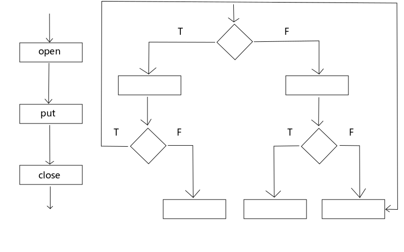
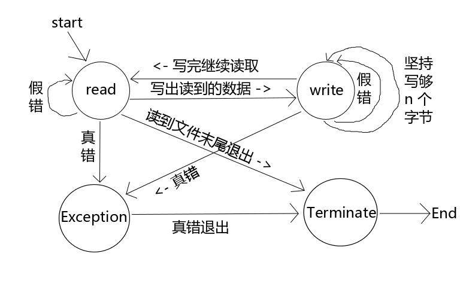

# 11.高级IO

1.非阻塞 I/O

高级 IO 部分有个很重要的概念是：非阻塞 I/O

在14章之前，我们讨论的所有函数都是阻塞的函数，例如 read() 函数读取设备时，设备中如果没有充足的数据，那么 read() 函数就会阻塞等待，直到有数据可读再返回。

当 IO 操作时出现了错误的时候，我们之前在讨论信号的博文中提到过会出现假错的情况。

那么从学了非阻塞 I/O 为止我们一共遇到了两种假错的情况：

EINTR：被信号打断，阻塞时会遇到。

EAGAIN：非阻塞形式操作失败。

遇到这两种假错的时候我们需要重新再操作一次，所以通常对假错的判断是放在循环中的。

例如 read() 函数使用非阻塞方式读取数据时，如果没有读取到数据，errno 为 EAGAIN，此时并不是说设备有问题或读取失败，只是表明采用的是非阻塞方式读取而已。

阻塞与非阻塞是使用的同一套函数，flags 特殊要求指定为 O_NONBLOCK 就可以了。

下面我们举个小栗子：（伪代码）


```c
fd = open("/etc/service", O_RDONLY | O_NONBLOCK);
/* if error */

while (1) {
    size = read(fd, buf, BUFSIZE);
    if (size < 0) {
        if (EAGAIN == errno) {
            continue;
        }
        perror("read()");
        exit(1);
    }

    // do sth...

}
```

上面的小栗子， 首先在 open() 的时候使用特殊要求 O_NONBLOCK 指定以非阻塞形式打开文件。

当 read() 发生错误时要判断是否为假错，如果发生了假错就再试一次，如果是真错就做相应的异常处理。


## 2.有限状态机

大家先考虑一个问题：把大象放到冰箱里需要几步？

+ 1）打开冰箱门；
+ 2）把大象放进去；
+ 3）关闭冰箱门；

这就是解决这个问题的自然流程。



图1 简单流程与复杂流程

把一个问题的解决步骤（自然流程）摆出来发现是结构化的流程就是简单流程，如果不是结构化的流程就是复杂流程。所有的网络应用和需要与人交互的流程都是复杂流程。

结构化的流程就是作为人类的本能解决问题的思路。

在之前的博文中 LZ 提到过一个“口令随机校验”的策略大家还记得吗？就是要求用户必须连续两次输入正确的密码才认为校验通过。就算是这样小的模块也不会用一个单纯的顺序选择流程把它完成，它一定是一个非结构化的流程。

**有限状态机**就是程序设计的一种思路而已，大家刚开始接触觉得难以理解，那是因为还没有习惯这种设计思路。我们为什么觉得像原先那种流程化的程序设计思路好用？那是因为被虐惯了，你曾经被迫习惯用计算机的思路来考虑问题而不是用作为人解决问题的本能步骤来考虑问题。有限状态机就是让你以作为人的本能的解决问题的方式来解决问题，当你习惯了有限状态机的设计思想之后就不觉得这是什么难以理解的东西了。

有限状态机被设计出来的目的就是为了解决复杂流程的问题，所以更何况是简单流程的问题也一样能够轻松的解决。

 

作为程序猿最怕的是什么？

恐怕最怕的就是需求变更了吧。

为什么要使用有限状态机的设计思路呢？因为它能帮助我们从容的应对需求变更。

使用有限状态机编程的程序在面对需求变更的时候往往仅需要修改几条 case 语句就可以了，而没有使用有限状态机编程的程序面对需求变更往往要把大段的代码推倒重来。

所以如果你掌握了有限状态机的编程思想，那么在很多情况下都可以相对轻松的解决问题，而且程序具有较好强的健壮性。

说了这么多废话，有限状态机到底是什么呢？

使用有限状态机首先要把程序的需求分析出来（废话，用什么编程都得先分析需求），然后把程序中出现的各种状态抽象出来制作成一张状态机流程图，然后根据这个流程图把程序的框架搭建出来，接下来就是添枝加叶了。

 

下面我们通过一个栗子来说明有限状态机的设计思想。

假如有如下需求：从设备 tty11 读取输入并输出到 tty12 上，同样从 tyy12 读取输入并输出到 tty11 上。

首先我们把它的各种状态抽象出来画成一幅图。



图2 有限状态机

每个状态画成一个圆形节点，每个节点延伸出来有多少条线就表示有多少种可能性。

这些节点拿到我们的程序中就变成了一条条 case 语句，下面我们看看使用代码如何实现。


```c
#include <stdio.h>
#include <stdlib.h>
#include <unistd.h>
#include <sys/types.h>
#include <sys/stat.h>
#include <fcntl.h>
#include <errno.h>

#define BUFSIZE        1024
#define TTY1        "/dev/tty11"
#define TTY2        "/dev/tty12"

/* 状态机的各种状态 */
enum
{
    STATE_R=1,
    STATE_W,
    STATE_Ex,
    STATE_T
};

/* 状态机，根据不同的需求设计不同的成员 */
struct fsm_st
{
    int state; // 状态机当前的状态
    int sfd; // 读取的来源文件描述符
    int dfd; // 写入的目标文件描述符
    char buf[BUFSIZE]; // 缓冲
    int len; // 一次读取到的实际数据量
    int pos; // buf 的偏移量，用于记录坚持写够 n 个字节时每次循环写到了哪里
    char *errstr; // 错误消息
};

/* 状态机驱动 */
static void fsm_driver(struct fsm_st *fsm)
{
    int ret;

    switch(fsm->state)
    {
        case STATE_R: // 读态
            fsm->len = read(fsm->sfd,fsm->buf,BUFSIZE);
            if(fsm->len == 0) // 读到了文件末尾，将状态机推向 T态
                fsm->state = STATE_T;
            else if(fsm->len < 0) // 读取出现异常
            {
                if(errno == EAGAIN) // 如果是假错就推到 读态，重新读一次
                    fsm->state = STATE_R;
                else // 如果是真错就推到 异常态
                {
                    fsm->errstr = "read()";
                    fsm->state = STATE_Ex;
                }
            }
            else // 成功读取到了数据，将状态机推到 写态
            {
                fsm->pos = 0;
                fsm->state = STATE_W;
            }
            break;

        case STATE_W: // 写态
            ret = write(fsm->dfd,fsm->buf+fsm->pos,fsm->len);
            if(ret < 0) // 写入出现异常
            {
                if(errno == EAGAIN) // 如果是假错就再次推到 写态，重新再写入一次
                    fsm->state = STATE_W;
                else // 如果是真错就推到 异常态
                {
                    fsm->errstr = "write()";
                    fsm->state = STATE_Ex;
                }
            }
            else // 成功写入了数据
            {
                fsm->pos += ret;
                fsm->len -= ret;
                if(fsm->len == 0) // 如果将读到的数据完全写出去了就将状态机推向 读态，开始下一轮读取
                    fsm->state = STATE_R;
                else // 如果没有将读到的数据完全写出去，那么状态机依然推到 写态，下次继续写入没写完的数据，实现“坚持写够 n 个字节”
                    fsm->state = STATE_W;
            }

            break;
    
        case STATE_Ex: // 异常态，打印异常并将状态机推到 T态
            perror(fsm->errstr);
            fsm->state = STATE_T;
            break;

        case STATE_T: // 结束态，在这个例子中结束态没有什么需要做的事情，所以空着
            /*do sth */
            break;
        default: // 程序很可能发生了溢出等不可预料的情况，为了避免异常扩大直接自杀
            abort();
    }

}

/* 推动状态机 */
static void relay(int fd1,int fd2)
{
    int fd1_save,fd2_save;    
    // 因为是读 tty1 写 tty2；读 tty2 写 tty1，所以这里的两个状态机直接取名为 fsm12 和 fsm21
    struct fsm_st fsm12,fsm21;

    fd1_save = fcntl(fd1,F_GETFL);
    // 使用状态机操作 IO 一般都采用非阻塞的形式，避免状态机被阻塞
    fcntl(fd1,F_SETFL,fd1_save|O_NONBLOCK);
    fd2_save = fcntl(fd2,F_GETFL);
    fcntl(fd2,F_SETFL,fd2_save|O_NONBLOCK);

    // 在启动状态机之前将状态机推向 读态
    fsm12.state = STATE_R;
    // 设置状态机中读写的来源和目标，这样状态机的读写接口就统一了。在状态机里面不用管到底是 读tty1 写tty2 还是 读tty2 写tty1 了，它只需要知道是 读src 写des 就可以了。
    fsm12.sfd = fd1;
    fsm12.dfd = fd2;

    // 同上
    fsm21.state = STATE_R;
    fsm21.sfd = fd2;
    fsm21.dfd = fd1;


    // 开始推状态机，只要不是 T态 就一直推
    while(fsm12.state != STATE_T || fsm21.state != STATE_T)
    {
        // 调用状态机驱动函数，状态机开始工作
        fsm_driver(&fsm12);
        fsm_driver(&fsm21);
    }

    fcntl(fd1,F_SETFL,fd1_save);
    fcntl(fd2,F_SETFL,fd2_save);
    
}

int main()
{
    int fd1,fd2;

    // 假设这里忘记将设备 tty1 以非阻塞的形式打开也没关系，因为推动状态机之前会重新设定文件描述符为非阻塞形式
    fd1 = open(TTY1,O_RDWR);
    if(fd1 < 0)
    {
        perror("open()");
        exit(1);
    }
    write(fd1,"TTY1\n",5);
    
    fd2 = open(TTY2,O_RDWR|O_NONBLOCK);
    if(fd2 < 0)
    {
        perror("open()");
        exit(1);
    }
    write(fd2,"TTY2\n",5);


    relay(fd1,fd2);


    close(fd1);
    close(fd2);


    exit(0);
}
```


大家先把这段代码读明白，下面我们还要用这段代码来修改示例。

如果只看上面的代码是很难理解程序是做什么的，因为都是一组一组的 case 语句，不容易理解。所以一般使用有限状态机开发的程序都会与图或相关的文档配套发行，看了图再结合代码就很容易看出来代码的目的了。

大家要对比着上面的图来看代码，这样思路就很清晰了。

使用状态机之前需要使两个待进行数据中继的文件描述符必须都是 O_NONBLOCK 的。

整个状态机中都没有使用循环来读写数据，因为状态机能确保每一种状态都是职责单一的，出现其它的任何状况的时候只要推动状态机问题就可以解决了。

所以这样的程序可维护性是不是高了很多？如果出现了需求变更，只需要简单的修改几条 case 语句就可以了，而不需要大段大段的修改代码了。

大家要多使用状态机的设计思想来写程序才能加深对这种设计思想的掌握程度。


## 3.I/O 多路转接

上面那个 读tty11 写tty12，读tty12 写tty11 的栗子是采用忙等的方式实现的，I/O 多路转接这个小节讨论的就是怎么把上面那个栗子修改为非忙等的模式。

有些时候就是这样的，读取多个文件（一般是设备）的时候不能使用阻塞方式，因为一个阻塞了其它的就没法读了；而非阻塞方式如果采用忙等的形式又得不偿失。你想想比如 telnet 服务在接收用户的命令的时候是不是这种情况呢？

对于处理这样的需求，Linux 系统为我们提供了 3 种方案：select()、poll() 和 epoll(7)，这些方案提供的函数可以同时监视多个文件描述符，当它们的状态没有变化时阻塞等待，当它们的状态发生变化时会给我们一个通知让我们继续处理任务，下面我们一个一个的介绍它们。

先来看第一个函数：select()


```c
// select,  FD_CLR,  FD_ISSET, FD_SET, FD_ZERO - synchronous I/O multiplexing

/* According to POSIX.1-2001 */
#include <sys/select.h>

/* According to earlier standards */
#include <sys/time.h>
#include <sys/types.h>
#include <unistd.h>

int select(int nfds, fd_set *readfds, fd_set *writefds, fd_set *exceptfds, struct timeval *timeout);

void FD_CLR(int fd, fd_set *set);
int  FD_ISSET(int fd, fd_set *set);
void FD_SET(int fd, fd_set *set);
void FD_ZERO(fd_set *set);
```

select() 的优点是足够老，各个平台都支持它，这也是它相对于 poll() 唯一的优点。

参数列表：

+ nfds：最大的文件描述符 + 1；
+ readfds：需要监视的输入文件描述符集合；
+ writefds：需要监视的输出文件描述符集合；
+ exceptfds：需要监视的会发生异常的文件描述符集合；
+ timeout：等待的超时时间，如果时间超时依然没有文件描述符状态发生变化那么就返回。设置为 0 会立即返回，设置为 NULL 则一直阻塞等待，不会超时。

还记得我们之前提到过使用 select() 函数替代 sleep() 函数吗？记不起来的童鞋自己回去翻看前面的博文吧，这里不再赘述了。

我们看到参数中的文件描述符集合是 fd_set 类型的，那么怎么把我们的 int 类型的文件描述符添加到 fd_set 当中去呢？

通过带参数的宏 FD_SET 就可以将文件描述符 fd 添加到 set 中了，而 FD_CLR 可以删除 set 中的给定的文件描述符。

带参数的宏 FD_ZERO 的作用是清空 set 中的文件描述符。

带参数的宏 FD_ISSET 的作用是测试文件描述符 fd 是否在 set 集合中。

下面我们重构上面的栗子，通过把它修改成非忙等的形式来看看 select 是如何使用的。代码没有太大的区别，所以只贴出有差异的部分。


```c
enum
{
    STATE_R=1,
    STATE_W,
    STATE_AUTO, // 添加这个值是为了起到分水岭的作用，小于这个值的时候才需要使用 select() 监视
    STATE_Ex,
    STATE_T
};

static int max(int a,int b)
{
    if(a < b)
        return b;
    return a;
}

static void relay(int fd1,int fd2)
{
    int fd1_save,fd2_save;    
    struct fsm_st fsm12,fsm21;
    fd_set rset,wset; // 读写文件描述符集合

    fd1_save = fcntl(fd1,F_GETFL);
    fcntl(fd1,F_SETFL,fd1_save|O_NONBLOCK);
    fd2_save = fcntl(fd2,F_GETFL);
    fcntl(fd2,F_SETFL,fd2_save|O_NONBLOCK);

    fsm12.state = STATE_R;
    fsm12.sfd = fd1;
    fsm12.dfd = fd2;

    fsm21.state = STATE_R;
    fsm21.sfd = fd2;
    fsm21.dfd = fd1;


    while(fsm12.state != STATE_T || fsm21.state != STATE_T)
    {
        //布置监视任务
        FD_ZERO(&rset);
        FD_ZERO(&wset);

        // 读态监视输入文件描述符；写态监视输出文件描述符
        if(fsm12.state == STATE_R)
            FD_SET(fsm12.sfd,&rset);
        if(fsm12.state == STATE_W)
            FD_SET(fsm12.dfd,&wset);
        if(fsm21.state == STATE_R)
            FD_SET(fsm21.sfd,&rset);
        if(fsm21.state == STATE_W)
            FD_SET(fsm21.dfd,&wset);

        if(fsm12.state < STATE_AUTO || fsm21.state < STATE_AUTO)
        {
            // 以阻塞形式监视
            if(select(max(fd1,fd2)+1,&rset,&wset,NULL,NULL) < 0)
            {
                if(errno == EINTR)
                    continue;
                perror("select()");
                exit(1);
            }
        }

        //查看监视结果
        if( FD_ISSET(fd1,&rset) || FD_ISSET(fd2,&wset) || fsm12.state > STATE_AUTO)
            fsm_driver(&fsm12);
        if( FD_ISSET(fd2,&rset) || FD_ISSET(fd1,&wset) || fsm21.state > STATE_AUTO)
            fsm_driver(&fsm21);
    }

    fcntl(fd1,F_SETFL,fd1_save);
    fcntl(fd2,F_SETFL,fd2_save);
    
}
```


 

在上面的栗子中，无论设备中是否有数据供我们读取我们都不停的推动状态机，所以导致出现了忙等的现象。

而在这个栗子中，我们在推状态机之前使用 select() 函数对文件描述符进行监视，如果文件描述状态没有发生变化就阻塞等待；而哪个状态机的文件描述符发生了变化就推动哪个状态机，这样就将查询法的实现改为通知法的实现了。是不是很简单呢？

 

poll() 出现的时间没有 select() 那么悠久，所以在可移植性上来说没有 select() 函数那么好，但是绝大多数主流 *nix 平台都支持 poll() 函数，它比 select() 要优秀很多，下面我们来了解下它。


```c
// poll - wait for some event on a file descriptor

#include <poll.h>

int poll(struct pollfd *fds, nfds_t nfds, int timeout);

struct pollfd {
    int   fd;         /* 需要监视的文件描述符 */
    short events;     /* 要监视的事件 */
    short revents;    /* 该文件描述符发生了的事件 */
};
```


 

 参数列表：

    + fds：实际上是一个数组的首地址，因为 poll() 可以帮助我们监视多个文件描述符，而一个文件描述放到一个 struct pollfd 结构体中，多个文件描述符就需要一个数组来存储了。
    + nfds：fds 这个数组的长度。在参数列表中使用数组首地址 + 长度的做法还是比较常见的。
    + timeout：阻塞等待的超时时间。传入 -1 则始终阻塞，不超时。

结构体中的事件可以指定下面七种事件，同时监视多个事件可以使用按位或（|）添加：

| 事件      | 描述                                     |
| --------- | ---------------------------------------- |
| POLLIN    | 文件描述符可读                           |
| POLLPRI   | 可以非阻塞的读高优先级的数据             |
| POLLOUT   | 文件描述符可写                           |
| POLLRDHUP | 流式套接字连接点关闭，或者关闭写半连接。 |
| POLLERR   | 已出错                                   |
| POLLHUP   | 已挂断（一般指设备）                     |
| POLLNVAL  | 参数非法                                 |

表1 poll() 可以监视的 7 种事件

 使用 poll() 的步骤也很简单：
    + 1）首先通过 struct pollfd 结构体中的 events 成员布置监视任务；
    + 2）然后使用 poll() 函数进行阻塞的监视；
    + 3）当从 poll() 函数返回时就可以通过 struct polfd 结构体中的 revents 成员与上面的 7 个宏中被我们选出来监视的宏进行按位与（&）操作了，只要结果不为 1 就认为触发了该事件。

好了，这 3 步就是 poll() 函数的使用方法，简单吧。

下面我们修改一下上面的栗子，把上面用 select() 实现的部分修改为用 poll() 来实现。没有改过的地方就不贴出来了，其实也只有 relay() 函数被修改了。


```c
static void relay(int fd1,int fd2)
{
    int fd1_save,fd2_save;    
    struct fsm_st fsm12,fsm21;
    struct pollfd pfd[2]; // 一共监视两个文件描述符


    fd1_save = fcntl(fd1,F_GETFL);
    fcntl(fd1,F_SETFL,fd1_save|O_NONBLOCK);
    fd2_save = fcntl(fd2,F_GETFL);
    fcntl(fd2,F_SETFL,fd2_save|O_NONBLOCK);

    fsm12.state = STATE_R;
    fsm12.sfd = fd1;
    fsm12.dfd = fd2;

    fsm21.state = STATE_R;
    fsm21.sfd = fd2;
    fsm21.dfd = fd1;

    pfd[0].fd = fd1;
    pfd[1].fd = fd2;

    while(fsm12.state != STATE_T || fsm21.state != STATE_T)
    {
        // 布置监视任务
        pfd[0].events = 0;
        if(fsm12.state == STATE_R)
            pfd[0].events |= POLLIN; // 第一个文件描述符可读
        if(fsm21.state == STATE_W)    
            pfd[0].events |= POLLOUT; // 第一个文件描述符可写

        pfd[1].events = 0;
        if(fsm12.state == STATE_W)
            pfd[1].events |= POLLOUT; // 第二个文件描述符可读
        if(fsm21.state == STATE_R)
            pfd[1].events |= POLLIN; // 第二个文件描述符可写

        // 只要是可读写状态就进行监视
        if(fsm12.state < STATE_AUTO || fsm21.state < STATE_AUTO)
        {
            // 阻塞监视
            while(poll(pfd,2,-1) < 0)
            {
                if(errno == EINTR)
                    continue;
                perror("poll()");
                exit(1);
            }
        }

        // 查看监视结果
        if( pfd[0].revents & POLLIN || \
            pfd[1].revents & POLLOUT || \
            fsm12.state > STATE_AUTO)
            fsm_driver(&fsm12); // 推状态机
        if( pfd[1].revents & POLLIN || \
            pfd[0].revents & POLLOUT || \
            fsm21.state > STATE_AUTO)
            fsm_driver(&fsm21); // 推状态机
    }

    fcntl(fd1,F_SETFL,fd1_save);
    fcntl(fd2,F_SETFL,fd2_save);
    
}
```


 

代码中注释写得很明确了，相信不需要 LZ 再解释什么了。

 

epoll(7) 不是一个函数，它在 man 手册的第 7 章里，它是 Linux 为我们提供的“加强版 poll()”，既然是加强版，那么一定有超越 poll() 的地方，下面就聊一聊 epoll(7)。 

在使用 poll() 的时候用户需要管理一个 struct pollfd 结构体或它的结构体数组，epoll(7) 则使内核为我们管理了这个结构体数组，我们只需要通过 epoll_create() 返回的标识引用这个结构体即可。

```c
// epoll_create - open an epoll file descriptor

#include <sys/epoll.h>

int epoll_create(int size);
```

 

调用 epoll_create() 时**最初** size 参数给传入多少，kernel 在建立数组的时候就是多少个元素。但是这种方式不好用，所以后来改进了，只要 size 随便传入一个正整数就可以了，内核不会再根据大家传入的 size 直接作为数组的长度了，因为内核是使用 hash 来管理要监视的文件描述符的。

返回值是 epfd，从这里也可以体现出 Linux 一切皆文件的设计思想。失败时返回 -1 并设置 errno。

 

得到了内核为我们管理的结构体数组标识之后，接下来就可以用  epoll_ctl() 函数布置监视任务了。


```c
// epoll_ctl - control interface for an epoll descriptor

#include <sys/epoll.h>

int epoll_ctl(int epfd, int op, int fd, struct epoll_event *event);


struct epoll_event {
       uint32_t events; /* Epoll 监视的事件，这些事件与 poll() 能监视的事件差不多，只是宏名前面加了个E */
       epoll_data_t data; /* 用户数据，除了能保存文件描述符以外，还能让你保存一些其它有关数据，比如你这个文件描述符是嵌在一棵树上的，你在使用它的时候不知道它是树的哪个节点，则可以在布置监视任务的时候将相关的位置都保存下来。这个联合体成员就是 epoll 设计的精髓。 */
};
```


 

epoll_ctl() 的作用是要对 fd 增加或减少（op） 什么行为的监视（event）。成功返回0，失败返回 -1 并设置 errno。

op 参数可以使用下面三个宏来指定操作：

| 宏            | 描述                                                        |
| ------------- | ----------------------------------------------------------- |
| EPOLL_CTL_ADD | 增加要监视的文件描述符                                      |
| EPOLL_CTL_MOD | 更改目标文件描述符的事件                                    |
| EPOLL_CTL_DEL | 删除要监视的文件描述符，event 参数会被忽略，可以传入 NULL。 |

表2 epoll_ctl() 函数 op 参数的选项

　　 

 

与 select() 和 poll() 一样， 布置完监视任务之后需要取监视结果，epoll(7) 策略使用 epoll_wait() 函数进行阻塞监视并返回监视结果。

```c
// epoll_wait  -  wait  for  an  I/O  event on an epoll file descriptor

#include <sys/epoll.h>

int epoll_wait(int epfd, struct epoll_event *events, int maxevents, int timeout);
```

 

参数列表：

+ epfd：要操作的 epoll 实例；
+ events + maxevents：共同指定了一个结构体数组，数组的起始位置和长度。其实每次使用 epoll_ctl() 函数添加一个文件描述符时相当于向内核为我们管理的数组中添加了一个成员，所以当我们使用同一个 struct epoll_event 变量操作多个文件描述符时，只需传入该变量的地址和操作了多少个文件描述符即可，大家看看下面的栗子就明白了。
+ timeout：超时等待的时间，设置为 -1 则始终阻塞监视，不超时。

跟上面的栗子一样，LZ 只贴出来被修改了的 relay() 函数，其它部分不变。


```c
static void relay(int fd1,int fd2)
{
    int fd1_save,fd2_save;    
    struct fsm_st fsm12,fsm21;
    int epfd;
    struct epoll_event ev;

    epfd = epoll_create(10);
    if(epfd < 0)
    {
        perror("epfd()");
        exit(1);
    }

    fd1_save = fcntl(fd1,F_GETFL);
    fcntl(fd1,F_SETFL,fd1_save|O_NONBLOCK);
    fd2_save = fcntl(fd2,F_GETFL);
    fcntl(fd2,F_SETFL,fd2_save|O_NONBLOCK);

    fsm12.state = STATE_R;
    fsm12.sfd = fd1;
    fsm12.dfd = fd2;

    fsm21.state = STATE_R;
    fsm21.sfd = fd2;
    fsm21.dfd = fd1;

    ev.events = 0;
    ev.data.fd = fd1;
    epoll_ctl(epfd,EPOLL_CTL_ADD,fd1,&ev);
    
    ev.events = 0;
        ev.data.fd = fd2;
        epoll_ctl(epfd,EPOLL_CTL_ADD,fd2,&ev);


    while(fsm12.state != STATE_T || fsm21.state != STATE_T)
    {
        // 布置监视任务

        ev.events = 0;
        ev.data.fd = fd1;
        if(fsm12.state == STATE_R)
            ev.events |= EPOLLIN;
        if(fsm21.state == STATE_W)    
            ev.events |= EPOLLOUT;
        epoll_ctl(epfd,EPOLL_CTL_MOD,fd1,&ev);

        ev.events = 0;
        ev.data.fd = fd2;
        if(fsm12.state == STATE_W)
            ev.events |= EPOLLOUT;
        if(fsm21.state == STATE_R)
            ev.events |= EPOLLIN;
        epoll_ctl(epfd,EPOLL_CTL_MOD,fd2,&ev);

        // 监视
        if(fsm12.state < STATE_AUTO || fsm21.state < STATE_AUTO)
        {
            while(epoll_wait(epfd,&ev,1,-1) < 0)
            {
                if(errno == EINTR)
                    continue;
                perror("epoll_wait()");
                exit(1);
            }
        }

        // 查看监视结果
        if( ev.data.fd == fd1 && ev.events & EPOLLIN || \
            ev.data.fd == fd2 && ev.events & EPOLLOUT || \
            fsm12.state > STATE_AUTO)
            fsm_driver(&fsm12);
        if( ev.data.fd == fd2 && ev.events & EPOLLIN || \
            ev.data.fd == fd1 && ev.events & EPOLLOUT  || \
            fsm21.state > STATE_AUTO)
            fsm_driver(&fsm21);
    }

    fcntl(fd1,F_SETFL,fd1_save);
    fcntl(fd2,F_SETFL,fd2_save);
    
    close(epfd);

}
```

## 4.记录锁 

记录锁就是用 fcntl() 函数创建一个锁文件，比较麻烦，感兴趣的童鞋可以自己看看书上的介绍，在这里 LZ 就不做介绍了，我们在最后会讨论两个方便的文件锁和锁文件。

## 5.异步 I/O

这部分主要是说信号驱动 IO，不是真正意义上的异步 IO。

异步 I/O 分为 System V 异步 I/O 和 BSD 异步 I/O，Linux 模仿的是后者，这里我们不过多讨论了，后面 LZ 在讨论内核的博文中会继续讨论异步。

## 6. readv() 和 write()

```c
// readv,  writev  -  read  or write data into multiple buffers

#include <sys/uio.h>

ssize_t readv(int fd, const struct iovec *iov, int iovcnt);

ssize_t writev(int fd, const struct iovec *iov, int iovcnt);

struct iovec {
    void  *iov_base;    /* 起始地址 */
    size_t iov_len;     /* Number of bytes to transfer */
};
```

这两个函数的作用就是对多个碎片的读写操作，将所有的小碎片写到文件中。

readv() 当没有连续的空间存储从 fd 读取或写入的数据时，将其存储在 iovcnt 个 iov 结构体中，writev() 的作用相同。iov 是结构体数组起始位置，iovcnt 是数组长度。


## 7. readn() 和 writen()

这两个函数可以从本书（《APUE》第三版）的光盘中找，它们并不是什么标准库的函数，也不是系统调用，只是本书作者自己封装的函数，算是方言中的方言，作用是坚持写够 n 个字节，之前我们在讨论 IO 的博文中实现过类似的效果。

对了，天朝在引入这本书的时候貌似没有引入配套光盘，需要的童鞋可以自己去网上搜索一下。

 
## 8.存储映射 I/O

存储映射 I/O 是十四章的小重点。

在 *nix 系统中分配内存的方法有好几种，不一定非得使用 free() 函数。

通过 mmap() 和 munmap() 函数可以实现一个实时的类似于 malloc() 和 free() 函数的效果，我们在前面的博文中提到过，malloc() 和 free() 实际上是以打白条的形式实现的，就是在你调用函数的时候并没有立即分配内存给你，而是在你真正使用内存的时候才分配给你的。

存储映射I/O说的就是将一个文件的一部分或全部映射到内存中，用户拿到的就是这段内存的起始位置，访问这个文件就相当于访问一个大字符串一样。


```c
// mmap, munmap - map or unmap files or devices into memory

#include <sys/mman.h>

void *mmap(void *addr, size_t length, int prot, int flags,
           int fd, off_t offset);
int munmap(void *addr, size_t length);
```

mmap() 函数的作用是把 fd 这个文件从 offset 偏移位置开始把 length 字节个长度映射到 addr 这个内存位置上，如果 addr 参数传入 NULL 则由 kernel 帮我们选择一块空间并使用返回值返回这段内存的首地址。

prot 参数是操作权限，可以使用下表中的宏通过按位或（|）来组合指定。

| 宏         | 含义           |
| ---------- | -------------- |
| PROT_READ  | 映射区可读     |
| PROT_WRITE | 映射区可写     |
| PROT_EXEC  | 映射区可执行   |
| PROT_NONE  | 映射区不可访问 |

表3 mmap() 函数的 prot 参数可选项

映射区不可访问（PROT_NONE）的含义是如果我映射的内存中有一块已经有某些数据了，绝对不能让我的程序越界覆盖了，就可以把这段空间设置为映射区不可访问。

flags 参数是特殊要求，以下二者必选其一：

| 宏          | 含义                                                                                                             |
| ----------- | ---------------------------------------------------------------------------------------------------------------- |
| MAP_SHARED  | 对映射区进行存储操作相当于对原来的文件进行写入，会改变原来文件的内容。                                           |
| MAP_PRIVATE | 当对映射区域进行存储操作时会创建一个私有副本，所有后来再对映射区的操作都相当于操作这个副本，而不影响原来的文件。 |

表4 mmap() 函数的 flags 参数可选项

其它常用选项：

MAP_ANONYMOUS：不依赖于任何文件，映射出来的内存空间会被清 0，并且 fd 和 offset 参数会被忽略，通常我们在使用的时候会把 fd 设置为 -1。

用这个参数可以很容易的做出一个最简单最好用的在具有亲缘关系的进程之间的共享内存，比后面第15章我们要讨论的共享内存还好用。后面 LZ 会给出一个小栗子让大家看看这种方式如何使用。

mmap() 在成功的时候返回一个指针，会指向映射的内存区域的起始地址。失败时返回 MAP_FAILED 宏定义，其实是这样定义的：(void *) -1。

首先我们写一个栗子看看如何把一个文件映射到内存中访问。


```c
#include <stdio.h>
#include <stdlib.h>
#include <sys/mman.h>
#include <sys/types.h>
#include <sys/stat.h>
#include <unistd.h>
#include <fcntl.h>


#define FNAME        "/etc/services"

int main(void)
{
    int fd,i;
    char *str;
    struct stat statres;
    int count = 0;

    fd = open(FNAME,O_RDONLY);    
    if(fd < 0)
    {
        perror("open()");
        exit(1);
    }

    // 通过 stat() 获得文件大小
    if(fstat(fd,&statres) < 0)
    {
        perror("fstat()");
        exit(1);
    }

    str = mmap(NULL,statres.st_size,PROT_READ,MAP_SHARED,fd,0);
    if(str == MAP_FAILED)
    {
        perror("mmap()");
        exit(1);
    }

    // 将文件映射到内存之后文件描述符就可以关闭了，直接访问映射的内存就相当于访问文件了。
    close(fd);

    for(i = 0 ; i < statres.st_size; i++) {
        // 因为访问的是文本文件，所以可以把映射的内存看作是一个大字符串处理
        if(str[i] == 'a') {
            count++;
        }
    }
    
    printf("count = %d\n",count);

    // 用完了别忘了解除映射，不然会造成内存泄漏！
    munmap(str,statres.st_size);

    exit(0);
}
```


这段代码会统计 /etc/services 文件中包含多少个字符 'a'。

mmap() 的返回值是 void* 类型的，这是一种百搭的类型，在映射了不同的东西的情况下我们可以使用不同的指针来接收，这样就能用不同的方式访问这段内存空间了。上面这个文件是文本文件，所以我们可以使用 char* 来接收它的返回值，这样就将整个文件看作是一个大字符串来访问了。

这个还是比较常规的用法，下面我们看一下如何使用 mmap() 函数制作一个好用的共享内存。


```c
#include <stdio.h>
#include <stdlib.h>
#include <sys/mman.h>
#include <sys/types.h>
#include <sys/stat.h>
#include <unistd.h>
#include <fcntl.h>
#include <string.h>
#include <wait.h>

#define MEMSIZE        1024

int main(void)
{
    char *str;
    pid_t pid;

    // 这里在 flags 中添加 MAP_ANONYMOUS，为制作共享内存做准备
    str = mmap(NULL,MEMSIZE,PROT_READ|PROT_WRITE,MAP_SHARED|MAP_ANONYMOUS,-1,0);
    if(str == MAP_FAILED)
    {
        perror("mmap()");
        exit(1);
    }

    // 创建子进程，父子进程使用共享内存进行通信
    pid = fork();
    if(pid < 0)
    {
        perror("fork()");
        exit(1);
    }
    if(pid == 0) // 子进程向共享内存中写入数据
    {
        strcpy(str,"Hello!");
        munmap(str,MEMSIZE); // 注意，虽然共享内存是在 fork() 之前创建的，但是 fork() 的时候子进程也拷贝了一份，所以子进程使用完毕之后也要解除映射
        exit(0);
    }
    else // 父进程从共享内存中读取子进程写入的数据
    {
        wait(NULL); // 保障子进程先运行起来，因为就算父进程先运行了也会在这里阻塞等待
        puts(str); // 把从共享内存中读取出来的数据打印出来
        munmap(str,MEMSIZE); // 不要忘记解除映射
        exit(0);
    }


    exit(0);
}
```


 

共享内存是进程间通信的一种手段，就是在内存中开辟一块空间让多个进程之间可以共同访问这段空间，从而实现进程之间的数据交换。在后面讨论 IPC 的博文中我们还会详细介绍共享内存，不过用 mmap() 制作的共享内存比后面介绍的共享内存使用起来更简便一些。

大家自己运行一下这段代码，可以看到父进程打印出了子进程写入的“Hello”字符串，说明这段内存确实是在父子进程之间共享的。

**大家在使用的时候不要忘记父子进程最后都要做解除映射的动作。**

从这个栗子中我们也可以看出来，这种共享内存的方式只适合在具有亲缘关系的进程之间使用，没有亲缘关系的进程是无法获得指向同一个映射内存空间的指针的。

 

## 9. flock() 和 lockf() 函数
```c
// lockf - apply, test or remove a POSIX lock on an open file

#include <unistd.h>

int lockf(int fd, int cmd, off_t len);

// flock - apply or remove an advisory lock on an open file

#include <sys/file.h>

int flock(int fd, int operation);
```

这两个函数可以实现好用的文件加锁。

我们这里只介绍 lockf() 函数，flock() 函数也差不多，都很简单，所以大家可以自己去查阅 man 手册。

lockf() 可以给文件进行局部加锁，简单来说就是从当前位置锁住 len 个字节。

参数列表：

+ fd：要加锁的文件描述符；
+ cmd：具体的命令见下表；

| 宏      | 说明                                                                                                                                     |
| ------- | ---------------------------------------------------------------------------------------------------------------------------------------- |
| F_LOCK  | 为文件的一段加锁，如果已经被加锁就阻塞等待，如果两个锁要锁定的部分有交集就会被合并，文件关闭时或进程退出时会自动释放，不会被子进程继承。 |
| F_TLOCK | 与 F_LOCK 差不多，不过是尝试加锁，非阻塞。                                                                                               |
| F_ULOCK | 解锁，如果是被合并的锁会分裂。                                                                                                           |
| F_TEST  | 测试锁，如果文件中被测试的部分没有锁定或者是调用进程持有锁就返回 0；如果是其它进程持有锁就返回 -1，并且 errno 设置为 EAGAIN 或 EACCES。  |

图5 lockf() 函数的 cmd 参数可选值

　　len：要锁定的长度，如果为 0 表示文件有多长锁多长，从当前位置一直锁到文件结尾。

下面我们使用 lockf() 函数写一个栗子。


```c
#include <stdio.h>
#include <stdlib.h>
#include <string.h>
#include <unistd.h>
#include <wait.h>
#include <sys/types.h>


#define PROCNUM        20    
#define FNAME        "/tmp/out"
#define BUFSIZE        1024


static void func_add()
{
    FILE *fp;
    int fd;
    char buf[BUFSIZE];
    
    fp = fopen(FNAME,"r+");    
    if(fp == NULL)
    {
        perror("fopen()");
        exit(1);
    }

    fd = fileno(fp);
    if(fd < 0)
    {
        perror("fd");
        exit(1);
    }

    // 使用之前先锁定
    lockf(fd,F_LOCK,0);

    fgets(buf,BUFSIZE,fp);
    rewind(fp); // 把文件位置指针定位到文件首
    sleep(1); // 放大竞争
    fprintf(fp,"%d\n",atoi(buf)+1);
    fflush(fp);

    // 使用之后释放锁
    lockf(fd,F_ULOCK,0);

    fclose(fp);

    return ;
}

int main(void)
{
    int i;
    pid_t pid;
    
    for(i = 0 ; i < PROCNUM ; i++)
    {
        pid = fork();        
        if(pid < 0)
        {
            perror("fork()");
            exit(1);
        }
        if(pid == 0)    // child
        {
            func_add();
            exit(0);
        }
    }

    for(i = 0 ; i < PROCNUM ; i++)
        wait(NULL);


    exit(0);
}
```

还是用我么以前的栗子改的，大家还记得以前写过一个栗子，让 20 个进程同时向 1 个文件中累加数字吗。

在这里每个进程在读写文件之前先加锁，如果加不上就等待别人释放锁再加。如果加上了锁就读出文件中当前的值，+1 之后再写回到文件中。

获得锁之后 sleep(1) 是为了放大竞争，让进程之间一定要出现竞争的现象，便于我们分析调试。

在调试并发的程序时，如果有些问题很难复现，那么可以通过加长每一个并发单位的执行时间来强制它们出现竞争的情况，这样可以让我们更容易的分析问题。

 

图3 flock() 和 lockf() 的缺点

文件锁还有一个机制是把一个文件当作锁，比如要操作的是 /tmp/out 文件，那么父进程可以先创建一个 /tmp/lcok文件，然后再创建 20 个子进程同时对 /tmp/out 文件进行读写，但是子进程必须先锁定 /tmp/lock 文件才能操作 /tmp/out 文件，没抢到锁文件的需要等待其它进程解锁再抢锁，等父进程为所有的子进程收尸之后再关闭/tmp/lock，/tmp/lock 这个文件就被称为锁文件。

 
高级 IO 部分大概就这些内容了，有什么疑问欢迎大家在评论中讨论。

 
===================================================
2020-08-27 补充：
select() 读管道时不停返回1的解决办法：
在非阻塞的情况下读管道，无论是写端向管道写入了数据，还是写端关闭了管道，select() 都能监听到。select() 无法识别是由于管道被写入了数据还是管道被写端关闭了导致的管道变化，所以需要通过 read() 函数的返回值来进行区分，read() 函数返回0就表示管道被写端关闭了。
参考文献：https://blog.csdn.net/weixin_30639719/article/details/98241129