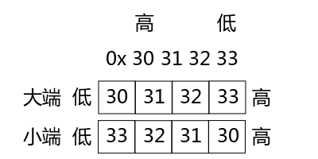

# 13.网络IPC之套接字

在前面的博文中我们讨论了进程间通讯（IPC）的各种常用手段，但是那些手段都是指通讯双方在同一台机器上的情况。在现实生活中我们会经常接触到各种各样的网络应用程序，比如大家经常使用的 ftp、svn、甚至QQ、迅雷等等，它们的通讯双方通常都是在不同的机器上的，那么它们的通讯就是**跨主机的进程间通讯**了，所以网络通讯也是一种进程间通讯的手段。

跨主机的程序在传输数据之前要制定严谨的协议，不然对方可能会看不懂你发送的数据，从而导致数据传送失败，甚至造成安全类bug，所以跨主机的通讯就不像我们之前学习的在同一台主机上的进程间通讯那么简单了。

制定协议要考虑的问题至少包括以下几点：

1）告诉对方自己的 IP 和端口；

先来看看 IP 和端口的概念。

当我们的程序在进行网络通讯之前，需要先与自己的机器进行约定，告诉操作系统我需要使用哪个端口，这样操作系统的某个端口在收到数据的时候就会发送给我们的进程。当另一个程序也来通知操作系统它要使用这个端口时，操作系统要保证这个端口只有我们使用而不能再让别人使用，否则当它收到数据的时候就不知道应该发送给谁了。

当我们需要发送数据的时候，也会使用这个端口进行发送，只有特殊情况才会使用别的端口或者使用多个端口。

 

2）还要考虑的问题是通信的双方应该采用什么数据类型呢？

假如通讯双方要传送一个 int 类型的数据，那么对方机器上 int 类型的位数与我们机器上的位数是否相同呢？

也就是说 int 类型在我的机器上是 32bit，但是在对方的机器上也是 32bit 吗？假设在对方机器上是 16bit，那么我发送给它的 int 值它能正确解析吗？

所以**通信双方的数据类型要采用完全一致的约定**，这个我们在下面会讨论如何让数据类型一致。

 

3）还要考虑**字节序**问题，这个说的是大小端的问题。

大端格式是：低地址存放高位数据，高地址存放低位数据。

小端格式是：低地址存放低位数据，高地址存放高位数据。



图1 大小端

如图1 所示，假设要存放的数据是 0x30313233，那么 33 是低位，30 是高位，在大端存储格式中，30 存放在低位，33 存放在高位；而在小端存储格式中，33 存放在低位，30 存放在高位。

这个东西有什么作用呢？它其实就是我们使用的网络设备（计算机、平板电脑、智能手机等等）在内存当中存储数据的格式。所以如果通讯双方的设备存储数据的格式不同，那么一端发送过去的数据，另一端是无法正确解析的，这可怎么办呢？

没关系，还好系统为我们准备了一组函数可以帮我们实现字节序转换，我们可以像使用公式一样使用它们。


```
 1 htonl,  htons,  ntohl,  ntohs - convert values between host and network byte order
 2 
 3 #include <arpa/inet.h>
 4 
 5 uint32_t htonl(uint32_t hostlong);
 6 
 7 uint16_t htons(uint16_t hostshort);
 8 
 9 uint32_t ntohl(uint32_t netlong);
10 
11 uint16_t ntohs(uint16_t netshort);
```


 

这组函数的名字好奇怪是吧，所以为了便于记忆，在讨论它们的功能之前我们先来分析一下它们名字里的玄机：

h 是 host，表示主机；n 是 network，表示网络。l 表示 long，s 表示 short。

这样一来就好理解多了吧？它们的作用从名字中就可以看出来了，就是把数据从主机序转换为网络序，或者把数据从网络序转换为主机序。

网路字节序一般都是大端的，而主机字节序则根据硬件平台的不同而不同（在 x86 平台和绝大多数的 ARM 平台都是小端）。所以为了简化我们编程的复杂度，这些函数的内部会根据当前机器的结构自动为我们选择是否要转换数据的字节序。我们不用管到底我们自己的主机采用的是什么字节序，只要是从主机发送数据到网络就需要调用 hton 函数，从网络接收数据到主机就需要调用 ntoh 函数。

 

4）最后一项约定是**结构体成员不对齐**，由于数据对齐也是与硬件平台相关的，所以不同的主机如果使用不同的对齐方式，就会导致数据无法解析。

如何使数据不对齐呢，只需要在定义结构体的时候在结尾添加 __attribute__((packed)) 就可以了，见如下栗子：

```
1 struct msg_st
2 {
3     uint8_t name[NAMESIZE];
4     uint32_t math;
5     uint32_t chinese;
6 }__attribute__((packed));
```

网络传输的结构体中的成员都是紧凑的，所以不能地址对齐，需要在结构体外面增加 __attribute__((packed))。

 

关于字节对齐的东西就足够写一篇博文了，LZ 在这里仅仅简单介绍一下什么是字节对齐，如果感兴趣大家可以去查阅专门的资料。

结构体的地址对齐是通过 **起始地址 % sizeof(type) == 0** 这个公式计算的，也就是说存放数据的起始地址位于数据类型本身长度的整倍数。
如果当前成员的起始地址能被 sizeof 整除，就可以把数据存放在这；否则就得继续看下一个地址能不能被 sizeof 整除，直到找到合适的地址为止。不适合作为起始地址的空间将被空(lang)闲(fei)。

 

图2 字节对齐

 

从进程间通信开始，我们写程序就是一步一步按部就班的写就可以了，编写网络应用也一样，网络通信本质上就是一种跨主机的进程间通信（IPC）。 

在上一篇博文中我们了解了主动端和被动端的概念，那么接下来看看在 Socket 中主动端和被动端都要做什么。

> 主动端（先发包的一方）
>
> 1.取得 Socket
>
> 2.给 Socket 取得地址（可省略，不必与操作系统约定端口，由操作系统指定随机端口）
>
> 3.发/收消息
>
> 4.关闭 Socket
>
>  
>
> 被动端（先收包的一方，先运行）
>
> 1.取得 Socket
>
> 2.给 Socket 取得地址
>
> 3.收/发消息
>
> 4.关闭 Socket

首先我们来看一个栗子，看不懂没关系，稍后 LZ 会告诉大家用到的函数都是什么意思。

proto.h 里面主要是通讯双方约定的协议，包含端口号、传送数据的结构体等等。


```
 1 /* proto.h */
 2 #ifndef PROTO_H__
 3 #define PROTO_H__
 4 
 5 #include <stdint.h>
 6 
 7 #define RCVPORT            "1989"    
 8 
 9 #define NAMESIZE        13
10 
11 
12 struct msg_st
13 {
14     uint8_t name[NAMESIZE];
15     uint32_t math;
16     uint32_t chinese;
17 }__attribute__((packed));
18 
19 
20 #endif
```


 

rcver.c 是被动端的代码，也是通讯双方先启动的一端。


```
 1 /* rcver.c */
 2 #include <stdio.h>
 3 #include <stdlib.h>
 4 
 5 #include <arpa/inet.h>
 6 #include <sys/types.h>
 7 #include <sys/socket.h>
 8 
 9 #include "proto.h"
10 
11 #define IPSTRSIZE        64
12 
13 int main()
14 {
15     int sd;
16     struct sockaddr_in laddr,raddr;
17     socklen_t raddr_len;
18     struct msg_st rbuf;
19     char ipstr[IPSTRSIZE];
20 
21     sd = socket(AF_INET,SOCK_DGRAM, 0/*IPPROTO_UDP*/);
22     if(sd < 0)
23     {
24         perror("socket()");
25         exit(1);
26     }
27 
28     laddr.sin_family = AF_INET;
29     laddr.sin_port = htons(atoi(RCVPORT));
30     inet_pton(AF_INET,"0.0.0.0",&laddr.sin_addr.s_addr);
31  
32     if(bind(sd,(void *)&laddr,sizeof(laddr)) < 0)
33     {
34         perror("bind()");
35         exit(1);
36     }
37 
38     raddr_len = sizeof(raddr);
39     while(1)
40     {
41         if(recvfrom(sd,&rbuf,sizeof(rbuf),0,(void *)&raddr,&raddr_len) < 0)
42         {
43             perror("recvfrom()");
44             exit(1);
45         }
46                 
47         inet_ntop(AF_INET,&raddr.sin_addr,ipstr,IPSTRSIZE);
48         printf("---MESSAGE FROM:%s:%d---\n",ipstr,ntohs(raddr.sin_port));
49         printf("Name = %s\n",rbuf.name);
50         printf("Math = %d\n",ntohl(rbuf.math));
51         printf("Chinese = %d\n",ntohl(rbuf.chinese));
52     }
53 
54     close(sd);
55         
56 
57     exit(0);
58 }
```


 

snder.c 是主动端，主动向另一端发送消息。这端可以不用向操作系统绑定端口，发送数据的时候由操作系统为我们分配可用的端口即可，当然如果想要自己绑定特定的端口也是可以的。


```
 1 /* snder.c */
 2 #include <stdio.h>
 3 #include <stdlib.h>
 4 #include <arpa/inet.h>
 5 #include <sys/types.h>
 6 #include <sys/socket.h>
 7 #include <string.h>
 8 
 9 #include "proto.h"
10 
11 
12 int main(int argc,char **argv)
13 {
14     int sd;
15     struct msg_st sbuf;
16     struct sockaddr_in raddr;
17     
18     if(argc < 2)
19     {
20         fprintf(stderr,"Usage...\n");
21         exit(1);
22     }
23 
24     sd = socket(AF_INET,SOCK_DGRAM,0);
25     if(sd < 0)
26     {
27         perror("socket()");
28         exit(1);
29     }
30 
31 //    bind();    // 主动端可省略绑定端口的步骤
32 
33     memset(&sbuf,'\0',sizeof(sbuf));
34     strcpy(sbuf.name,"Alan");
35     sbuf.math = htonl(rand()%100);
36     sbuf.chinese = htonl(rand()%100);
37 
38     raddr.sin_family = AF_INET;
39     raddr.sin_port = htons(atoi(RCVPORT));
40     inet_pton(AF_INET,argv[1],&raddr.sin_addr);
41 
42     if(sendto(sd,&sbuf,sizeof(sbuf),0,(void *)&raddr,sizeof(raddr)) < 0)
43     {
44         perror("sendto()");
45         exit(1);
46     }
47 
48     puts("ok!");
49 
50     close(sd);    
51 
52 
53     exit(0);
54 }
```


 

由这三个文件组成的程序就可以进行网络通讯了，不知道大家有没有注意到，无论是发送端还是接收端，执行的步骤都是固定的，将来大家在开发更复杂的网络应用时也是基于这几个步骤进行扩展。

根据上面的代码中协议（proto.h）的定义，我们知道其中 msg_st 结构体中 name 成员的长度是固定的，这样并不好用，那么我们就把它修改为变长结构体。

修改成变长结构体很简单，只需把变长的部分放到结构体的最后面，然后通过 malloc(3) 动态内存管理来为它分配我们需要的大小。如下所示：

```
1 struct msg_st
2 {
3     uint32_t math;
4     uint32_t chinese;
5     uint8_t name[1];
6 }__attribute__((packed));
```

 

UDP 包常规的最大尺寸是 512 字节，去掉包头的 8 个字节，再去掉结构体中除了最后一个成员以外其它成员大小的总和，剩下的就是我们最后一个成员最大能分配的大小。

 

大家还记得如何操作一个文件吗？

1.首先通过 open(2) 函数打开文件，并获得文件描述符；

2.通过 read(2)、write(2) 函数读写文件；

3.调用 close(2) 函数关闭文件，释放相关资源。

没错，在 Linux 的一切皆文件的设计理念中，网络也是文件，网络之间的通讯也可以像操作文件一样，对它进行读写。

在网络程序中，通常步骤是这样的：

1.首先通过 socket(2) 函数获得 socket 文件描述符；

2.通过 send(2)、sendto(2)、recv(2)、recvfrom(2) 等函数读写数据，这一步就相当于在网络上收发数据了。

3.调用 close(2) 函数关闭网络，释放相关资源。你没看错，这个函数就是我们关闭文件描述符的时候使用的函数。

下面我们依次介绍上面遇到的各种函数。

socket(2)

```
1 socket - create an endpoint for communication
2 
3 #include <sys/types.h>          /* See NOTES */
4 #include <sys/socket.h>
5 
6 int socket(int domain, int type, int protocol);
```

socket(2) 函数是用来获取对网络操作的文件描述符的，就像 open(2) 函数一样。

参数列表：

　　domain：协议族；

　　type：链接方式；

　　protocol：具体使用哪个协议。在 domain 的协议族中每一个对应的 type 都有一个或多个协议，使用协议族中默认的协议可以填写 0。

返回值：如果成功，返回的是一个代表当前网络链接的文件描述符，你要保存好它，因为后续的网络操作都需要它。如果失败，返回 -1，并设置 errno。

下面就是 Linux 支持的协议族，也就是 domain 参数可以选择的宏，它们都定义在 sys/socket.h 头文件中，所以想要使用下面的宏不要忘记包含这个头文件哟。

> AF_UNIX、AF_LOCAL：本地协议；通过 man 7 unix 可以得到有关这个协议族更详细的描述。
>
> **AF_INET**：IPV4 协议；这是我们最常见的协议族，通过 man 7 ip 可以得到有关这个协议族更详细的描述。
>
> AF_INET6：IPV6 协议；，通过 man 7 ipv6 可以得到有关这个协议族更详细的描述。
>
> AF_IPX：Novell 当年是网络的代名词，是非常古老的操作系统，出现在 TCP/IP 之前；
>
> AF_NETLINK：是用户态与内核态通信的协议；
>
> AF_X25：这是很早的协议，感兴趣的话可以自己去 Google 一下；
>
> AF_AX25：应用于业余无线电，也称为短波通信，都是一些无线电爱好者使用的协议。据说汶川地震时灾区所有通讯都瘫痪了，第一个求救信号就是短波发送出来的，因为这些无线电爱好者家里一般都有大大小小的发电机。
>
> AF_ATMPVC：当年如日中天，后来死于封闭。协议设计得非常好，后来几家公司都为了拿大头就僵持起来，谁都没有推广它，就在这时候以太网发展起来了，就把它打败了。以太网发展起来就是因为很简陋，所以更容易推广。
>
> AF_APPLETALK：苹果使用的一个局域网协议；
>
> AF_PACKET：底层 socket 所用到的协议，比如抓包器所遵循的协议一定要在网卡驱动层，而不能在应用层，否则无法见到包封装的过程。再比如 ping(1) 命令大家都熟悉吧，想要实现 ping(1) 命令就需要了解这个协议族，感兴趣的话大家可以自行 Google 一下。

如果想要对网络编程进行更深入的学习，那么《APUE》作者写的《UNIX 网络编程》有必要读一遍；《TCP/IP详解》三卷也要读一下，但是这三卷都很难读，而且翻译质量也一般，可以买一本中文的再找一本英文电子版的，遇到中文的读不通的时候拿出来英文原文对照一下就可以了。

 

下面我们看一下 type 参数有哪些可选项： 

> SOCK_STREAM：流式套接字，特点是有序、可靠。有序、双工、基于链接的、以字节流为单位的。
>
> **可靠**不是指不丢包，而是流式套接字保证只要你能接收到这个包，那么包中的数据的完整性一定是正确的。
>
> **双工**是指双方都能收发。
>
> **基于链接的**是指：比如大街上张三、李四进行对话，一定不会说每句话之前都叫着对方的名字。也就是说通信双方是知道对方是谁的。
>
> **字节流**是指数据没有明显的界限，一端数据可以分为任意多个包发送。
>
>  
>
> SOCK_DGRAM：报式套接字，无链接的，固定的最大长度，不可靠的消息。
>
> 就像写信，无法保证你发出的信对方一定能收到，而且无法保证内容不会被篡改。如果今天发了一封信，明天又发了一封信，不能保证哪封信先到。大家都能收到这个包，但是发现不是自己的之后就会丢弃，发现是自己的包再处理，有严格的数据分界线。更详细的解释可以参阅 man 手册。
>
>  
>
> SOCK_SEQPACKET：提供有序、可靠、双向基于连接的数据报通信。
>
> SOCK_RAW：原始的套接字，提供的是网络协议层的访问。
>
> SOCK_RDM：数据层的访问，不保证传输顺序。
>
> SOCK_PACKET：不好用，具体的 bug 要查 man 7 packet。

 

 

bind(2)


```
1 bind - bind a name to a socket
2 
3 #include <sys/types.h>          /* See NOTES */
4 #include <sys/socket.h>
5 
6 int bind(int sockfd, const struct sockaddr *addr,
7          socklen_t addrlen);
```


 

bind(2) 函数用于绑定本机端口，就是提前跟操作系统约定好，来自 xx 端口的数据都要转交给我（当前进程）处理，并且我占用了这个端口号别人（其它进程）就不能再使用了。

参数列表：

　　sockfd：刚刚使用 socket(2) 函数得到的文件描述符，表示要对该网络链接绑定端口。

　　addr：要绑定到套接字上的地址。根据不同的协议要在 man 手册第 7 章查阅具体的章节，然后在 Address Types 一栏里面找到对应的结构体。比如你在调用 socket(2) 函数的时候，domain 参数选择的是 AF_INET，那么这个结构体就可以在 man 手册 ip(7) 章节中找到。

　　addrlen：addr 传递的地址结构体的长度。

以 AF_INET 为例，下面这两个结构体就是在 ip(7) 中找到的。


```
 1 struct sockaddr_in {
 2 sa_family_t sin_family; /* 指定协议族，一定是 AF_INET，因为既然是 man ip(7)，那么一定是 AF_INET 协议族的 */
 3 in_port_t sin_port; /* 端口，需要使用 htons(3) 转换为网络序 */
 4 struct in_addr sin_addr; /* internet address */
 5 };
 6 
 7 /* Internet address. */
 8 struct in_addr {
 9 uint32_t s_addr; /* 无符号32位大整数，可以使用 inet_pton(3) 将便于记忆的点分式 IP 地址表示法转换为便于计算机使用的大整数，inet_ntop(3) 的作用则正好相反。本机地址转换的时候可以使用万能IP：0.0.0.0(称为any address)，函数会自动将 0.0.0.0 解析为真实的本机 IP 地址。 */
10 };
```


 

 大家可以看到，这个结构体的类型是 struct sockaddr_in，而 bind(2) 函数的第二个参数 的类型是 struct sockaddr，它们二者有什么关系呢？别瞎想，不是继承关系啦，C 语言中没有继承这种东东。在传参的时候直接把实参强转为 void* 类型即可，就像上面栗子中 rcver.c 写得那样。

 

recv(2) 和 recvfrom(2) 函数


```
1 recv, recvfrom - receive a message from a socket
2 
3 #include <sys/types.h>
4 #include <sys/socket.h>
5 
6 ssize_t recv(int sockfd, void *buf, size_t len, int flags);
7 
8 ssize_t recvfrom(int sockfd, void *buf, size_t len, int flags,
9                  struct sockaddr *src_addr, socklen_t *addrlen);
```


 

这两个函数的作用是从网络上接收内容并写入 len 个字节长度的数据到 buf 中，且将发送端的地址信息填写到 src_addr 中。

返回值是真正能接收到的字节数，返回 -1 表示失败。

recv(2) 函数一般用在流式（SOCK_STREAM）套接字中，而 recvfrom(2) 则一般用在报式（SOCK_DGRAM）套接字中。

为什么这么说呢，还记得上面我们提到过吗，流式套接字是基于链接的，而报式套接字是无链接的。那么我们再来观察下这两个函数的参数列表，很明显 recv(2) 函数并没有地址相关的参数，而 recvfrom(2) 函数则会将对方的地址端口等信息回填给调用者。

网络中的数据只有单字节数据不用考虑字节序，从网络上接收过来的数据只要涉及到字节序就需要使用 ntoh 系列函数进行字节序转换。这一组函数我们上面介绍过了，没记住的童鞋可以往上翻。

 

> 小提示：通过 netstat(1) 命令 ant 参数可以查看 TCP 链接情况，或通过 netstat(1) 命令 anu 参数可以查看 UDP 链接情况。
>
> t 参数表示 TCP；
>
> u 参数表示 UDP；

 

send(2) 和 sendto(2) 函数


```
1 send, sendto, sendmsg - send a message on a socket
2 
3 #include <sys/types.h>
4 #include <sys/socket.h>
5 
6 ssize_t send(int sockfd, const void *buf, size_t len, int flags);
7 
8 ssize_t sendto(int sockfd, const void *buf, size_t len, int flags,
9                const struct sockaddr *dest_addr, socklen_t addrlen);
```


 

这两个函数与 recv(2) 和 recvfrom(2) 函数正好是对应的，它们的作用是向网络上发送数据。

参数列表：

　　sockfd：通过哪个 Socket 往外发数据，这个参数的值就是在调用 socket(2) 函数的时候取得的；

　　buf：要发送的数据；

　　len：要发送的数据的长度；

　　flags：特殊要求，没有填 0；

　　src_addr：目标地址；就像上面我们讨论 bind(2) 函数时一样，具体使用哪个结构体要根据你在调用 socket(2) 函数的时候使用的具体协议族有关系，然后到对应的 man 手册第 7 章去查找。

　　addrlen：目标地址的长度；

返回值是真正发送出去的数据的长度；出现错误返回 -1 并设置 errno。

 

最后剩下 close(2) 函数就不需要 LZ 在这里介绍了吧，如果还有童鞋对 close(2) 函数不熟悉，那么请翻阅到前面 文件 IO 部分的博文中复习一遍。

 

上面我们讨论的是单点通讯，多点通讯只能用报式套接字来实现。

一般多点通讯分为：**广播** 和 **多播（组播）**两种方式。

广播又分为 **全网广播**（255.255.255.255） 和 **子网广播** 两种形式。

**多播**：都是 D 类地址，以 224. 开头。224.0.0.1 是一个组播中的特殊地址，发到这个地址的消息会强制所有组播地址中的主机接收，类似于全网广播。

注意：广播和组播仅在局域网内有效。

 

getsockopt(2) 和 setsockopt(2) 函数


```
1 getsockopt, setsockopt - get and set options on sockets
2 
3 #include <sys/types.h>
4 #include <sys/socket.h>
5 
6 int getsockopt(int sockfd, int level, int optname,
7                void *optval, socklen_t *optlen);
8 int setsockopt(int sockfd, int level, int optname,
9                const void *optval, socklen_t optlen);
```


 

这两个函数用于读取和设置套接字的特殊要求。

对 sockfd 这个套接字的 level 层的 optname 选项进行设置，值放在 optval 里，大小是 optlen。

参数 sockfd、level 和 optname 的对应关系就是：一个 sock 有多个 level，每个 level 有多个选项。

所有的选项需要在不同协议的 man 手册(第7章) **Socket options** 一栏查找。

 

常用 optname 参数：

**SO_BROADCAST**：设置或获取广播标识，当这个标识被打开时才允许接收和发送报式套接字广播，**所以大家使用广播的时候不要忘记设置这个 opt**，但在流式套接字中无效。

**IP_MULTICAST_IF**：创建多播组，optval 参数应该使用 ip_mreqn 还是 ip_mreq 结构体，取决于 IP_ADD_MEMBERSHIP 选项。

```
1 struct ip_mreqn {
2 struct in_addr imr_multiaddr; /* 多播组 IP 地址，大整数，可以用 inet_pton(3) 将点分式转换为大整数 */
3 struct in_addr imr_address; /* 本机 IP 地址，可以用 0.0.0.0 代替，大整数，可以用 inet_pton(3) 将点分式转换为大整数 */
4 int imr_ifindex; /* 当前使用的网络设备的索引号，ip ad sh 命令可以查看编号，用 if_nametoindex(3) 函数也可以通过网络设备名字获取编号，名字就是 ifconfig(1) 看到的名字，如 eth0、wlan0 等 */
5 };
```

 

**IP_ADD_MEMBERSHIP**：加入多播组

 

下面来谈谈丢包和校验的问题。

UDP 会丢包，为什么会丢包呢？因为不同的请求会选择不同的路径经过不同的路由器，这些包到达路由器的时候会进入路由器的等待队列，当路由比较繁忙的时候队列就会满，当队列满了的时候各个路由会根据不同的算法丢弃多余的包（一般是丢弃新来的包或随机丢弃包）。所以丢包的根本原因是拥塞。

ping 命令的 TTL 是一个数据包能够经过的路由器数量的上限，这个上限在 Linux 环境里默认是 64，在 Windows 里默认是 128。假设从中国某个点发送一个包到美国的某个点，从发出开始到中国的总路由器需要大约十几跳，从中国总路由到美国总路由大约两三跳就到了，再从美国总路由到达目标点也经过大约十几跳，因此无论 TTL 是 64 还是 128 都足以从全球任何一个点发送数据到另一个点了，所以丢包绝不是因为 TTL 值太小导致的。

 

解决丢包的方法是使用流量控制，之前我们写过令牌桶还记得吧？流控分为开环式和闭环式。

我们在这里介绍一种停等式流控：它是一种闭环式流控。它的实现方式很简单，一问一答即可。就是发送方每次发送一个数据包之后要等待接收方的响应，确认接收方收到了自己的数据包后再发送下一个数据包。这种方式的特点是每次等待的时间是不确定的，因为每次发包走的路径是不同的，所以包到达目的地的时间也是不同的，而且还要受网络等环境因素影响。

并且停等式流控的缺点也很明显：
1.浪费时间，多数时间都花费在等待响应上面了。
2.双方发送包的数量增加了，这也意味着丢包率升高了。
3.为了降低错误率，实现的复杂度会变高。如果 s 端 data 包发过去了，但是 c 端响应的 ack 包丢了，s 端过了一会儿没收到 ack 认为 data 丢了再次发送 data，当 c 端再次收到一模一样的 data 包时不知道到底是有两段数据一模一样还是 s 端把包发重复了，所以需要给data包加编号，这样 c 端就知道当前这个 data 包是合法的数据还是多余的数据了。

停等式流控虽然上升了丢包率，但是能保证对方一定能收到数据包。

web 传输通常采用两种校验方案：

1.不做硬性校验：交给用户来做。比如你在浏览网页，网页周边的广告都加载出来了，但是正文没有加载出来，你肯定会刷新页面吧？但是如果正文加载出来了，周边的广告没有加载出来，你会刷新网页一定要让整个网页全部都加载完整再看内容码？

2.延迟应答：下次通讯的时候把上次的 ack 带过来，表示上次的通讯是完整的。


图3 ack 延迟

不仅仅 data 包会出现延迟， ack 包也会出现延迟（见图3）。所以 ack 包也需要加编号。为了防止被抓包，所以往往不会把原始的编号暴露出来，比如将编号+1或-1再发送。

网络的拥塞不仅仅会带来丢包的问题，还会带来延迟的问题。延迟并不可怕，可怕的是延迟抖动。比如在北京看新闻联播和在云南看新闻联播会是同时的吗？肯定会有相应的延迟吧，每一帧都延迟就没关系，就怕其中某些帧延迟，其它帧不延迟，这样看到的内容就全乱了。

上面说了用停等式流控可以保证数据一定能够让对方接收到，但是有没有觉得速度慢了点？

可以通过窗口或滑动窗口提高速度，见图4。

 

图4 窗口

 

使用窗口协议的停等式流控，不再是发送一个包之后等待 ack 然后再发送另一个包，而是一下子发送出去多个包（图中一次发送 5 个包），分别等待它们的响应后再发送下一批次的包。一次发送 5 个包，那么窗口的大小就是 5。使用窗口协议就可以尽可能多的抢占公共资源（交换机的等待队列等）了，这样传输效率相比简单的停等式流控就更高了。当然窗口的缺点也是显而易见的：窗口的大小不可变，对于复杂的网络情况并不灵活。那么只要对窗口稍加改变就可以更灵活的应对复杂多变的网络环境：动态改变窗口的大小，使之可以根据不同的网络情形动态的改变流控的速率，这样就可以平衡丢包率和传输速率之间的杠杆了，这种可以动态调整窗口大小的协议叫做“滑动窗口”。关于窗口和滑动窗口这里就不做过多介绍了，感兴趣的童鞋可以去查阅一些专门的资料。

 

说完了 UDP，接下来聊一聊 TCP。

说到 TCP 就不得不谈到 TCP 的三次握手，见图 5。


图5 TCP 三次握手

TCP 都是要客户端先发起请求，所以客户端可以称为“主动端”，而服务器被动接收请求，所以服务端也可以称为“被动端”。往往服务端要先运行起来，然后客户端再发送消息，否则客户端发送的包会因为找不到目的地而被丢弃。

服务端收到客户端发来的 SYN 报文后，会响应 SYN+ACK 报文给客户端，并将当前链接的一些信息放入一个叫做“半链接池”的缓冲区中，当超过一定时间后该客户端没有返回 ACK 报文，服务端再把这个半链接从半链接池中移除，释放相关资源。

只要出现了“XX池”，那么该池的容量终归是有限的，所以有一种下流的拒绝服务攻击手段就是利用大量的半链接把服务端的半链接池沾满，以实现拒绝服务攻击。例如当很多肉鸡向某台服务器发送第一次握手（FIN）却永远不发送第三次握手（ACK），这样很快就把服务器的半链接池沾满了，有效的用户也就无法请求服务器了，这就是下流的半链接攻击手段的大致原理。

防范半链接的手段就是取消半链接池，然后通过一个算法为每个链接计算出一个独一无二的标识，再把这个标识放入 cookie 中通过 ACK 返回给客户端。cookie 由内核产生，仅保留这一秒和上一秒的 cookie。当用户再次请求时需要带着这个 cookie，用相同的 cookie 计算，只要与用户带来的 cookie 相同就认为是合法用户，如果不相同就用上一秒的cookie再次计算和比较，如果还不相同，就认为用户的cookie 是伪造的或是超时的，所以用户会立即重新建立第一次握手。

cookie计算公式：本机IP+本机端口+对端IP+对端端口 | Salt

其实在实践当中也会保留半链接池，里面仅仅存放频繁访问的用户来优化 cookie 方式的链接。

 

简要的介绍了 TCP 的三次握手之后，我们来看看如何实现用 TCP 协议收发数据。有关更详细的 TCP 知识，感兴趣的童鞋可以参阅《TCP/IP 卷一：协议》。

TCP 的步骤

S端（先运行）

1.取得 SOCKET (socket(2)) IPPROTO_SCTP 是一种新协议，也可以实现流式套接字

2.给 SOCKET 取得地址 (bind(2))

3.将 SOCKET 置为监听模式 (listen(2)) backlog 参数写什么正整数都行。

4.接受链接 (accept(2)) 如果成功返回接受链接的文件描述符，失败返回 -1 并设置 errno。注意不能直接用存放之前 socket(2) 返回的文件描述符变量来接收 accept(2) 的返回值，因为accept(2) 可能会遇到假错，这样之前变量里保存的文件描述符就丢了，会导致内存泄漏。

5.收/发消息 (send(2))

6.关闭 SOCKET (close(2))

 

C端（主动）

1.取得 SOCKET (socket)

2.给 SOCKET 取得地址（可省） (bind)

3.发起链接 (connect)

4.收/发消息

5.关闭 SOCKET

proto.h，这个文件是客户端与服务端的协议，双方共同遵守的格式要定义在这里，所以两边都要包含这个头文件。


```
1 #ifndef PROTO_H__
2 #define PROTO_H__
3 
4 // 服务器端口号
5 #define SERVERPORT        "12999"
6 
7 #define FMT_STAMP        "%lld\r\n"
8 
9 #endif
```


 

server.c 服务端，要先运行起来，监听指定的端口，操作系统指定的端口收到数据后就会送到服务端程序这里来。


```
 1 #include <stdio.h>
 2 #include <stdlib.h>
 3 #include <arpa/inet.h>
 4 #include <sys/types.h>
 5 #include <sys/socket.h>
 6 #include <errno.h>
 7 
 8 #include "proto.h"
 9 
10 #define BUFSIZE 1024
11 #define IPSTRSIZE 40
12 
13 static void server_job(int sd)
14 {
15     char buf[BUFSIZE];
16     int len;
17 
18     len = sprintf(buf,FMT_STAMP,(long long)time(NULL));
19 
20     if(send(sd,buf,len,0) < 0)
21     {
22         perror("send()");
23         exit(1);
24     }
25     
26     return ;
27 }
28 
29 int main()
30 {
31     int sd,newsd;
32     struct sockaddr_in laddr,raddr;
33     socklen_t raddr_len;
34     char ipstr[IPSTRSIZE];
35 
36     // 选择 TCP 协议
37     sd = socket(AF_INET,SOCK_STREAM,0/*IPPROTO_TCP,IPPROTO_SCTP*/);
38     if(sd < 0)
39     {
40         perror("socket()");
41         exit(1);
42     }
43 
44     // SO_REUSEADDR 用来设置端口被释放后可立即被重新使用
45     int val = 1;
46     if(setsockopt(sd,SOL_SOCKET,SO_REUSEADDR,&val,sizeof(val)) < 0)
47     {
48         perror("setsockopt()");
49         exit(1);
50     }
51 
52     laddr.sin_family = AF_INET;
53     // 指定服务端使用的端口号
54     laddr.sin_port = htons(atoi(SERVERPORT));
55     inet_pton(AF_INET,"0.0.0.0",&laddr.sin_addr.s_addr);
56 
57     // 绑定端口
58     if(bind(sd,(void *)&laddr,sizeof(laddr)) < 0)
59     {
60         perror("bind()");
61         exit(1);
62     }
63 
64     // 开始监听端口
65     if(listen(sd,200) < 0)
66     {
67         perror("listen()");
68         exit(1);
69     }
70 
71     raddr_len = sizeof(raddr);
72 
73     while(1)
74     {
75         // 阻塞等待新消息传入
76         newsd = accept(sd,(void *)&raddr,&raddr_len);
77         if(newsd < 0)
78         {
79             if(errno == EINTR || errno == EAGAIN)
80                 continue;
81             perror("newsd()");
82             exit(1);
83         }
84 
85         inet_ntop(AF_INET,&raddr.sin_addr,ipstr,IPSTRSIZE);
86         printf("Client:%s:%d\n",ipstr,ntohs(raddr.sin_port));
87         server_job(newsd);
88         close(newsd);
89     }
90 
91     close(sd);
92 
93     exit(0);
94 }
```


 client.c 是客户端，也就是主动端，它的发送端口可以不用手动指定而由操作系统来随机分配一个未被占用的端口。


```
 1 #include <stdio.h>
 2 #include <stdlib.h>
 3 #include <arpa/inet.h>
 4 #include <sys/types.h>
 5 #include <sys/socket.h>
 6 #include <errno.h>
 7 
 8 #include "proto.h"
 9 
10 int main(int argc,char **argv)
11 {
12   int sd;
13   FILE *fp;
14   struct sockaddr_in raddr;
15   long long stamp;    
16 
17   if(argc < 2)
18     {
19       fprintf(stderr,"Usage...\n");
20       exit(1);
21     }
22 
23   // 使用 TCP 协议
24   sd = socket(AF_INET,SOCK_STREAM,0/*IPPROTO_TCP,IPPROTO_SCTP*/);
25   if(sd < 0)
26     {
27       perror("socket()");
28       exit(1);
29     }
30 
31   raddr.sin_family = AF_INET;
32   // 指定服务器的端口号
33   raddr.sin_port = htons(atoi(SERVERPORT));
34   // 指定服务端 IP 地址
35   inet_pton(AF_INET,argv[1],&raddr.sin_addr);
36   // 发起连接请求
37   if(connect(sd,(void *)&raddr,sizeof(raddr)) < 0)
38     {
39       perror("connect()");
40       exit(1);
41     }
42 
43   fp = fdopen(sd,"r+");
44   if(fp == NULL)
45     {
46       perror("fdopen()");
47       exit(1);
48     }
49 
50   // 读取服务端的响应，当然也可以使用 recv(3P) 函数来替代 fscanf(3) 函数。
51   if(fscanf(fp,FMT_STAMP,&stamp) < 1)
52     fprintf(stderr,"fscanf() failed.\n");
53   else
54     printf("stamp = %lld\n",stamp);
55 
56   fclose(fp);
57 
58   exit(0);
59 }
```


通过这几个栗子可以看出来，TCP 一般使用 recv(3P)、send(3P) 等函数来收发数据，而 UDP 一般使用 recvfrom(3P)、sendto(3P) 等函数来收发数据。因为 TCP 一开始就创建了稳定的链接，所以在通讯的过程中就不需要每次都指定对方的地址了。而 UDP 是报式传输协议，并没有建立一个稳定的链接，所以通讯的过程中要始终指定当前这个数据报要发送到哪里，或者是指明它是从哪里来的。

 

最后再补充一点：如果 Ctrl+C 结束服务端，再次启动后执行 bind(2) 就会报错。

bind(): Address already in use

使用 netstat -ant 命令会发现之前的链接都没有释放，且端口也没有释放，所以由于无法监听一个没有被释放的端口就报错了。

有两种办法，一种是等一会儿就好了，另一种是使用 setsockopt(2) 函数，这个在上面 server.c 的注释中说明过了，没有注意到的童鞋请翻到上面去参考一下。

为什么等一会儿就好了呢？因为操作系统会经常检查有哪些端口被无效的进程占用了，找到了就会释放这个端口。

在 bind(2) 之前使用 setsockopt(2) 函数，将 optname 设置为 SO_REUSEADDR，它表示如果占用当前端口的程序已经消亡了，那么重新使用这个端口。

 

Socket  的内容就先介绍到这里了，其实它还有很多很多种用法，LZ 希望这篇文章能够起到抛砖引玉的作用，感兴趣的童鞋可以通过《APUE》或者 man 手册学习到更多的用法。

-------------------------调皮的分割线------------------------

至此，《一起学 Unix 环境高级编程（APUE）》系列博文就结束了。本系列博文是 LZ 学习过程中总结的笔记（包括课堂笔记），而远远没有把 APUE 里面所有的内容都覆盖到，希望能给各位同样在学习 APUE 的童鞋起到一个抛砖引玉的作用吧。LZ 后期有时间还会一直维护和更新这些博文，当然也难免会出现一些错误，所以还请各位童鞋予以斧正。说实话，坚持写完这些博文十分不易，写完它的这一刻 LZ 找回了久违的成就感，心中有说不出的兴奋。感谢一直以来关注和支持 LZ 的园友们给予的鼓励，感谢 APUE 的作者 W.Richard Stevens 和 Stephen A. Rago 撰写了如此经典的著作，还要特别感谢李慧琴老师精彩的讲解让 LZ 学到了好多知识，最后也要感谢曾经付出大量努力的 LZ 自己，共勉！