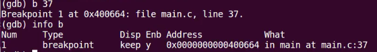
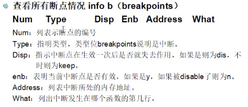

# 7. 程序调试

## 7.1 什么是程序调试

任何一个软件在开发时都不可能一气呵成，编写完成后就是没有任何问题的可以直接发布的成品，都会遇到各种各样的bug，bug并不是编译错误，在开发过程中编译错误都容易解决，最不好解决的是程序能编译通过，但是无法得到正确运行结果的bug。
  
小的bug可能导致程序运行不顺畅，大的bug可能就会直接导致程序跑飞、死机，显然我们把这些bug干掉，干掉Bug就是“程序调试”要干的事情，所以在程序开发的过程中，程序调试是非常重要的。

## 7.2 调试手段

代码复杂后，仅仅看源码是很难找出bug的，所以我们需要借助一些调试手段，调试手段总体而言可以分为如下几种:

+ 打印调试
+ 单步调试
+ 硬件调试
+ log文件调试

### 7.2.1 打印调试

+ （1）什么是打印调试
    利用printf打印关键信息，然后通过这些关键信息来判断代码可能的问题。

+ （2）打印调试的优点
    打印调试简单易行，而且很直接、很直观，是程序员最为常用的调试方式。

+ （3）打印调试的缺点
    打印调试太少了可能找不出问题，但是太多了又有可能会淹没有用信息，不好把握。
    打印调试不如“单步调试”精确，显示的调试信息也不如“单步调试”丰富。

### 7.2.2 单步调试

很多初学编程的同学一听到调试，总认为“单步调试”才是真正的调试，前面介绍的“打印调试”不算是一种正规的调试方法，甚至都鄙视“打印调试”，显然这是一种误区。

#### （1）如何实现单步调试

编译器集合会提供“debug调试程序”（调试命令），比如gcc编译器集合就会提供debug调试程序（gdb.exe），我们在第1章介绍gcc编译器集合的时，其实就介绍过gdb，不知道大家还有没有映像。

debug程序会专门负责单步调试，debug的使用方式有两种：

起一个WEBIDE进行调试(用地cloud9)

```shell
docker run --security-opt seccomp=unconfined -it -d -p 9528:80 -v /Users/liangshanguang/Program/Web/webide/c9docker/workspace2/:/workspace/ waterknife/webide
```

然后访问 http://localhost:9528 即可进行代码调试了

+ 1）直接命令行运行gdb，然后调试程序 
    + （a）编译时，在程序中包含基本的调试信息  
        比如调试需要用到的文件名，行号，变量名等等

        实现方法：`gcc a.c -g`
          `如果要进行gdb单步调试的话，必须加-g`，如果不加-g的话，程序包含的调试信息太少，不能进行调试。
        以上一章tea和stu的代码为例，可以看到加上-g后编译会多很多信息，a.out也大不少：

        ```shell
        root@23c438a7015e:/workspace/gdb_test# gcc main.c public.c stu.c tea.c
        root@23c438a7015e:/workspace/gdb_test# ll -ah a.out
        -rwxr-xr-x 1 root root 14K Mar 23 03:40 a.out*
        root@23c438a7015e:/workspace/gdb_test# gcc main.c public.c stu.c tea.c -g
        root@23c438a7015e:/workspace/gdb_test# ll -ah a.out
        -rwxr-xr-x 1 root root 18K Mar 23 03:40 a.out*
        root@23c438a7015e:/workspace/gdb_test# ls
        a.out  main.c  public.c  public.h  stu.c  stu.h  tea.c  tea.h
        ```

    + （b）使用gdb命令，进行gdb调试，gdb就是`gcc debug`的缩写
        `gdb ./a.out`
        + `设置断点的命令b`
          + `在主函数所在文件的lineNo行号出设置断点`: `b lineNo`：
          + `在fileName文件的lineNo行号处设置断点`: `b fileName:lineNo`
          + `在funName函数名出设置断点`: `b funName`
          + 断点详细信息介绍  
              
            

        + `查看所有断点b的信息`:`info b`：
        + `让断点失效`：`diable b`
        + `使能断点时`: `enable b`
        + `删除断点`：`clear b`
        + `运行程序`：`r` 开始运行后，就可以调试了
        + `单步运行`：
          + `下一步，遇到函数时不进入函数`: `n`
          + `下一步，遇到函数则进入函数`: `s`
        + `查看变量值`：`p n(变量名)`
        + `查看源码`：`l`
        + `结束单步调试`：`kill`
        + `退出gdb调试`：`q`
        + ...

      有关gdb的其它命令，请大家自己另外了解，实际上相比打印调试来说，命令行的单步调试用的不多，所以这里对于gdb命令行调试来说，知道大概怎么使用，当要用到时能够自己摸索用起来就可以了。

+ 2）IDE调用gdb程序来进行单步调试
    codeblocks使用的也是gcc编译器，Codeblocks会提供图形化界面的单步调试，但是背后同样是调用gdb来实现的，只不过提供了图形化的界面给我们，我们则不需要关心IDE在背后是如何去调用gdb的。

    实现步骤：

    + （a）创建debug工程
      创建了debug工程后，IDE调用gcc编译时就会自动加上-g选项，然后就能进行单步调试。

    + （b）进行单步调试
        IDE提供了单步调试的界面按钮，操作非常的简单，大家自己下去熟悉下就好了。

#### （2）单步调试的优点和缺点

+ 1）单步调试的优点
  + （a）单步调试可以帮助我们提供更精细的跟踪
  + （b）相比打印调试，可以提供更加丰富的调试信息
      比如可以展示各个变量值，各个寄存器的值，甚至是某段c代码所对应的汇编代码

+ 2）单步调试的缺点
    单步跟踪调试的节奏往往有点慢，不如打印调试来的直接，所以大多数情况下程序员还是喜欢使用打印调试，当遇到特别难搞定的bug时，此时还是使用单步调试来精细的跟踪，然后找出bug。

### 7.2.3 硬件调试

使用led、蜂鸣器等硬件来调试，这种调试方式常见于裸机（比如单片机）开发中，在纯应用开发中是见到不到的，

天使方法：比如

  ```c
  ... //正常代码
  ...
  驱动led、蜂鸣器的代码
  ...
  ...
  ```

  如果led被点亮了或者蜂鸣器鸣响了，说明前面的代码就没有问题，否则就说明前面的代码有问题，通过这种方式就可以找到问题的所在，当然这种调试方式并不是万能的，有些情况下，这种调试方式不合适
  在裸机开发中，也能使用打印调试和单步调试。  

### 7.2.4 log文件（日志文件）调试

很多同学不了解日志文件，这里有必要说一说。

#### （1） log文件会记录什么呢？

日志文件原本是用来记录人每天工作相关内容，比如工作进度，工作计划等，这里的计算机log文件，指的是软件程序在运行的过程中所记录的信息，log文件一般是txt文本形式，可以直接打开查看，但是有些log文件有固定格式，不能直接使用txt文本打开阅读，事实上日志文件也能帮助我们进行调试。

#### （2）日志文件种类

日志文件大体上个分为两种，分别是uninstall.log或是error.log，各自记录的信息不一样，作用也不一样。

+ 1）uninstall.log：通常用于记录软件在安装过程中所生成的记录，以便将来卸载的时候提供给卸载程序使用  
+ 2）error.log：通常用来记录软件运行过程中的所产生信息，程序运行时的bug信息也会被记录  
    程序在发布时不可能将所有的bug都找出来，剩余的bug只能在发布后的公测阶段来被发现，程序运行所产生的bug就会记录在日志文件中，然后就可以利用这些信息来帮助调试  

### 7.2.5 补充：借助汇编来辅助调试

这个我们了解一下即可。
面对有些非常难搞定的问题，我们有时候还可以通过查看汇编代码来辅助解决。

```shell
c代码 ————>编译 —————> 汇编  ————> 链接 ————> 二进制的可执行程序
```

中间会产生汇编代码，我们可以查阅这个汇编代码。

实际上还有“反汇编”这个东西，但是只有“逆向开发”才会涉及到反汇编，因此我们这里不深入介绍。

事实上几乎所有的bug，都可以通过前面所介绍的方式来调试解决，“借助汇编来辅助调试”的这种方式，了解下就可以了，并不是必须的。

## 7.3 调试宏

有关调试宏，我们在第2章就介绍过，我们这里再介绍一下。

调试宏其实就是“打印调试的宏”，也就是我们打印调试时所用到的宏。

### 7.3.1 调试宏举例

```c
#ifdef DEBUG
    #define debug(fmt, arg1, arg2) printf(fmt, arg1, arg2)
#else
    #define debug(fmt, args...)  
#endif
```

如果定义了DEBUG宏，宏体为printf，此时debug宏有效，否则无效  

但是以上调试宏有一个缺点，printf的参数时固定的，但是我们打印调试信息时，参数往往是不定的，所以我们要改进一下  

```c
#ifdef DEBUG
    #define debug(fmt, args...) printf(fmt, args)
#else
    #define debug(fmt, args...)
#endif
```

此时debug为`变参宏`，刚好对应着printf的变参需求，有关变参宏和变参函数，后面会详细介绍。

### 7.3.2 如何定义DEBUG宏

+ （1）在.h中定义：只有定义
+ （2）gcc编译时时，可以通过`-D`来指定为“自定义”的预定义宏

    ```shell
    gcc a.c b.c -DDEBUG
    ```

    **这个预定宏(DEBUG)是一个全局宏，对于所有的.h和.c来说，都是可见的，如果gcc时没有定义DEBUG的话，调试宏的宏体就是空，此时无效**

    在.h中定义需要源码，不太好，我们最好通过gcc的选项来指定，更方便

### 7.3.3 函数错误打印

函数错误打印，可以帮我们排查函数错误，以及进行异常处理，提高程序的健壮性。

#### （1）errno.h和错误号

有关errno.h和错误号，我们在第5章就提到过，我们这里详细介绍一下。可以通过命令`man errno`来查看

几乎所有的c标准库函数出错时，都会有相应的出错原因，c标准库会使用各种错误号（整数）来代表相应的错误，这些错误号定义在了errno.h中  

errno.h：

```c
#ifndef _ERRNO_H_
#define _ERRNO_H_

#define EPERM   1   /* Operation not permitted(权限问题，不允许操作) */
...
#define EINVAL  22  /* Invalid argument（无效参数） */
...
#define EROFS   30 /* Read-only file system（文件是只读的） */
...
#define ENAMETOOLONG 38 /* Filename too long (91 in Cyg?)(文件名太长，最多只允许91字符) */
...

extern int errno; //存放错误号的全局变量，如果没有任何函数出错，里面默认就是0

...

#endif /* _ERRNO_H_ */
```

当被调用的库函数出错时，比如函数参数为无效参数时，就会自动将错误号22设置到全局变量errno(`extern int errno`)中，以记录当前函数的出错信息。

然后我们通过strerror这个函数，可以将errno中的22翻译为字符换"Invalid argument"，这样我们就知道发生了什么错误了。这就是我们为什么在阅读函数手册返回值时，经常会看到这么一句话，如果函数调用失败就会返回NULL或者-1等，然后设置errno，比如fopen函数的返回值描述为：

原话为： `Upon successful completion fopen(), fdopen()  and  freopen()  return  a FILE pointer.  Otherwise, NULL is returned and errno is set to indicate the error.`

```c
#include <stdio.h>   // fprintf所需的.h
#include <string.h>  // strerror所需的.h
#include <errno.h>   // 全局变量errno所在的头文件
#include <stdlib.h>  // exit()函数所在头文件

int main(void)
{
    FILE * p= fopen(".\\file.txt", "t");
    if(NULL == p)
    {
        //strerror会将errno中的错误号翻译为字符串
        fprintf(stderr, "fopen error：%s\n", strerror(errno)); // strerror(错误号)用于把整数错误码转换为错误的文字信息
        exit(-1); //直接终止进程
    }

    return 0;
}
```

结果为：

```shell
fopen error：Invalid argument
```

fopen为标准io函数，我们会在第9章详细介绍，事实上第二个参数"t"的写法是错误的，所以fopen会返回NULL并且将errno设置为错误号EINVAL（22）。

strerror会自动取出errno的中的错误号并将22翻译为Invalid argument，并且将字符串指针返回，利用这个返回字符串指针，就能通过%s打印出"Invalid argument"，以提示除了什么错误。至于fprintf(stderr,...)的写法，我们在第9章讲标准IO时也会详细介绍。

**改进**： 

大家也看出来了，`使用strerror(errno)方式有些麻烦，还需要包含string.h和errno.h`，  

`所以c标准库给出了perror这个函数，这个函数只需要包含stdio.h即可`，使用起来更方便。

```c
#include <stdio.h>   //printf所需的.h
#include <stdlib.h>  // exit()函数所在头文件

int main(int argc, char *argv[])
{
    FILE * p= fopen(".\\file.txt", "t");
    if(NULL == p)
    {
        perror("fopen error"); 
        exit(-1); //直接终止进程
    }

    return 0;
}
```

显然perror更简洁。

**为了让报错处理更方便，我们最好将“报错操作”封装为函数或者带参宏**

#### （2）函数方式

直接通过例子来理解。

```c
#include "stdio.h"
#include <stdlib.h>  // exit()函数所在头文件

//出错处理函数
void print_error(char *file, int line, char *str)
{
    //报告错误的位置
    fprintf(stderr, "File %s, Line %d, Function %s error\n", file, line, str);
    perror("error Reason"); //打印函数出错的原因
    exit(-1); //终止进程，说白了就是终止整个程序
}

int fun(int **p, int size)
{
    *p = malloc(size);
    //如果malloc返回NULL，就说明错了，需要报函数错误
    if(NULL == *p) print_error(__FILE__, __LINE__, "malloc");
}

int main(void)
{
    int ret = 0;
    int *p = 0;
    int size = sizeof(int)*4000000000000000000; 

    ret = fun(&p, size);

    return 0;
}
```

要开辟空间如此之大，肯定会报错，最后打印的错误信息为：

```shell
File C:\Users\Administrator\Desktop\EGEProj\qq\a.c, Line 23, Function malloc error
error Reason: Not enough space
```

`exit`函数：这个函数的作用是结束整个进程（程序），一般情况下，传递的参数其实没有什么意义，可以随意指定，不过按照约定俗成的规矩，如果是因为出错而要结束进程的话，一般都写-1。

如果你真想知道exit(-1)的-1到底到哪里去了，大家请看《Linux系统、网络编程》课程的第5章：进程控制。

#### （3）宏方式

> 在第2章介绍过，对于简短的函数来说，我们完全可以使用宏来代替

```c
#define print_error(str) \
do{\
    fprintf(stderr, "File %s, Line %d, Function %s error\n", __FILE__, __LINE__, str);\
    perror("error Reason");\
    exit(-1);\
}while(0);

int fun(int **p, int size)
{
    *p = malloc(size);
    if(NULL == *p) print_error( "malloc");
}
```

有同学不太理解do {}while(0)在这里到底有什么，有关这一点我们后面会详细介绍，目前简单的理解就是，等价于{ }。

#### （4）有关函数报错需要注意的地方

+ 1）并不是所有的函数都需要进行报错处理，只需对重要的、关键的函数进行报错处理
+ 2）我们自己写的函数，重要函数在出错时也要返回NULL或者-1等值来表示出错，并进行出错处理
+ 3）当函数出错后，一般的处理方式有两种
    + （a）调用exit()结束整个进程
    + （b）调用return返回上一级，此时返回一个值比如-1，用于表示函数执行出问题了。

    当然有需要的话，还应该对错误进行相应的处理。

## 7.4 如何编译得到得到Debug和Release程序

后面再介绍这个问题。
