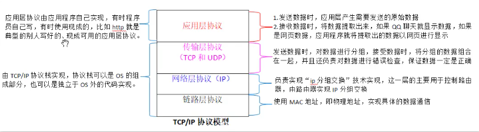
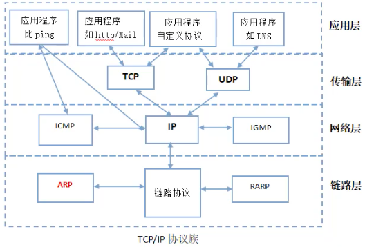
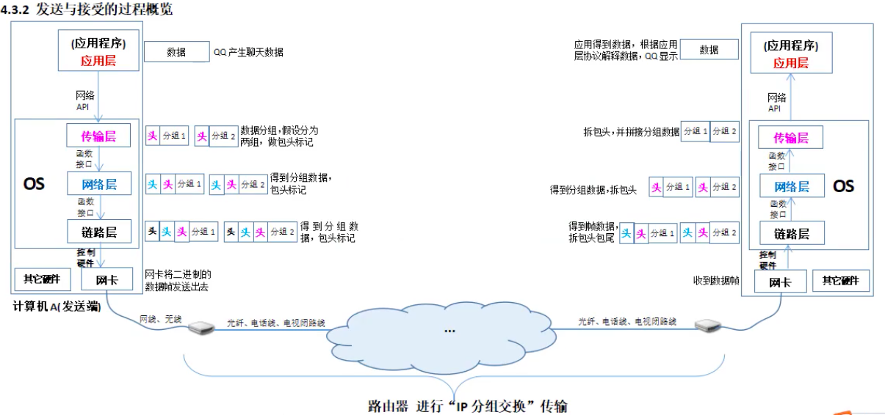
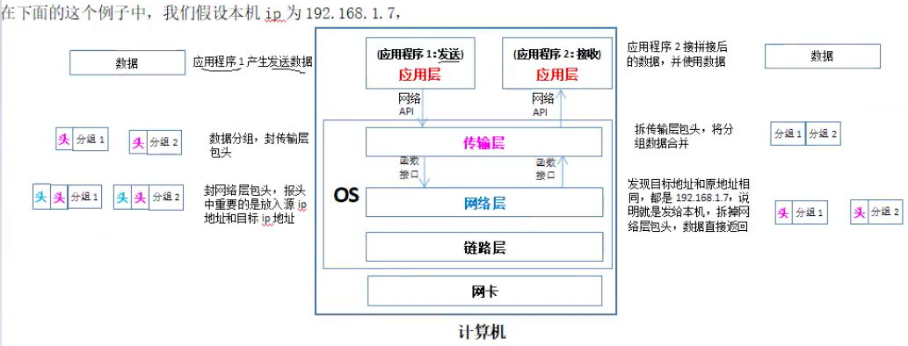
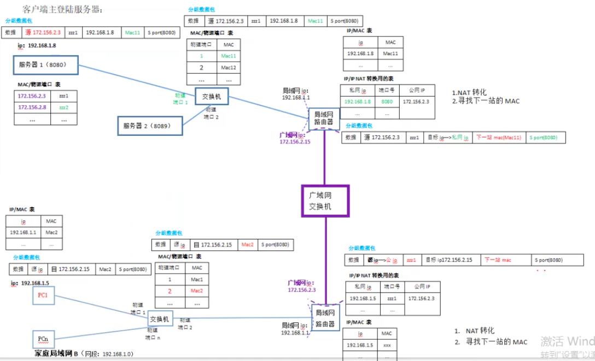

# 1. 回顾《计算机体系结构体——网络篇》的部分知识

## 1.1 TCP/IP协议栈的四层结构

## 1.2 TCP/IP协议族的详细情况

在前面的课程我们说过，TCP/IP协议是由不同子协议，按照以上四层结构组合在一起的协议家族。

应用层想使用TCP/IP通信有三条路线：

+ （1）tcp路线：应用层——>TCP——> ip ——>硬件接口
+ （2）udp路线：应用层——>UDP——> ip ——>硬件接口
+ （3）ip路线：应用层——> ip ——>硬件接口  `速度越过了TCP和UDP`

## 1.3 数据传输的时的封包和拆包

ip层封装的源IP和目标IP是怎么来的。

+ （1）源ip：自动检测本机ip得到的
+ （2）目标ip：由应用层（应用程序）或者传输层交给ip层的。

为什么是应用层或者传输层交给IP层的？  
答：因为只有应用层或则传输层才知道你要将数据发送给谁（目标）。

## 1.4 回顾数据传输的几种情况

### 1.4.1 `目标ip == 源IP`(本机通信)

数据只在本机内通信，数据到ip层就回去了，不过网卡，也不经过链路层。

### 1.4.2 `目标ip != 源IP`，但是`目标IP网段 == 源IP网段`(局域网通信)此时仅仅在局域网内通信，数据不会经过路由器到外网。

+ （1）封包的过程
+ （2）如何找到对方的  图：

### 1.4.3 `目标ip网段 != 源ip网段`(跨网通信)

此时数据一定会过路由器，通信双方属于跨网通信

+ （1）封包的过程
    跨网通信时，目标IP一定要封装对方所在路由器的公网IP。ip同样的是由应用层或者传输层嫁给IP层封装的。

+ （2）如何找到对方的
    跨网通信时，必须通过NAT转换才能找到对方。

    服务器NAT转换所需的信息，必须由管理人员自动配置，但是客户端NAT转换记录的信息，是在向外主动发送信息时自动记录的。

    对方收到数据包后，会得到发送发方所在路由器的公网ip，然后即可原路返回数据。

    疑问：网上不是说发送数据和回答数据时，所走的路由器可能是不一样吗，但是如果原路返回的话路由器不就一样了吗？

    其实我们的这个图只是一个示意图，画的非常简略，路由器都是以集群形式存在的，某集群中的路由器都会记录相同信息，所以返回时不管走的是哪些路由器，返回时NAT所用的信息是一样的，因为所用的信息是一样的，所以相当于还是原路返回的。

    对于以上NAT转换的过程，不论是TCP通信还是UDP通信都是一样的，TCP和UDP的不同并不体现在底层的实际传输上，而是TCP和UDP协议本身的实现上。
