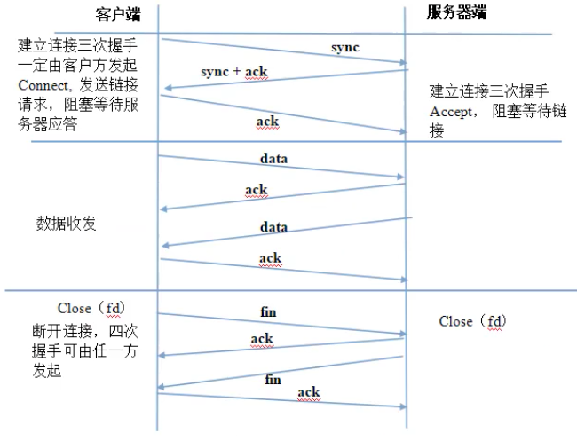

# 4. 使用TCP协议通信

> TCP的全称叫Transmission Control Protocol，即传输控制协议，简称TCP。

## 4.1 TCP协议的特点

TCP协议是有序的、面向连接的、可靠的字节流传输层协议。

### 4.1.1 什么是字节流

> 字节流的意思就是说，将数据分组发送时，分组数据的大小可以以字节为单位进行调整。

#### （1）为什么要调整分组数据的字节数

当网络状况不好，如果你还拼命的发送字节数很大的分组数据时，出错的可能性很高。
这就好比道路状况本来就差，结果还大量的涌入车辆，出事的概率自然就很高，所以当道路状况很差时就应该减少汽车流量，当路况好转时在逐步的增加汽车流量。

所以进行TCP通信时，如果TCP检测到网络不佳时，就会减少分组数据的字节数(把分组数据变小)，网络状况好转时再逐步增加字节数，总之会根据网络的好坏来调整字节数，这个调整的机制被称为“滑动窗口机制”。

之所以起名叫“滑动窗口机制”，是因为和“滑动窗口”调整通风状况的原理很相似，“滑动窗口机制”工作原理如下：

+ （1）当网络不好导致数据丢失时，数据每丢失一次，分组字节数减为以前的二分之一. 比如原本1000字节，现在变为500字节  
+ （2）当网络状态恢复时
  + 1）如果目前分组大小 < 最初大小的二分之一时，每成功发送一个字节，字节数增加1倍
  + 2）如果目前分组大小 >= 最初大小的二分之一时，每成功发送一次，分组字节数只增加1字节，增加减缓了。

#### （2）对比UDP

UDP跟TCP不一样的，UDP的分组数据包是固定长度的数据报，并不会根据网络的好坏来进行调整。

### 4.1.2 TCP协议为什么是可靠传输协议

通过三点来保证：

+ 第一：三次握手建立连接
+ 第二：有应答机制，也就是将数据发送给对方后，对方必须应答是否发送成功
+ 第三：使用“滑动窗口”机制，根据网络的好坏，控制发送的分组数据的大小

#### （1）三次握手建立连接

+ 1）三次握手
  

  这张图不仅画出了三次握手（三次通信），还出画出了双发收发数据时的应答机制，断开连接时四次握手。

  + （a）三次握手
    只要三次握手成功，客户和服务器就建立了连接，否者连接没有建立成功，双方不能通信。
    + 三次握手，一定是由客户方先发起的  
      为什么是一定是客户先发起的呢？
      因为只有服务器的IP和端口是固定不变、以及公开的，而客户端（pc）的ip和端口就不一定了，如果让服务器向客户主动发起握手请求，服务器根本就不知道客户的IP和端口多少，怎么主动连接呢

      所以`只能是客户主动向服务器发起握手请求`，当服务器收到客户数据后，在数据包里面提取出客户的IP和端口后，服务器能够向客户回发数据。

      所以从这里我们可以看出，我们实现服务器程序时，必须想办法固定服务器的IP和端口，至于如何固定，我们后面在再介绍，其实很简单，只要调用bind函数即可实现。

    + 为什么是三次握手，不是建立两次，不是四次、五次？
      这个是由TCP实现原理来决定的，这里不解释这个问题，大家只需知道三次握手成功后，客户和服务器即可成功建立连接，建立连接后即可正式通信。三次握手的通信并不是正式通信，只是握手通信。

      疑问：怎么理解TCP的“连接”？后面回答这个问题。

    + 如何实现TCP的三次握手  
      调用相应的API来实现，后面再介绍。

  + （b）应答机制  
    就是将数据发送给对方后，不管对方是服务器还是客户，对方必须回答我是否收到数据，收到的数据是否正确，这就是应答机制。

  + （c）四次握手断开连接  

    发起者可以是服务器和客户任何一方，不像三次握手，一定要客户方先发起，为什么服务器也可以发起呢？  

    因为断开连接时，连接已经建立了，在建立连接时服务器已经记录下客户的IP和端口，所以服务器可以主动向客户发起断开连接的请求。

    四次握手结束后，连接就断开了，断开的意思就是客户和服务器之间不能再进行通信。

    疑问：具体怎么断开连接呢？  
    调用相应的API来实现，调用API后，四次握手由TCP自动完成。

+ 2）三次握手建立连接的目的

    第一：提高通信的可靠性  
    第二：记录对方的ip和端口，正式通信时会自动的使用记录的ip和端口  

  + （a）提高通信的可靠性
    + 疑问：为什么建立连接就可以提高通信的可靠性呢？

       要回答这个问题，就必须先明白到底什么是建立连接，其实从三次握手可以看出，所谓的建立连接其实就是相互成功问答三次，相互问答三次说白了就是相互打个招呼，“哎我要和你通信了”，对方说“好，没问题”，只要双方问答成功，就说明双方的通信线路是好的，此时再正式通信，双方就能进行可靠的数据传输，如果问答不成功就说明通信线路有问题，不能进行通信。

       这就好比我想往某个地方运输货物，但是我又怕走到半道发现道路有问题，导致半途而废，此时我就可以先去探探路，如果能够到达目的地，就说明道路是通的，然后我正式运输货物，如此一来就能保证运输是可靠的。

       所以不要把“三次握手建立连接”想得太复杂，这个“连接”说白了就是事先通信探探路，把路探通后在进行正式的数据传输，如此就能在相当程度上保证传输的可靠性。

       **UDP**：udp不是这样的，udp在发送数据时，并不会通过连接先确认线路是不是通的，然后再发数据，对于UDP协议来说，数据发送方并不知道线路是不是通的。正是由于UDP不存在这种通过连接确认线路的机制，所以UDP属于不可靠通信。

  + （b）记录对方的IP和端口  
    客户与服务器建立连接后，各自的TCP都会记录好对方IP和端口，后面正式通信时就会自动使用记录的IP和端口。

#### （2）有应答机制

+ 1）为什么应答机制能够TCP的可靠性  
  因为如果发送给对方的分组数据有丢失、有错误，对方就会回答数据有错误，那么发送方会重发，以保证一定将正确的数据发送对方。

+ 2）UDP  
  UDP没有应答机制，发送方完全不关心对方对于数据的接受状态，所以  
  + TCP：可靠通信，因为TCP完全清楚现在通信状态，可以保证一定可以把户数发送给对方，发送的数据一定是正确的 
  + UDP：不可靠通信，因为UDP完全不清楚目前的通信状态，有点像种庄稼“凭天收”的感觉

#### （3）滑动窗口机制

可以根据网络状态调整分组数据大小，减少网络状况不好所带来的错误  
UDP就没有这种机制，不管网络是好是外，每次发送的都是固定字节数的分组数据

## 4.3 什么时候使用TCP协议

> 需要进行可靠传输时就使用TCP，比如好多现成的应用层协议就要求可靠传输，是以他们使用的就是TCP协议，

+ （1）HTTP：专门用于访问WEB的“超文本传输”的应用层协议
+ （2）SMTP：邮件传输的应用层协议
+ （3）Telnet：远程登录协议
+ （4）SNMP：简单网络管理协议
+ （5）FTP：文件传输协议
+ （6）TFTP：简单文件传输协议
+ （7）NFS：网络文件系统协议

如果你不想使用现成的应用层协议，或者压根就没有你要的应用层协议的话，我们就可以自己直接调用TCP来通信，本章讲TCP通信时，讲的就是应用程序如何直接调用TCP来通信。

当然这些“应用层协议”不一定非要使用TCP/IP这种网络协议，只不过由于TCP/IP是主流网络通信协议，所以这些应用层协议下层对接的基本都是TCP/IP协议。

## 4.4 使用TCP通信时，TCP协议要求必须要有一个服务器端

> 这一点是由TCP协议本身的特性决定的，只要你使用TCP协议来通信，就必须要有一个TCP服务器端。

### 4.4.1 TCP服务器的大概工作过程

+ （1）服务器会使用专门“文件描述符”来监听客户的“三次握手”，然后建立连接
+ （2）一旦连接建立成功后，服务器会分配一个专门的“通信文件描述符”，用于实现与该连接客户的通信

由于建立连接时，双方的TCP协议都已经记住了对方IP和端口，所以双方正式通信时，TCP会自动使用记录的IP和端口，我们不需要重新指定对方的IP和端口。

### 4.4.2 TCP编程模型

在编程模型里面，必须要有一方是TCP服务器，另一方是TCP客户。

服务器只有一个，但是客户端有很多，不管客户端有多少个，客户端与服务器端的通信，都按照编程模型的描述来实现的。图：

### 4.4.3 服务器是如何同时应对多客户的通信呢？

+ （1）多线程 和 多进程 图：
+ （2）多路io  图：
