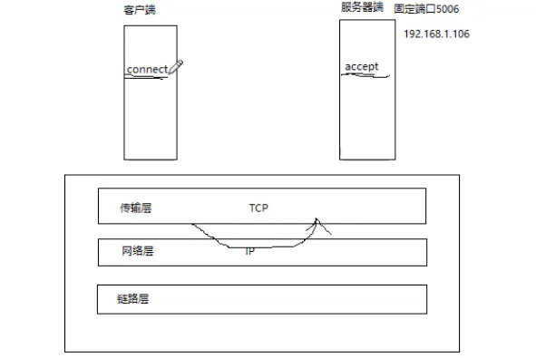
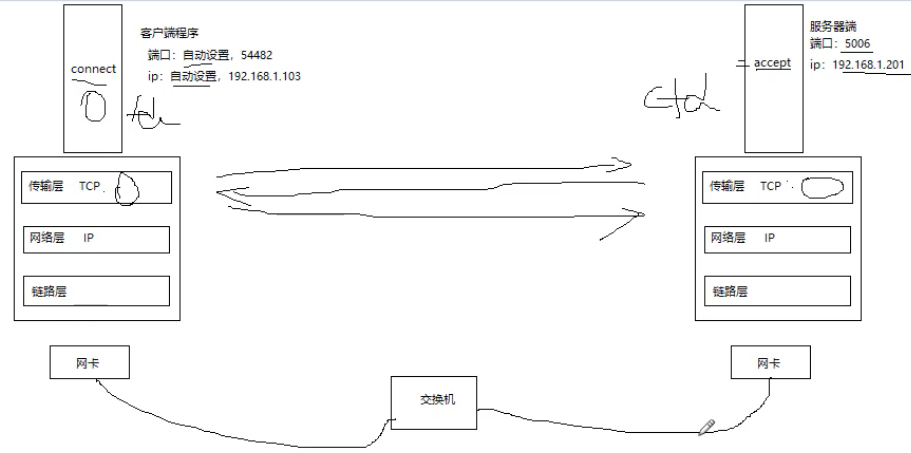

# 总结

## 4.7 总结下TCP通信

TCP通信分为两步，

+ 第一步：建立连接，建立连接时，服务器和客户的TCP协议会自动记录下对方ip和端口  
  当然，能够建立连接的前提是，服务器端绑定了固定的ip和端口，而且客户端知道这个固定的ip和端口，只有这样客户端才知道向谁请求连接，否则都不知道和谁连接，更不要谈连接成功了。

+ 第二步：使用通信描述符直接收发数据，此时会自动使用TCP记录的IP和端口

为了弄清楚TCP通信的具体过程，我们分三种情况来看。

### 4.7.1 本机通信

### 4.7.2 局域网内跨机通信

### 4.7.3 过路由器，跨网通信
  

## 4.8 TCP服务器/客户模式

对于TCP协议来说，只要你使用TCP协议，必然有一个服务器端，而其它的都是客户端，这一点是由TCP协议本身的特性所决定的，而不是“应用程序”来决定的，所以使用TCP协议通信时，是天然的服务器/客户模式。图：

如果TCP客户之间想要通信，在TCP的服务器/客户模式下，只能通过服务器来中转。

服务器为了同时与众多客户进行通信，可以有三种方式：

+ （1）多线程
+ （2）多进程
+ （3）多路IO

这三种方式的实现，后面在详细介绍。
