# Linux基础

## 01_Linux介绍

### 操作系统的地位

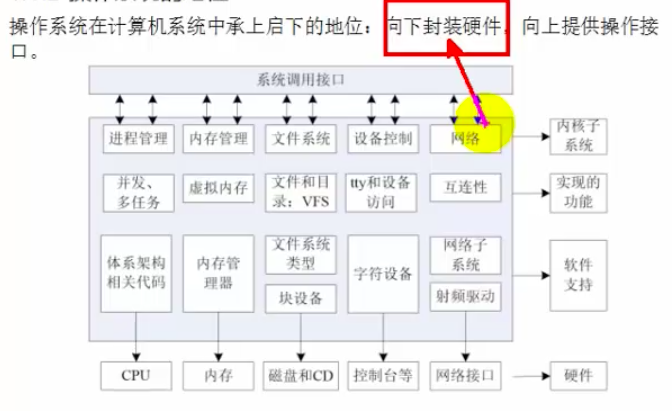

### Linux发展史

> Linux能发展起来最大的原因是AT&T和伯克利(BSD)因为Unix的使用权和收费权在1990~2001打了10多年的官司

​	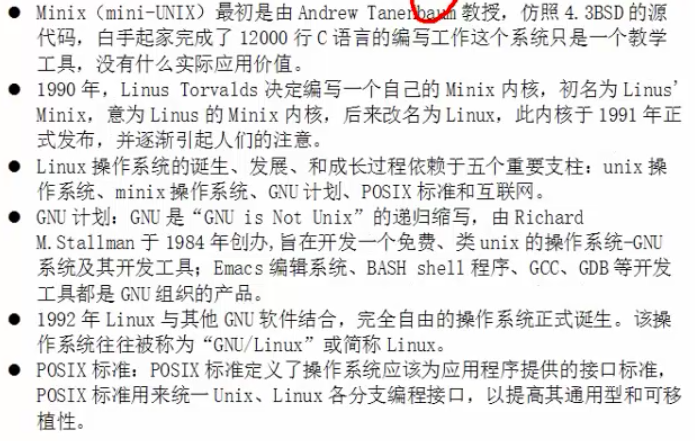

### IOS的来源

​	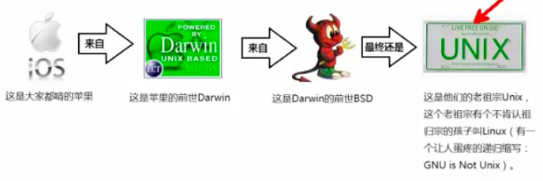

### Linux和Unix的联系和区别

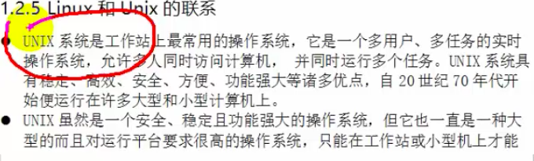

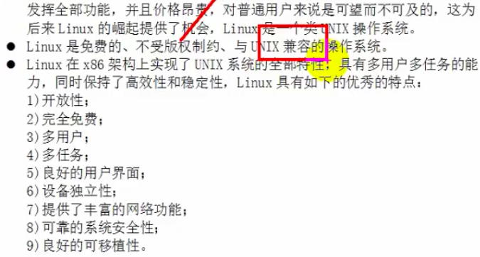

### Top10的Linux发行版

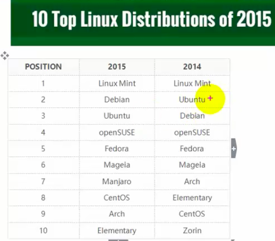

## 02.Linux的目录结构介绍

+ 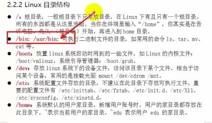
+ 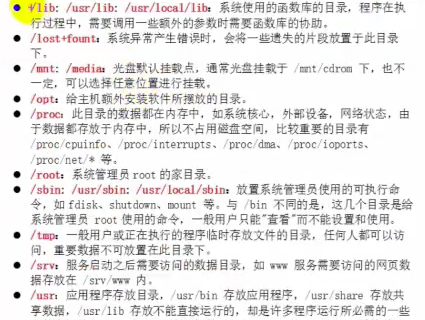
+ 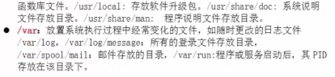

## 03.文件权限

### 文件类型

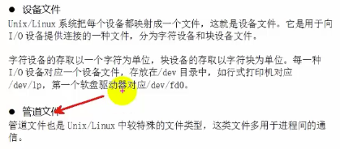

### 权限类型

+ 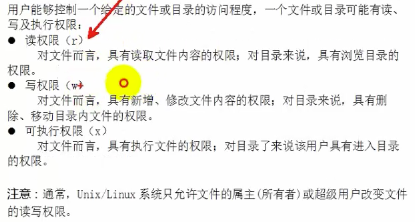
+ 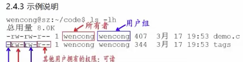
+ 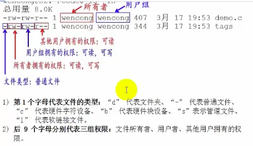
+ 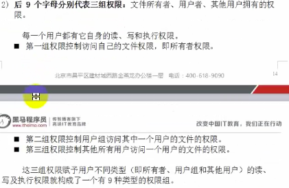